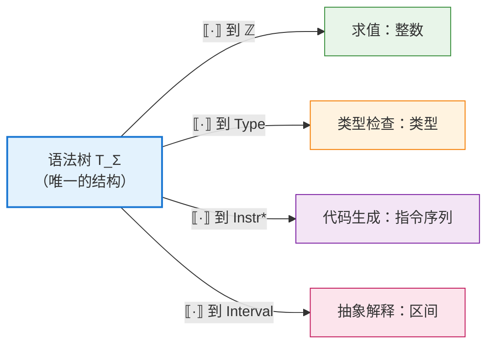
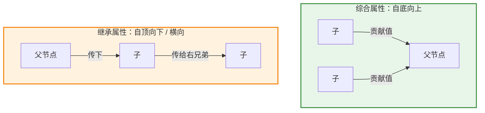
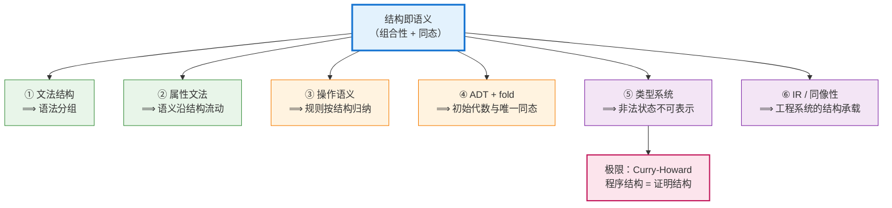
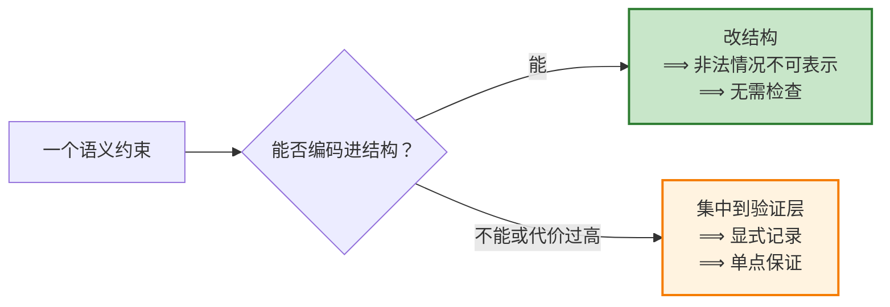

# 结构即语义：从表达式文法到类型系统的一条主线

> **本文的缘起**：在拆解龙书 4.1 的经典 E-T-F 表达式文法时（见 [表达式文法如何"编码"结合性与优先级](./expression-grammar-associativity-and-precedence.md)），我们看到一个令人印象深刻的事实——运算符的优先级与结合性并没有写成一段 `if/else` 判断，而是被"雕刻"进了文法的产生式结构里。这个观察背后是一条贯穿编译原理、程序语言理论、形式语义学乃至类型系统的主线：**结构即语义**。本文把这条主线完整展开。

---

## 目录

1. [命题的精确表述](#1-命题的精确表述)
2. [数学内核：语义是从语法到语义域的同态](#2-数学内核语义是从语法到语义域的同态)
3. [第一层：文法结构决定语法分组](#3-第一层文法结构决定语法分组)
4. [反面案例：当结构不够用时，语义就得"外挂"](#4-反面案例当结构不够用时语义就得外挂)
5. [第二层：属性文法——让语义沿结构流动](#5-第二层属性文法让语义沿结构流动)
6. [第三层：结构化操作语义——推理规则按语法归纳](#6-第三层结构化操作语义推理规则按语法归纳)
7. [第四层：代数数据类型与折叠——结构即语义的函数式化身](#7-第四层代数数据类型与折叠结构即语义的函数式化身)
8. [第五层：类型系统——让非法语义在结构上不可表示](#8-第五层类型系统让非法语义在结构上不可表示)
9. [第六层：IR 与同像性——工程系统中的结构承载](#9-第六层ir-与同像性工程系统中的结构承载)
10. [统一图景：一条从语法到证明的谱系](#10-统一图景一条从语法到证明的谱系)
11. [边界：结构不能表达什么](#11-边界结构不能表达什么)
12. [方法论：如何在自己的设计中运用](#12-方法论如何在自己的设计中运用)
13. [总结](#13-总结)
14. [参考文献与延伸阅读](#14-参考文献与延伸阅读)

---

## 1. 命题的精确表述

"结构即语义"是一句口号，直接使用容易滑向玄学。要让它成为可操作的工程原则，必须先把它拆成两个强度不同的命题。

### 1.1 弱形式（描述性）：语义由结构唯一决定

> **弱形式**：一个复合表达式的含义，由它的**结构**以及各个**直接成分的含义**唯一决定。

这正是语言哲学与形式语义学中的**组合性原则（principle of compositionality）**，通常追溯到 Frege，并在 Montague 语法中被形式化（参见 [Stanford Encyclopedia of Philosophy: Compositionality](https://plato.stanford.edu/entries/compositionality/)）。

它的工程价值在于**可计算性**：如果语义是组合的，那么就可以写出一个沿**语法树**递归的求值器、类型检查器或代码生成器，而不必对整个程序做全局分析。整个**语法制导翻译（syntax-directed translation）**的技术栈都建立在这个前提上。

### 1.2 强形式（构造性）：结构排除非法语义

> **强形式**：通过精心设计结构，使**语义上非法的东西在结构上根本无法被表示**。

弱形式说的是"结构**能算出**语义"；强形式说的是"结构**能拒绝**错误语义"。

E-T-F 文法就是强形式的范例：它不是"检查"了 `2 + 3 * 4` 应该分组为 $2 + (3*4)$，而是让另一种分组**在语法上无法推导出来**——因为 `T` 的产生式里没有 `+`。错误的可能性不是被检测掉的，而是**从来没有存在过**。


本文后续各层，可以看作是这两个形式在不同抽象层次上的反复出现：**第 3、5、6、7 节主要体现弱形式；第 4、8 节主要体现强形式。**

---

## 2. 数学内核：语义是从语法到语义域的同态

"结构即语义"之所以不是修辞，是因为它有一个干净的代数表述。

### 2.1 语法作为项代数

给定一个**签名（signature）** $\Sigma$，即一组带元数（arity）的构造子。以算术表达式为例：

$$
\Sigma = \{\, \mathsf{lit}^{(1)},\ \mathsf{add}^{(2)},\ \mathsf{mul}^{(2)} \,\}
$$

由 $\Sigma$ 自由生成的**项集合** $T_\Sigma$ 就是所有抽象语法树。注意此处的关键：$T_\Sigma$ 中的元素是**树**，不是字符串——具体语法（括号、优先级、空格）已经在解析阶段被吸收掉了。

### 2.2 语义作为同态

选定一个**语义域** $D$，并为每个构造子指定一个 $D$ 上的运算，$D$ 便成为一个 $\Sigma$-代数。此时存在**唯一的**同态映射：

$$
\llbracket \cdot \rrbracket : T_\Sigma \longrightarrow D
$$

它满足对每个构造子的分配律：

$$
\llbracket \mathsf{add}(e_1, e_2) \rrbracket = \llbracket e_1 \rrbracket \;+_D\; \llbracket e_2 \rrbracket
\qquad
\llbracket \mathsf{mul}(e_1, e_2) \rrbracket = \llbracket e_1 \rrbracket \;\times_D\; \llbracket e_2 \rrbracket
$$

这条等式就是"结构即语义"的**数学定义**：等式左边是对**结构**的分解，右边是对**语义**的组合，二者一一对应。

### 2.3 三个推论

这个同态视角立刻给出三个有实践意义的结论：

| 推论       | 含义                      | 工程后果                            |
| -------- | ----------------------- | ------------------------------- |
| **唯一性**  | 只要给定各构造子的语义运算，整体语义就唯一确定 | 语义规范可以写得很短——只需逐产生式说明            |
| **可替换性** | 语义相同的子项可互相替换而不改变整体语义    | 编译优化（常量折叠、公共子表达式消除）的正当性来源       |
| **可换域性** | 换一个 $D$，就得到一套新语义        | 同一棵树可以求值、可以生成代码、可以做类型检查、可以做抽象解释 |

第三条推论尤其值得强调：**同一个结构可以承载多套语义**。求值器把 $D$ 取为整数集，类型检查器把 $D$ 取为类型集，代码生成器把 $D$ 取为指令序列，抽象解释器把 $D$ 取为区间格。它们全都是同一个 $T_\Sigma$ 上的不同同态。这正是编译器能够"一棵树、多趟遍历"的理论依据。



---

## 3. 第一层：文法结构决定语法分组

这是"结构即语义"在编译原理中的第一次亮相，也是最容易亲手验证的一层。

回顾龙书 4.1 的文法：

$$
\begin{align*}
E &\rightarrow E + T \mid T \\
T &\rightarrow T * F \mid F \\
F &\rightarrow (E) \mid \mathbf{id}
\end{align*}
$$

它用三种结构手段编码了三件语义相关的事：

| 结构手段                      | 编码的内容 | 机制                                           |
| ------------------------- | ----- | -------------------------------------------- |
| **分层**（`E → T → F` 单向下降）  | 优先级   | 高优先级运算符只能出现在更深的非终结符层，因而在树中被嵌套得更深             |
| **递归方向**（`E → E + T` 左递归） | 结合性   | 左递归强制树向左偏斜，得到 $(a+b)+c$ 的分组；右递归则给出 $a+(b+c)$ |
| **回路**（`F → (E)`）         | 显式覆盖  | 括号让最底层重新跳回最高层，从而人为改变分组                       |

细节推导见 [表达式文法如何"编码"结合性与优先级](./expression-grammar-associativity-and-precedence.md)。这里只强调一个必须守住的边界：

> ⚠️ **文法结构决定的是「语法分组」，不是「运行时求值顺序」。**

这两件事在纯算术例子中往往重合，导致大量教材与博客把它们混为一谈。但一旦表达式带副作用，区别立刻显现：`f() + g()` 的分组结构毫无疑义（`+` 的两个操作数分别是两次调用），但 `f` 与 `g` 谁先执行，文法**完全没有规定**——那取决于语言的动态语义。第 6 节会说明真正规定这件事的是谁。

---

## 4. 反面案例：当结构不够用时，语义就得"外挂"

要真正理解"结构承载语义"的价值，最好的办法是看它**缺席**时会发生什么。

考虑龙书中那个刻意写得"平坦"的文法（4.3）：

$$
E \rightarrow E + E \mid E * E \mid (E) \mid \mathbf{id}
$$

它把 `+` 和 `*` 放在同一层，结构上完全对称。后果是：`a + b * c` 有两棵合法的解析树，文法**有歧义**。此时结构不再承载优先级信息，优先级必须从别处来。

工程上的通行做法是给 parser generator 加优先级声明。以 GNU Bison 为例：

```yacc
%left  '+' '-'      /* 优先级最低，左结合 */
%left  '*' '/'      /* 优先级更高，左结合 */
%right UMINUS       /* 一元负号，右结合，优先级最高 */

%%
expr : expr '+' expr
     | expr '*' expr
     | '(' expr ')'
     | ID
     ;
```

这里发生的事情很值得玩味：`%left`、`%right` 并没有改变文法——文法依然是有歧义的。它们改变的是**分析表中冲突的消解方式**（移入还是归约），也就是把优先级信息从"文法结构"搬到了"分析器配置"里（见 [Bison: Using Precedence](https://www.gnu.org/software/bison/manual/html_node/Using-Precedence.html)、[Bison: Precedence Decl](https://www.gnu.org/software/bison/manual/html_node/Precedence-Decl.html)）。

两条路线的对照：

| 维度          | 分层文法（结构承载）       | 歧义文法 + 优先级声明（外挂承载）        |
| ----------- | ---------------- | ------------------------- |
| 优先级信息的位置    | 产生式结构本身          | 分析器配置（`%left` / `%right`） |
| 文法是否无歧义     | 是                | 否，靠**冲突消解规则**"选一棵"        |
| 新增一个优先级层的成本 | 新增一个非终结符，改动多条产生式 | 加一行声明                     |
| 可读性         | 优先级关系需从产生式链推断    | 优先级表一目了然                  |
| 出错时的表现      | 文法写错 → 语言接受的串就不对 | 声明写漏 → 移入/归约冲突警告          |
| 语义的"可信度"    | 结构保证，不可能被绕过      | 依赖工具正确应用消解规则              |

**结论不是"外挂一定不好"**。实践中，C 语言的表达式优先级有十余层，若严格用分层文法表达，就需要 `assignment-expression → conditional-expression → logical-OR-expression → …` 这样一条十几个非终结符的长链，文法臃肿且难改。这正是 Pratt 在 1973 年提出**自顶向下算符优先分析**的动机——他用一张"绑定强度"数据表取代了这条冗长的非终结符链（见 [Top Down Operator Precedence](https://tdop.github.io/)，[ACM DL](https://dl.acm.org/doi/10.1145/512927.512931)）。

于是我们得到一个更成熟的表述：

> **结构承载语义是一种可选的强度。** 把语义放进结构，换来的是"不可能出错"的保证；代价是结构的膨胀与刚性。工程决策的实质，是在**保证强度**与**表达便利**之间取舍。

---

## 5. 第二层：属性文法——让语义沿结构流动

第 3 节的结构只承载了"分组"这一件事。要让结构承载**任意**语义计算，需要 Knuth 1968 年引入的**属性文法（attribute grammar）**（[Semantics of Context-Free Languages](https://link.springer.com/article/10.1007/BF01692511)，[PDF](https://courses.cs.umbc.edu/331/fall12/resources/papers/Knuth67AG.pdf)）。

其做法是把第 2 节的同态**逐产生式地写出来**：为每个文法符号配备**属性**，为每条产生式配备**语义规则**。

| 产生式                 | 语义规则                           |
| ------------------- | ------------------------------ |
| $E \to E_1 + T$     | $E.val = E_1.val + T.val$      |
| $T \to T_1 * F$     | $T.val = T_1.val \times F.val$ |
| $F \to (E)$         | $F.val = E.val$                |
| $F \to \mathbf{id}$ | $F.val = \mathbf{id}.lexval$   |

这张表就是同态 $\llbracket \cdot \rrbracket$ 的"分片定义"：每一行说明一个构造子如何把子结构的语义组合成自身的语义。**结构提供骨架，属性沿骨架流动。**

属性的流动方向进一步细分了两类信息传递：



- **综合属性**：由孩子算父亲，信息自底向上——表达式求值、代码生成结果。
- **继承属性**：由父亲/左兄弟算自己，信息自顶向下或横向——类型分发、符号表上下文。

这里出现了一个极具启发性的转折。属性文法允许任意依赖方向，于是可能出现**循环依赖**，导致不存在合法求值顺序。而"判定一个属性文法是否可能循环"这个问题被证明是**指数时间**的——连 $P = NP$ 都救不了它。

编译领域的应对方式，恰恰又是"结构即语义"的强形式：不去做那个昂贵的检测，而是**限制到结构上天生无环的子类**——S-属性文法（只用综合属性）与 L-属性文法（继承属性只能来自父节点或左兄弟）。对这两类文法，"无环 + 存在求值顺序"是**结构白送的保证**。

> 完整推导见：[SDD 循环依赖判定：为什么"即使 P = NP 也难解"](../../5-Syntax-Directed-Translation/5.1-Syntax-Directed-Definitions/NP-hard-to-cycle-detection-in-dependency-graph.md)；SDD 与 SDT 的概念区分见 [语法制导：SDD、SDT 与翻译方案](../../5-Syntax-Directed-Translation/Syntax-directed-translation&SDD&SDT.md)。

这个案例的方法论价值极高：

> **当一个性质难以验证时，考虑重新设计结构，使该性质成为结构的推论。**

---

## 6. 第三层：结构化操作语义——推理规则按语法归纳

Plotkin 1981 年的 *A Structural Approach to Operational Semantics* 把"结构即语义"推到了动态语义领域（[PDF](https://homepages.inf.ed.ac.uk/gdp/publications/sos_jlap.pdf)）。它的核心特征就写在标题里的 **structural** 一词上：**每条推理规则对应一个语法构造子，整个语义定义就是对语法结构的归纳。**

以小步语义（small-step SOS）描述加法为例，$\langle e, \sigma \rangle$ 表示表达式 $e$ 在状态 $\sigma$ 下的配置：

$$
\frac{\langle e_1, \sigma\rangle \to \langle e_1', \sigma'\rangle}
     {\langle e_1 + e_2, \sigma\rangle \to \langle e_1' + e_2, \sigma'\rangle}
\quad\text{(Add-L)}
$$

$$
\frac{\langle e_2, \sigma\rangle \to \langle e_2', \sigma'\rangle}
     {\langle n_1 + e_2, \sigma\rangle \to \langle n_1 + e_2', \sigma'\rangle}
\quad\text{(Add-R)}
$$

$$
\frac{}{\langle n_1 + n_2, \sigma\rangle \to \langle n_1 \oplus n_2, \sigma\rangle}
\quad\text{(Add-Done)}
$$

请仔细看这三条规则揭示了什么：

**(Add-R) 的前提要求左操作数已经是一个值 $n_1$。** 正是这个约束——而不是文法——规定了"先求值左子表达式"。如果把 (Add-R) 的左侧写成任意 $e_1$，就得到一个允许任意交错求值的非确定性语义。

这就精确地回答了第 3 节留下的问题：

> **语法结构决定「有哪些子表达式、它们如何组合」；语义规则决定「以什么顺序遍历这些子表达式」。**
> 
> 前者是分组，后者是求值顺序。**二者都"沿结构"定义，但不是同一件事。**

这也解释了为什么 C/C++ 中函数实参的求值顺序是 unspecified：语言标准在这一点上**故意不给出**那条限定规则，把选择权留给实现以便优化。结构在那里，顺序被刻意留空。

大步语义（big-step / natural semantics）则给出另一套沿同一结构定义的规则：

$$
\frac{\langle e_1, \sigma\rangle \Downarrow n_1 \qquad \langle e_2, \sigma\rangle \Downarrow n_2}
     {\langle e_1 + e_2, \sigma\rangle \Downarrow n_1 \oplus n_2}
$$

同一个结构、不同的语义规则集——这正是第 2.3 节"可换域性"推论的动态语义版本。

---

## 7. 第四层：代数数据类型与折叠——结构即语义的函数式化身

函数式编程把第 2 节的代数视角变成了日常写码方式。

**代数数据类型（ADT）就是签名 $\Sigma$ 的语言级声明**：

```haskell
data Expr
  = Lit Int
  | Add Expr Expr
  | Mul Expr Expr
```

这三行做了两件事：定义了 $T_\Sigma$（所有可能的表达式树），并且——注意这是强形式——**使非法结构不可表示**。你无法构造一个"缺少右操作数的 Add"，因为 `Add` 的类型要求两个 `Expr`。

而**语义就是一个折叠（fold / catamorphism）**：

```haskell
eval :: Expr -> Int
eval (Lit n)     = n
eval (Add e1 e2) = eval e1 + eval e2
eval (Mul e1 e2) = eval e1 * eval e2
```

把这段代码与第 5 节的属性文法表逐行对照，会发现它们**是同一张表**：每个构造子一行，每行把子结构的语义组合成自身的语义。`eval` 就是那个唯一的同态 $\llbracket \cdot \rrbracket$。

这一对应关系在范畴论层面得到了精确表述：语法是某个函子的**初始代数（initial algebra）**，而"从初始代数到任意代数存在唯一同态"这条性质，正是 fold 的存在性与唯一性。Meijer、Fokkinga、Paterson 的经典论文系统发展了这套 recursion scheme 演算（[Functional Programming with Bananas, Lenses, Envelopes and Barbed Wire](https://ris.utwente.nl/ws/portalfiles/portal/6142049/meijer91functional.pdf)）。

在面向对象语言中，同一件事以**访问者模式（Visitor）**的形式出现：每个 AST 节点类一个 `visit` 方法，遍历骨架由结构固定，语义放在 visitor 里替换。Nystrom 在 *Crafting Interpreters* 的 [Representing Code](https://craftinginterpreters.com/representing-code.html) 一章对此有非常清晰的讲解。换句话说：

$$
\text{属性文法} \;\cong\; \text{fold} \;\cong\; \text{Visitor 模式}
$$

三者是同一个思想在不同范式中的投影。

Rust 中的等价写法进一步展示了"结构排除错误"的力度：

```rust
enum Expr {
    Lit(i64),
    Add(Box<Expr>, Box<Expr>),
    Mul(Box<Expr>, Box<Expr>),
}

fn eval(e: &Expr) -> i64 {
    match e {
        Expr::Lit(n)      => *n,
        Expr::Add(a, b)   => eval(a) + eval(b),
        Expr::Mul(a, b)   => eval(a) * eval(b),
    }
}
```

编译器的**穷尽性检查（exhaustiveness checking）**会在你新增一个构造子却忘记处理时直接报错。这是"结构即语义"给出的额外红利：**结构的完备性，转化成了语义实现的完备性检查。**

---

## 8. 第五层：类型系统——让非法语义在结构上不可表示

到这一层，"结构即语义"从"计算语义"转向"约束语义"，强形式登场。

### 8.1 让非法状态不可表示

考虑一个常见的坏设计：

```rust
struct Connection {
    is_connected: bool,
    socket: Option<Socket>,   // 只有 is_connected 为真时才有意义
}
```

这个结构允许四种组合，其中两种（`is_connected == true` 但 `socket == None`，以及反之）是**语义上非法**的。于是代码里必然长出一堆防御性检查，而且无法保证覆盖完全。

改成用结构表达状态：

```rust
enum Connection {
    Disconnected,
    Connected(Socket),   // socket 只在此分支存在
}
```

非法组合**消失了**——不是被检查掉，而是无法构造。这就是 Yaron Minsky 概括的 **"make illegal states unrepresentable"**（[Effective ML](https://blog.janestreet.com/effective-ml/)，[讲稿 PDF](https://www.cs.cornell.edu/courses/cs3110/2013fa/lectures/27/lecture27_Minsky_EffectiveML.pdf)）。

与 E-T-F 文法的关系是直接的：

| E-T-F 文法          | 类型设计                             |
| ----------------- | -------------------------------- |
| `T` 的产生式里没有 `+`   | `Disconnected` 分支里没有 `Socket` 字段 |
| ⟹ 错误分组无法推导        | ⟹ 非法状态无法构造                       |
| 无需在 parser 里检查优先级 | 无需在业务代码里检查一致性                    |

### 8.2 Parse, don't validate

Alexis King 的 [Parse, don't validate](https://lexi-lambda.github.io/blog/2019/11/05/parse-don-t-validate/) 把这条原则提炼成了一句可执行的口号，而且用词恰好落在编译原理的术语上：

- **validate（验证）**：检查数据是否合法，返回 `bool`；调用者拿到的仍是原类型，**信息在返回时被丢弃**，后续代码不得不重复检查。
- **parse（解析）**：把弱结构的输入转换成**结构更强的类型**，把"已验证"这个事实**编码进类型结构**，后续代码从类型上就能确信不变式成立。

例如把 `validateNonEmpty :: [a] -> Bool` 换成 `parseNonEmpty :: [a] -> Maybe (NonEmpty a)`：一旦拿到 `NonEmpty a`，"非空"就不再是一个需要记住的约定，而是结构事实。

这与解析器的工作完全同构：parser 把**无结构的字符串**转换成**有结构的语法树**，此后所有下游阶段都不必再关心"这段文本是否符合语法"。**Parse, don't validate 就是把编译器前端的智慧推广到了一般软件设计。**

### 8.3 极限情形：命题即类型

沿这条路走到尽头，会到达 **Curry–Howard 对应**：类型是命题，程序是证明，程序的**结构**就是证明的**结构**。

| 逻辑                     | 类型                      |
| ---------------------- | ----------------------- |
| 蕴含 $A \to B$           | 函数类型 `A -> B`           |
| 合取 $A \wedge B$        | 积类型 `(A, B)`            |
| 析取 $A \vee B$          | 和类型 `Either A B`        |
| 全称量化 $\forall x. P(x)$ | 依赖函数类型 `(x : A) -> P x` |

此时"结构即语义"达到最强形态：**一段程序能被构造出来，本身就是对应命题为真的证明。** 语义不再是附加在结构上的解释，而与结构合一。Wadler 的 *Propositions as Types* 是这个主题最好的普及性论述（[PDF](https://homepages.inf.ed.ac.uk/wadler/papers/propositions-as-types/propositions-as-types.pdf)，[CACM](https://cacm.acm.org/research/propositions-as-types/)）。

---

## 9. 第六层：IR 与同像性——工程系统中的结构承载

这条主线在真实系统里同样处处可见。

### 9.1 S-表达式与同像性

Lisp 把程序直接表示为 S-表达式，即"程序就是数据结构本身"（**homoiconicity，同像性**）。McCarthy 1960 年的原始论文即建立在这个设计之上（[Recursive Functions of Symbolic Expressions and Their Computation by Machine](https://dl.acm.org/doi/10.1145/367177.367199)）。

其后果是宏系统变得异常自然：宏就是一个把语法树映射到语法树的普通函数。**因为结构本身就是可操作的一等对象，"操作程序语义"退化成了"操作数据结构"。**

### 9.2 MLIR：把语义约束写进结构与验证器

现代编译基础设施 MLIR 把这条原则做到了系统层面（[MLIR Language Reference](https://mlir.llvm.org/docs/LangRef/)）。它的 IR 由 Operation、Region、Block 构成嵌套结构，而大量语义信息直接由结构承载：

- **Region 的嵌套**天然表达了控制流的作用域与层次，无需额外的"作用域表"；
- **SSA 支配关系（dominance）**由结构位置决定，"定义先于使用"成为结构性质；
- **Trait / Interface** 把"这个 op 满足某性质"编码进类型系统，pass 可以据此安全地做变换；
- **Verifier** 则承担那些确实无法由结构保证的约束。

这个分工非常具有代表性：**能由结构保证的，交给结构；不能的，才写进验证器。** 与第 5 节"S/L-属性文法 vs 通用循环检测"是同一个决策模式。

---

## 10. 统一图景：一条从语法到证明的谱系

把六层放在一起，可以看到一条清晰的递进：

| 层次          | 结构载体            | 语义载体           | 结构决定了什么        | 形式    |
| ----------- | --------------- | -------------- | -------------- | ----- |
| 1. 表达式文法    | 产生式分层与递归方向      | 语法树形状          | 运算符分组（优先级、结合性） | 强     |
| 2. 属性文法     | 产生式 + 属性依赖      | 属性值            | 语义计算的骨架与合法求值顺序 | 弱     |
| 3. 操作语义     | 按构造子归纳的推理规则     | 状态转移           | 程序的执行行为与求值顺序   | 弱     |
| 4. 代数数据类型   | 构造子签名           | fold / Visitor | 可表示的项 + 遍历骨架   | 弱 + 强 |
| 5. 类型系统     | 类型构造            | 类型即命题          | 可表示的状态、可通过的程序  | 强     |
| 6. IR / 同像性 | Region 嵌套、S-表达式 | Pass / 宏       | 作用域、支配关系、可变换性  | 弱 + 强 |



---

## 11. 边界：结构不能表达什么

一个原则若不划出边界，就会被滥用。下面四条是"结构即语义"确实力不能及或代价过高的地方。

### 11.1 上下文相关约束

上下文无关文法**无法**表达这类要求：

- 标识符必须先声明后使用；
- 赋值两侧类型必须相容；
- 函数调用的实参个数必须与形参一致；
- `break` 只能出现在循环或 `switch` 内部。

原因很简单：这些约束涉及树中**相距很远的两个节点之间的一致性**，而 CFG 的产生式只能约束"父节点与其直接孩子"的局部关系。因此它们必须交给属性文法、符号表与类型检查器——也就是**语义分析**阶段。

这划出了编译器阶段划分的理论依据：**语法分析处理能由结构表达的部分，语义分析处理不能的部分。**

### 11.2 求值顺序与副作用

第 6 节已详述：结构给出分组，规则给出顺序。把二者混同，是关于优先级/结合性最常见的误解。带副作用的表达式、短路求值、惰性求值、并发交错，都属于"结构之外"的语义。

### 11.3 结构膨胀的代价

C 语言十余层的表达式优先级若严格分层，将产生一条极长的非终结符链；每次新增运算符都要改动多处。这时用 Pratt parsing 的数据表反而更可维护。**结构承载语义的强度与结构的复杂度成正比，存在一个工程上的最优点。**

同类现象在类型设计中也存在：过度用类型编码不变式会导致类型体操，牺牲可读性与编译速度。

### 11.4 结构正确 ≠ 语义正确

最后一条提醒：结构只能保证它所编码的那部分性质。文法保证 `2 + 3 * 4` 分组正确，但保证不了程序逻辑正确；类型保证不出现空指针，但保证不了业务规则无误。**结构是把一部分错误提前到编译期消灭，而不是消灭所有错误。**

---

## 12. 方法论：如何在自己的设计中运用

把这条原则落到日常设计上，可以归纳为五个动作。

**① 先问"这个约束能不能变成结构"**

每当你准备写一段运行时检查、一条注释约定、一份文档规范时，先问：能否改变数据结构或类型，让被禁止的情况根本无法构造？

**② 用和类型替代"标志位 + 可选字段"**

`bool` 加若干 `Option` 字段的组合几乎总意味着有非法状态存在。改用 enum / sum type，让每个分支只携带该状态下有意义的数据。

**③ 在边界上 parse，而不是在内部反复 validate**

在系统入口把外部输入一次性转换成强结构类型；此后内部代码依赖类型而非约定。这与"编译器前端把字符串变成语法树"是同一件事。

**④ 让遍历骨架由结构决定，语义可替换**

用 fold / Visitor / pass 的方式组织代码：结构定义遍历骨架，语义作为参数注入。这样"一棵树、多套语义"就成为自然结果，而不是需要额外设计的能力。

**⑤ 明确写下结构无法保证的部分**

结构承载不了的约束不会自动消失。把它们集中到一处（验证器、类型检查器、契约层）并显式记录，避免它们散落成隐性假设。



---

## 13. 总结

```
【核心命题】
    弱形式：语义由结构与成分语义唯一决定（组合性）
        ⟹ 语义可沿结构递归计算
    强形式：结构使非法语义不可表示
        ⟹ 错误无需检测，因为从未存在

【数学内核】
    语法 = 项代数 T_Σ（初始代数）
    语义 = 唯一同态 ⟦·⟧ : T_Σ → D
    ⟦add(e1,e2)⟧ = ⟦e1⟧ +_D ⟦e2⟧
        ⟹ 一棵树可承载多套语义（求值/类型/代码生成/抽象解释）

【六层体现】
    ① 文法分层与递归方向  ⟹ 优先级与结合性
    ② 属性文法（Knuth）    ⟹ 语义沿结构流动
    ③ 结构化操作语义       ⟹ 规则按构造子归纳
    ④ ADT + fold           ⟹ 初始代数与唯一同态的语言化
    ⑤ 类型系统             ⟹ 非法状态不可表示，极限是 Curry-Howard
    ⑥ IR / 同像性          ⟹ Region 嵌套、S-表达式承载语义

【必须守住的边界】
    结构决定「分组」，规则决定「求值顺序」
    上下文相关约束（先声明后使用、类型相容）超出 CFG 能力
    结构承载的强度与结构复杂度成正比，存在最优点
    结构正确 ≠ 语义正确

【方法论】
    每个约束都先问一句：它能不能变成结构？
    能 ⟹ 改结构，让错误不可表示
    不能 ⟹ 集中到验证层，显式记录
```

> 📌 **核心洞察**：龙书 4.1 那个只有三行的 E-T-F 文法，之所以值得反复咀嚼，是因为它在最小的篇幅里演示了计算机科学中一种反复出现的顶级技巧——**不去实现规则，而去设计一个让规则自动成立的结构**。优先级不是被判断出来的，而是被分层"逼"出来的；结合性不是被选择的，而是被递归方向"定"下来的。这与函数式程序员用和类型消灭非法状态、与类型驱动设计者用 `NonEmpty` 取代运行时判空、与 MLIR 用 Region 嵌套取代作用域表、与依值类型使用者用类型编码定理，在思想上是**同一个动作**：把语义约束从"事后检查的逻辑"迁移为"事前保证的结构"。这个迁移带来两个质变——第一，正确性从"我检查过了"升级为"它不可能错"，因为错误的表示根本不存在；第二，语义从"藏在代码里的实现细节"升级为"写在结构里的公共规范"，任何人读结构就读到了语义。当然，这条原则也有它诚实的边界：结构表达不了上下文相关的一致性，规定不了带副作用的求值顺序，而且强行把一切塞进结构会让结构本身崩塌成不可维护的复杂度——这也正是编译器要分出语义分析阶段、MLIR 仍需要 verifier、C 语言宁愿用优先级表而非十几层非终结符的原因。因此真正成熟的运用不是教条地追求"一切皆结构"，而是每遇到一个约束都清醒地做一次判断：**这一条，我是要用结构让它不可能出错，还是要用检查让它出错时被发现？** 能持续、准确地做出这个判断，就是把"结构即语义"从一句口号，变成了一种可靠的设计能力。

---

## 14. 参考文献与延伸阅读

### 本仓库内相关文章

- [表达式文法如何"编码"结合性与优先级：拆解经典的 E-T-F 文法](./expression-grammar-associativity-and-precedence.md) —— 本文的直接出发点
- [4.1 Introduction 原文与笔记](./index.md) —— 龙书 4.1 节，含 4.1 / 4.2 / 4.3 三个代表性文法
- [语法制导：SDD、SDT 与翻译方案](../../5-Syntax-Directed-Translation/Syntax-directed-translation&SDD&SDT.md) —— 属性文法的声明式与过程式两种形式
- [SDD 循环依赖判定：为什么"即使 P = NP 也难解"](../../5-Syntax-Directed-Translation/5.1-Syntax-Directed-Definitions/NP-hard-to-cycle-detection-in-dependency-graph.md) —— "用结构保证性质"取代"检测性质"的经典案例

### 教材与工具文档

- Aho, Lam, Sethi, Ullman. *Compilers: Principles, Techniques, and Tools*（龙书）官方页面：<https://suif.stanford.edu/dragonbook/>
- Robert Nystrom. *Crafting Interpreters* — Representing Code（AST 与 Visitor 模式）：<https://craftinginterpreters.com/representing-code.html>
- GNU Bison Manual — Using Precedence：<https://www.gnu.org/software/bison/manual/html_node/Using-Precedence.html>
- GNU Bison Manual — Precedence Declarations：<https://www.gnu.org/software/bison/manual/html_node/Precedence-Decl.html>
- MLIR Language Reference（Operation / Region / Block 结构）：<https://mlir.llvm.org/docs/LangRef/>

### 经典论文

- Donald E. Knuth. *Semantics of Context-Free Languages* (1968) —— 属性文法的奠基之作
  - Springer：<https://link.springer.com/article/10.1007/BF01692511>
  - PDF：<https://courses.cs.umbc.edu/331/fall12/resources/papers/Knuth67AG.pdf>
- Gordon D. Plotkin. *A Structural Approach to Operational Semantics* (1981) —— 结构化操作语义
  - PDF：<https://homepages.inf.ed.ac.uk/gdp/publications/sos_jlap.pdf>
- Vaughan R. Pratt. *Top Down Operator Precedence* (1973) —— 用数据表替代分层文法
  - 重排版：<https://tdop.github.io/>
  - ACM DL：<https://dl.acm.org/doi/10.1145/512927.512931>
- Erik Meijer, Maarten Fokkinga, Ross Paterson. *Functional Programming with Bananas, Lenses, Envelopes and Barbed Wire* (1991) —— catamorphism 与 recursion schemes
  - PDF：<https://ris.utwente.nl/ws/portalfiles/portal/6142049/meijer91functional.pdf>
- John McCarthy. *Recursive Functions of Symbolic Expressions and Their Computation by Machine, Part I* (1960) —— S-表达式与同像性的起点
  - ACM DL：<https://dl.acm.org/doi/10.1145/367177.367199>
- Philip Wadler. *Propositions as Types* (2015) —— Curry–Howard 对应的最佳普及性论述
  - PDF：<https://homepages.inf.ed.ac.uk/wadler/papers/propositions-as-types/propositions-as-types.pdf>
  - CACM：<https://cacm.acm.org/research/propositions-as-types/>

### 理论背景与设计实践

- *Compositionality*, Stanford Encyclopedia of Philosophy —— 组合性原则的系统梳理：<https://plato.stanford.edu/entries/compositionality/>
- Alexis King. *Parse, don't validate* (2019) —— 把"已验证"编码进类型结构：<https://lexi-lambda.github.io/blog/2019/11/05/parse-don-t-validate/>
- Yaron Minsky. *Effective ML* —— "make illegal states unrepresentable" 的出处
  - 博客：<https://blog.janestreet.com/effective-ml/>
  - 讲稿 PDF：<https://www.cs.cornell.edu/courses/cs3110/2013fa/lectures/27/lecture27_Minsky_EffectiveML.pdf>
