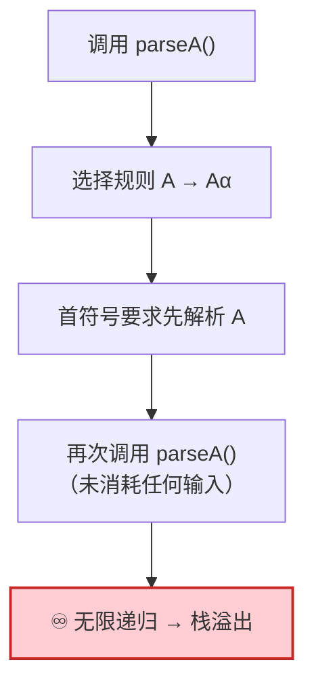
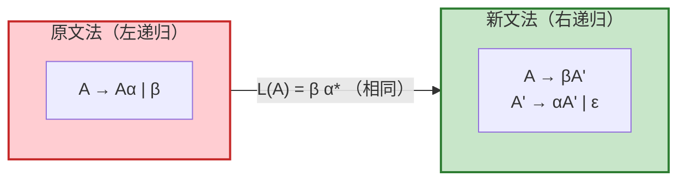
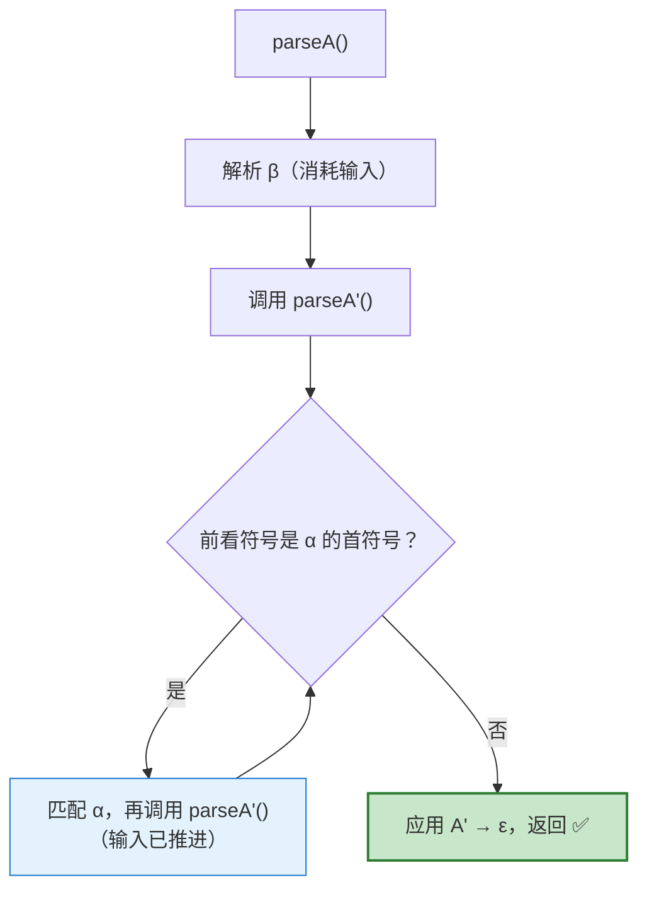
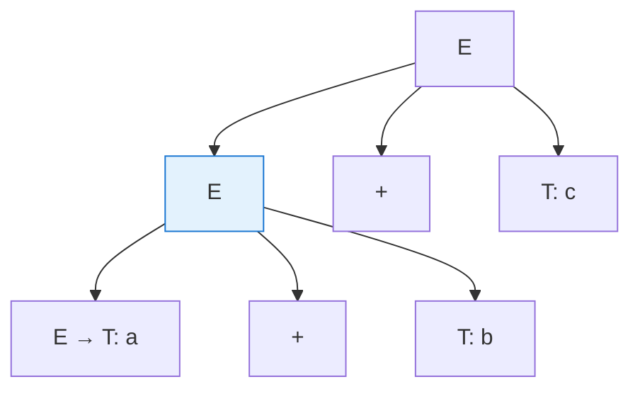
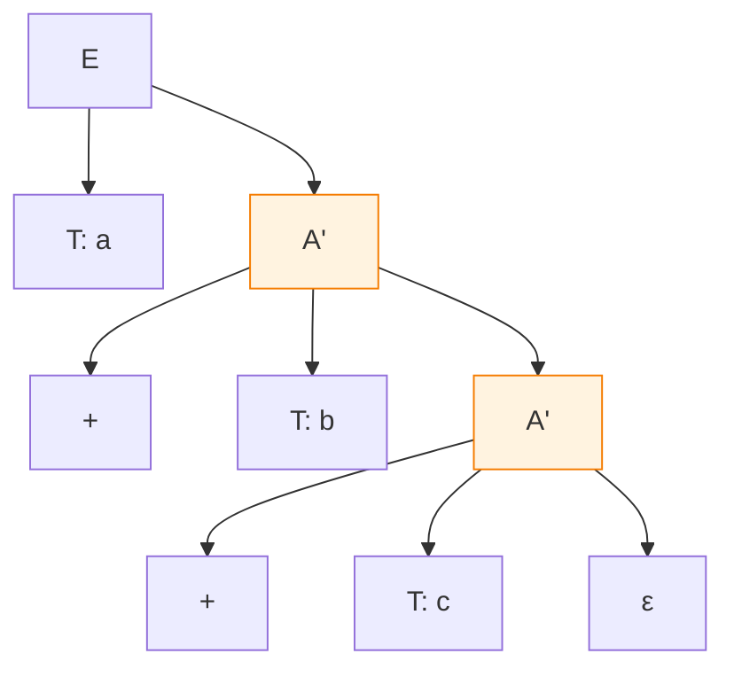
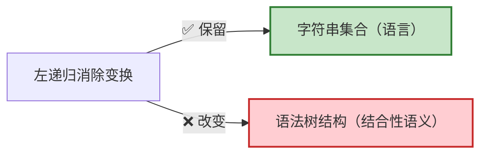
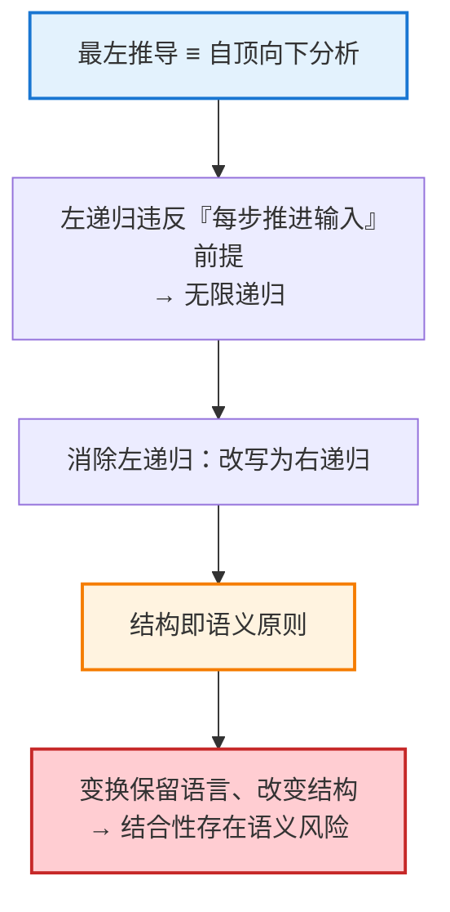

# 左递归消除技术：原理、动机与语义保持分析

**文档类型**：编译原理技术文档
**主题**：上下文无关文法的左递归消除变换
**关联主题**：最左推导与自顶向下分析、语法树结构与语义的对应关系

---

## 文档摘要

本文档系统阐述上下文无关文法中的**左递归消除（left-recursion elimination）** 变换。该变换将形如 $A \to A\alpha \mid \beta$ 的左递归产生式改写为等价的非左递归形式，在**保持语言（可推导字符串集合）不变**的前提下，消除自顶向下分析器面临的无限递归障碍。

文档进一步指出一个关键且易被忽视的性质：该变换将**左递归**改写为**右递归**，**改变了语法树的结合方向（由左倾变为右倾）**；由于语法树结构承载着**运算结合性语义**，对于**不满足结合律的运算符（如减法、除法）**，这种结构改变会导致求值结果错误，须在语义动作层面显式恢复正确的结合性。

---

## 1. 术语与背景

### 1.1 左递归的定义

**定义 1.1（直接左递归）**：设文法 $G$ 中存在非终结符 $A$，若 $A$ 的某条产生式的右部以 $A$ 自身开头，即形如：

$$
A \to A\alpha
$$

则称 $A$ 存在**直接左递归**。

本文档讨论的标准情形为：

$$
A \to A\alpha \mid \beta
$$

其中 $\alpha, \beta$ 为**文法符号串**，且 $\beta$ 不以 $A$ 开头。

### 1.2 典型实例

表达式文法中的加法产生式即为直接左递归：

$$
E \to E + T \mid T
$$

此处 $A = E$，$\alpha = {}+T$，$\beta = T$。

---

## 2. 问题陈述：左递归与自顶向下分析的冲突

### 2.1 前置事实

自顶向下分析器（递归下降、LL 分析）在算法上**模拟最左推导**：从起始符号出发，每一步优先展开当前句型中最左端的非终结符。此类算法的正确性依赖一个前提——**每一次递归展开都应向前消耗至少一部分输入**，以保证分析过程终止。

### 2.2 冲突的产生

当分析器处理左递归产生式 $A \to A\alpha$ 时，展开 $A$ 的第一步动作是"再次展开 $A$"，而此时尚未消耗任何输入符号。

**结论**：左递归导致自顶向下分析器进入不推进的无限递归。因此，在采用自顶向下分析技术前，必须消除文法中的左递归。

> **注**：自底向上分析器（如 LR 系列）能够天然处理左递归，此为 LR 分析能力强于 LL 的原因之一。本文档讨论范畴限于需要消除左递归的自顶向下场景。

---

## 3. 变换规则

### 3.1 规则陈述

**变换 3.1**：左递归产生式对

$$
A \to A\alpha \mid \beta
$$

可等价替换为以下非左递归产生式：

$$
\begin{align*}
A  &\to \beta A' \\
A' &\to \alpha A' \mid \epsilon
\end{align*}
$$

其中 $A'$ 为新引入的非终结符。

### 3.2 语言等价性证明（要点）

**原文法生成的语言**。反复应用 $A \to A\alpha$，最终以 $A \to \beta$ 终止：

$$
A \Rightarrow A\alpha \Rightarrow A\alpha\alpha \Rightarrow \cdots \Rightarrow \beta\,\underbrace{\alpha\alpha\cdots\alpha}_{n \text{ 个},\ n \ge 0}
$$

即：

$$
L(A) = \beta\,\alpha^{*}
$$

**新文法生成的语言**。$A \to \beta A'$ 首先产出 $\beta$；$A' \to \alpha A' \mid \epsilon$ 产出零个或多个 $\alpha$。故：

$$
L(A) = \beta\,\alpha^{*}
$$

两者一致，变换保持语言不变。∎

### 3.3 可分析性说明

新产生式 $A' \to \alpha A'$ 为**右递归**：展开 $A'$ 时先匹配 $\alpha$，再进入递归。由于每次递归前均已消耗输入，无限递归被消除。

---

## 4. 语义保持性分析：结构不变式的丧失

### 4.1 核心命题

变换 3.1 保证**语言等价**，但**不保证语法树结构等价**。由于**语义**（尤其是**运算结合性**）由**语法树结构**决定，此差异具有实质性的语义后果。

### 4.2 结构对比

以 $E \to E + T \mid T$ 分析输入串 `a + b + c` 为例。

**原文法（左递归）——左倾语法树，蕴含左结合语义 `(a + b) + c`**：

**新文法（右递归）——右倾语法树，蕴含右结合语义 `a + (b + c)`**：

### 4.3 属性对照表

| 属性       | 变换前（左递归）          | 变换后（右递归）          | 保持性  |
| -------- | ----------------- | ----------------- | ---- |
| 可推导字符串集合 | $\beta\alpha^{*}$ | $\beta\alpha^{*}$ | ✅ 保持 |
| 语法树形状    | 左倾                | 右倾                | ❌ 改变 |
| 蕴含的结合性   | 左结合               | 右结合               | ❌ 改变 |

### 4.4 风险场景与应对

**风险场景**：对于满足结合律的运算符（如 `+`、`*`），`(a+b)+c` 与 `a+(b+c)` 求值结果相同，结构改变无实际影响。但对于**非结合运算符**（如减法 `-`、除法 `/`）：

- `a - b - c` 的规范语义为 `(a - b) - c`（左结合）；
- 右倾树的自然语义为 `a - (b - c)`，导致**求值错误**。

**应对措施**：左递归消除是纯语法层面的变换，不携带结合性信息。因此在完成变换后，须在**语义动作**（AST 构建、属性计算或翻译方案）中**显式恢复正确的结合性**，不得依赖**右递归树**的自然结构倾向。

> ⚠️ **实践要求**：凡对非结合运算符消除左递归，必须在语义动作中通过迭代累积或显式左结合构造，重建 `(((β α) α) α)` 形式的求值顺序。

---

## 5. 关联知识点整合

本变换处于三条编译原理主线的交汇处：

- **自顶向下分析视角**：因分析算法要求每步消耗输入，左递归必须消除；
- **结构即语义视角**：变换保留语言却翻转结构，从而潜藏结合性错误，须在语义层补救。

---

## 6. 结论

1. **左递归定义**：非终结符在产生式右部最左端引用自身，形如 $A \to A\alpha \mid \beta$。

2. **消除动机**：自顶向下分析器在处理左递归时会在未消耗输入的情况下反复自调用，导致无限递归。

3. **变换规则**：改写为右递归形式
   
   $$
   A \to \beta A', \qquad A' \to \alpha A' \mid \epsilon
   $$
   
   新文法生成相同语言 $\beta\alpha^{*}$，且可被自顶向下分析器正确处理。

4. **语义保持性限制**：变换**仅保证语言等价，不保证语法树结构等价**。左递归对应左倾树（左结合），右递归对应右倾树（右结合）。对于非结合运算符，须在语义动作中显式恢复正确结合性，以避免语义错误。

---

## 附：一句话要点

> 左递归消除通过将左递归改写为右递归，解除了自顶向下分析器的无限递归障碍；此变换保持语言不变，但改变语法树结构——而结构承载着结合性语义，故对非结合运算符必须在语义动作中显式重建正确的结合性。

