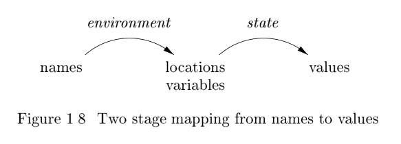

[TOC]

# 1.6 Programming Language Basics

In this section, we shall cover the most important terminology and distinctions that appear in the study of programming languages. It is not our purpose to cover all concepts or all the popular programming languages. We assume that the reader is familiar with at least one of C, `C++`, C#, or Java, and may have
encountered other languages as well.

## 1.6.1 The Static/Dynamic Distinction

Among the most important issues that we face when designing a compiler for a language is what decisions can the **compiler** make about a program. If a language uses a policy that allows the compiler to decide an issue, then we say that the language uses a ***static policy*** or that the issue can be decided at ***compile***
***time***. On the other hand, a policy that only allows a decision to be made when we execute the program is said to be a ***dynamic policy*** or to require a decision at ***run time***.

One issue on which we shall concentrate is the ***scope of declarations***. The ***scope of a declaration*** of `x` is the region of the program in which uses of `x` refer to this declaration. A language uses ***static scope*** or ***lexical scope*** if it is possible to determine the scope of a declaration by looking only at the program. Otherwise, the language uses ***dynamic scope***. With ***dynamic scope***, as the program runs, the same use of `x` could refer to any of several different declarations of `x`.

> NOTE:上面关于**scope**的定义所指代的是declaration，而非variable。显然declaration能够指代的范围远远大于variable。
>
> See also: [Scope (computer science)](https://en.wikipedia.org/wiki/Scope_(computer_science))

Most languages, such as C and Java, use **static scope**. We shall discuss **static scoping** in Section 1.6.3.


**Example 1.3** : As another example of the **static/dynamic distinction**, consider the use of the term **"static"** as it applies to data in a Java class declaration. **In Java, a variable is a name for a location in memory used to hold a data value**. Here, **"static"** refers **not** to the **scope** of the variable, but rather to the ability of the **compiler** to determine the location in memory where the declared variable can be found. A declaration like

```java
public static int x;
```

makes `x` a **class variable** and says that there is only one copy of `x`, no matter how many objects of this class are created. Moreover, the compiler can determine a location in memory where this integer `x` will be held. In contrast, had "**static**" been omitted from this declaration, then each object of the class would have its own location where `x` would be held, and the compiler could not determine all these places in advance of running the program.


> NOTE: 通过关键字`static`来告诉compiler：你可以在进行编译的时候就给`x`分配memory；而不是在运行程序的时候使用`new`来创建对象时再分配`x`的memory，显然这是所谓的static policy。
>
> See also: [Static (keyword)](https://en.wikipedia.org/wiki/Static_%28keyword%29)


## 1.6.2 Environments and States

Another important distinction we must make when discussing programming languages is whether changes occurring as the program runs affect the **values** of data elements or affect the interpretation of names for that data. For example,the execution of an assignment such as `x = y + 1` changes the **value** denoted by
the **name** `x`. More specifically, the assignment changes the **value** in whatever **location** is denoted by `x`.

It may be less clear that the **location** denoted by `x` can change at **run time**. For instance, as we discussed in Example 1.3, if `x` is not a **static** (or "**class**") variable, then every object of the class has its own location for an instance of variable x. In that case, the assignment to `x` can change any of those "instance" variables, depending on the **object** to which a method containing that assignment is applied.



The association of **names** with **locations** in memory (the store) and then with **values** can be described by two mappings that change as the program runs (see Fig. 1.8):
1. The **environment** is a mapping from **names** to **locations** in the store. Since **variables** refer to **locations** ("l-values" in the terminology of C), we could alternatively define an **environment** as a mapping from **names** to **variables**(**location**).
2. The **state** is a mapping from **locations** in store to their **values**. That is, the state maps **l-values** to their corresponding **r-values**, in the terminology of C.

**Environments** change according to the **scope rules** of a language.

> NOTE:  **environments**和**scope** 是不同的概念。

**Example 1.4** : Consider the C program fragment in Fig. 1.9. Integer `i` is declared a global variable, and also declared as a variable local to function `f` .When `f` is executing, the **environment** adjusts so that name `i` refers to the location reserved for the `i` that is local to `f` , and any use of `i`, such as the assignment `i = 3 ` shown explicitly, refers to that location. Typically, the local `i` is given a place on the **run-time stack**

```c

int i; /* global i */

void f(...) {
    int i; /* local i */
    ...
    i = 3; /* use of local i */
    ...
}
...
    x = i + 1; /* use of global i */
```


Whenever a function `g` other than `f` is executing, uses of `i` cannot refer to the `i` that is local to `f` . Uses of name `i` in `g` must be within the scope of some other declaration of `i`. An example is the explicitly shown statement `x = i+1`,which is inside some procedure whose definition is not shown. The `i` in `i + 1`
presumably（大概） refers to the global `i`. As in most languages, declarations in C must precede their use, so a function that comes before the global `i` cannot refer to it. 


The **environment** and **state** mappings in Fig. 1.8 are **dynamic**, but there are a few exceptions:

1. **Static versus dynamic** binding of **names** to **locations**. Most binding of names to locations is **dynamic**, and we discuss several approaches to this binding throughout the section. Some declarations, such as the global `i` in Fig. 1.9, can be given a location in the store once and for all, as the compiler generates object code(也就是global `i`是static).

  > Technically, the C compiler will assign a location in **virtual memory** for the global `i`,leaving it to the loader and the operating system to determine where in the **physical memory** of the machine `i` will be located. However, we shall not worry about relocation issues such as these, which have no impact on compiling. Instead, we treat the **address space** that the compiler uses for its output code as if it gave **physical memory locations**.

2. **Static versus dynamic** binding of **locations** to **values**. The binding of locations to values (the second stage in Fig. 1.8), is **generally** dynamic as well, since we cannot tell the value in a location until we run the program. **Declared constants** are an exception. For instance, the C definition

   ```c
   #define ARRAYSIZE 1000
   ```

   binds the name `ARRAYSIZE` to the value 1000 statically. We can determine this binding by looking at the statement, and we know that it is impossible for this binding to change when the program executes.

   

## 1.6.3 Static Scope and Block Structure

Most languages, including C and its family, use [static scope](#1.6.1 The Static/Dynamic Distinction)_. The **scope rules** for C are based on **program structure**; the scope of a declaration is determined implicitly(隐式地) by where the declaration appears in the program. Later languages,such as C++, Java, and C#, also provide explicit control over scopes through
the use of keywords like `public`, `private`, and `protected`.

In this section we consider static-scope rules for a language with **blocks**, where a block is a grouping of **declarations** and **statements**. C uses braces `{` and `}` to delimit(定界) a **block**; the alternative use of `begin` and `end` for the same purpose dates back to Algol.

> NOTE : 在`c++`中，block除了可以用于确定scope外，block也可以决定*storage duration* 。以下是摘自cppreference 的 [Storage class specifiers](https://en.cppreference.com/w/cpp/language/storage_duration)章节：
>
> ***automatic*** storage duration. The storage for the object is allocated at the beginning of the enclosing code block and deallocated at the end. All local objects have this storage duration, except those declared `static`, `extern` or `thread_local`.

---

>**Names**, **Identifiers**, and **Variables**
>
>Although the terms "name" and "variable," often refer to the same thing,we use them carefully to distinguish between compile-time names and the run-time locations denoted by names.
>
>An identifier is a string of characters, typically letters or digits, that refers to (identifies) an **entity**, such as a **data object**, a **procedure**, a **class**,or a **type**. All **identifiers** are **names**, but not all **names** are **identifiers**.Names can also be expressions. For example, the name `x.y` might denote the field `y` of a structure denoted by `x`. Here, `x` and `y` are identifiers, while `x.y` is a name, but not an **identifier**. Composite names like `x.y` are called **qualified names**.
>
>***SUMMARY***:显然，name是比identifier更加宽泛的概念。
>
>A **variable** refers to a particular **location** of the store. It is common for the same identifier to be declared more than once; each such **declaration** introduces a new **variable**. Even if each identifier is declared just once, an identifier local to a recursive procedure will refer to different locations of
>the store at different times.
>
>***SUMMARY***:显然，variable更加倾向于运行时概念

---


**Example 1.5**：C static-scope policy is as follows

1. A C program consists of a sequence of top-level declarations of variables and functions
2. Functions may have **variable declarations** within them, where **variables** include **local variables** and **parameters**. The scope of each such declaration is restricted to the function in which it appears.
3. The **scope** of a top-level declaration of a name `x` consists of the entire program that follows, with the exception of those statements that lie within a function that also has a declaration of `x`

The additional detail regarding the C static-scope policy deals with **variable declarations** within **statements**. We examine such declarations next and in Example 1.6. 2


---

>Procedures, Functions, and Methods
>
>To avoid saying procedures, functions, or methods, each time we want to talk about a subprogram that may be called, we shall usually refer to all of them as **procedures**.The exception is that when talking explicitly of programs in languages like C that have only functions, we shall refer to them as **functions**.Or, if we are discussing a language like Java that has only **methods**, we shall use that term instead.
>
>A **function** generally returns a value of some type (the return type), while a **procedure** does not return any value. C and similar languages, which have only **functions**, treat **procedures** as **functions** that have a special return type `void`, to signify no return value. Object-oriented languages like Java and `C++ `use the term **methods**.These can behave like either functions or procedures, but are associated with a particular class.

---


In C, the syntax of **blocks** is given by

1. One type of statement is a block(block是一种statement). Blocks can appear anywhere that other types of statements, such as assignment statements, can appear.
2. A block is a sequence of declarations followed by a sequence of statements,all surrounded by braces


Note that this syntax allows blocks to be nested inside each other. This nesting property is referred to as ***block structure***. The C family of languages has block structure, except that a function may not be defined inside another function.


We say that a declaration `D`  belongs to a block `B` if `B` is the most closely nested block containing `D `; that is, `D ` is located within `B` , but not within any block that is nested within `B`.


The **static-scope rule** for variable declarations in **block-structured languages** is as follows. If declaration `D` of name `x` belongs to block `B` , then the scope of `D` is all of `B` , except for any blocks `B' `nested to any depth within B , in which `x` is redeclared. Here, `x` is redeclared in `B'` if some other declaration D of the same name `x` belongs to `B'`.


An equivalent way to express this rule is to focus on a use of a name `x`.Let $B_1$, $B_2$, ... $B_k$ be all the blocks that surround this use of `x`, with $B_k$ the smallest, nested within $B_{k-1}$ , which is nested within $B_{k-2}$ , and so on. Search for the largest `i` such that there is a declaration of `x` belonging to $B_i$. This use of `x` refers to the declaration in $B_i$ . Alternatively, this use of `x` is within the scope of the declaration in $B_i$.

## 1.6.4 Explicit Access Control

**Classes** and **structures** introduce a new **scope** for their members. If `p` is an object of a class with a field (member) `x`, then the use of `x` in `p.x` refers to field `x` in the class definition. In analogy with block structure, the scope of a member declaration `x ` in a class `C` extends to any subclass `C'`, except if `C'`
has a local declaration of the same name `x`.

Through the use of keywords like `public`, `private`, and `protected`, object-oriented languages such as C++ or Java provide explicit control over access to member names in a superclass. These keywords support encapsulation by restricting access. Thus, **private names** are purposely given a scope that includes
only the method declarations and definitions associated with that class and any **friend classes** (the `C++` term). **Protected names** are accessible to subclasses. **Public names** are accessible from outside the class.

In `C++`, a class definition may be separated from the definitions of some or all of its methods. Therefore, a name `x` associated with the class `C` may have a region of the code that is outside its scope, followed by another region (a method definition) that is within its scope. In fact, regions inside and outside the scope may alternate, until all the methods have been defined


---

>Declarations and Definitions
>
>The apparently similar terms **declaration** and **definition** for programming-language concepts are actually quite different. **Declarations** tell us about the **types** of things, while **definitions** tell us about their **values**. Thus,`int i` is a **declaration** of `i`, while `i = 1` is a **definition** of i.
>
>The difference is more significant when we deal with **methods** or other procedures. In C++, a **method** is declared in a **class definition**, by giving the types of the arguments and result of the method (often called the **signature** for the method). The method is then defined, i.e., the code for executing the method is given, in another place. Similarly, it is common to **define** a C function in one file and **declare** it in other files where the function is used.

---


## 1.6.5 Dynamic Scope

Technically, any scoping policy is dynamic if it is based on factor(s) that can be known only when the program executes. The term **dynamic scope**, however,usually refers to the following policy: a use of a name `x` refers to the declaration of `x` in the most recently called, not-yet-terminated, **procedure** with such a declaration. **Dynamic scoping** of this type appears only in special situations.We shall consider two examples of dynamic policies: macro expansion in the C preprocessor and method resolution in object-oriented programming.

**Example 1.7** : In the C program of Fig. 1.12, identifier a is a macro that stands for expression `(x + 1)`. But what is `x`? We cannot resolve `x ` statically,that is, in terms of the program text

```c
#define a (x+1)
int x = 2;
void b() { int x = 1; printf("%d\n", a); }
void c() { printf("%d\n", a); }
void main() { b(); c();}
```

In fact, in order to interpret `x,` we must use the usual dynamic-scope rule.We examine all the function calls that are currently **active**, and we take the most recently called function that has a declaration of x. It is to this declaration that the use of `x` refers.


In the example of Fig. 1.12, the function main first calls function `b`. As `b` executes, it prints the value of the macro `a`. Since `(x + 1) `must be substituted for `a`, we resolve this use of `x `to the declaration int `x=1` in function `b`. The reason is that `b` has a declaration of `x`, so the `(x + 1) ` in the `printf` in `b` refers to this `x`. Thus, the value printed is 2.

After `b` finishes, and `c`is called, we again need to print the value of macro `a`. However, the only `x ` accessible to `c` is the global `x`. The `printf `statement in `c` thus refers to this declaration of `x`, and value 3 is printed. 

**Dynamic scope resolution** is also essential for **polymorphic procedures**, those that have two or more definitions for the same **name**, depending only on the **types** of the arguments(inheritance and override).In some languages, such as ML (see Section 7.3.3), it is possible to determine statically types for all uses of names, in which case the compiler can replace each use of a procedure name `p` by a reference to the code for the proper procedure. However, in other languages, such as Java and C++,there are times when the compiler cannot make that determination.

**Example 1.8** : A distinguishing feature of object-oriented programming is the ability of each object to invoke the appropriate method in response to a message.In other words, the procedure called when `x.m()` is executed depends on the class of the object denoted by `x` at that time. A typical example is as follows:

1. There is a class C with a method named `m()`.
2. `D` is a subclass of `C` , and `D` has its own method named `m()`.
3. There is a use of `m` of the form `x.m()`, where `x` is an object of class `C `

Normally, it is impossible to tell at compile time whether `x` will be of class `C` or of the subclass `D` . If the method application occurs several times, it is highly likely that some will be on objects denoted by `x` that are in class `C` but not `D` , while others will be in class `D` . It is not until run-time that it can be decided which definition of `m` is the right one. Thus, the code generated by the compiler must determine the class of the object `x`, and call one or the other method named `m`. 

---

>Analogy Between Static and Dynamic Scoping
>
>While there could be any number of **static** or **dynamic** policies for scoping,there is an interesting relationship between the normal (block-structured) static scoping rule and the normal dynamic policy. **In a sense, the dynamic rule is to time as the static rule is to space**. While the **static rule** asks us to find the **declaration** whose unit (block) most closely surrounds the physical **location** of the use, the dynamic rule asks us to find the declaration whose unit (procedure invocation) most closely surrounds the **time** of the use.
>
>翻译：动态作用域处理时间的方式类似于静态作用域处理空间的方式。

---

## 1.6.6 Parameter Passing Mechanisms

All programming languages have a notion of a procedure, but they can differ in how these procedures get their **arguments**. In this section, we shall consider how the **actual parameters** (the parameters used in the call of a procedure) are associated with the **formal parameters** (those used in the procedure definition). Which mechanism is used determines how the calling-sequence code treats parameters. The great majority of languages use either **call-by-value**,or **call-by-reference**, or both. We shall explain these terms, and another method known as **call-by-name**,that is primarily of historical interest.

### Call-by-Value

In **call-by-value**, the actual parameter is evaluated (if it is an **expression**) or copied (if it is a variable). The **value** is placed in the location belonging to the corresponding **formal parameter** of the called procedure. This method is used in C and Java, and is a common option in `C++`, as well as in most other languages. Call-by-value has the effect that all computation involving the **formal parameters** done by the called procedure is **local** to that procedure, and the actual parameters themselves cannot be changed.

Note, however, that in C we can pass a pointer to a variable to allow that variable to be changed by the **callee**. Likewise, **array names** passed as parameters in C, `C++`, or Java give the called procedure what is in effect a pointer or reference to the array itself. Thus, if `a` is the name of an array of the calling procedure, and it is passed by value to corresponding formal parameter `x`, then an assignment such as `x[i] = 2 `really changes the array element `a[i]` to 2. The reason is that, although `x` gets a copy of the value of a, that value is really a pointer to the beginning of the area of the store where the array named `a` is located.

Similarly, in Java, many variables are really references, or pointers, to the things they stand for. This observation(结论) applies to arrays, strings, and objects of all classes. Even though Java uses call-by-value exclusively(仅仅), whenever we pass the name of an object to a called procedure, the value received by that
procedure is in effect a pointer to the object. Thus, the called procedure is able to affect the value of the object itself.

### Call-by-Reference

In call-by-reference, the **address** of the actual parameter is passed to the **callee** as the value of the   corresponding formal parameter. Uses of the formal parameter in the code of the callee are implemented by following this pointer to the location indicated by the caller. Changes to the formal parameter thus appear as changes to the actual parameter.If the **actual parameter** is an **expression**, however, then the expression is evaluated before the call, and its value stored in a location of its own. Changes to the formal parameter change the value in this location, but can have no effect on the data of the caller.

Call-by-reference is used for "ref " parameters in `C++` and is an option in many other languages. It is almost essential when the formal parameter is a large object, array, or structure. The reason is that strict call-by-value requires that the caller copy the entire actual parameter into the space belonging to the corresponding formal parameter. This copying gets expensive when then parameter is large. As we noted when discussing call-by-value, languages such as Java solve the problem of passing arrays, strings, or other objects by copying only a reference to those objects. The effect is that Java behaves as if it used call-by-reference for anything other than a basic type such as an integer or real.

### Call-by-Name

A third mechanism call-by-name was used in the early programming language Algol 60. It requires that the **callee** execute as if the actual parameter were substituted literally for the formal parameter in the code of the callee, as if the formal parameter were a macro standing for the actual parameter (with renaming of local names in the called procedure, to keep them distinct). When the actual parameter is an expression rather than a variable, some unintuitive behaviors occur, which is one reason this mechanism is not favored to day.

## 1.6.7 Aliasing

There is an interesting consequence of call-by-reference parameter passing or its simulation, as in Java, where references to objects are passed by value. It is possible that two formal parameters can refer to the same location; such variables are said to be **aliases** of one another. As a result, any two variables, which may appear to take their values from two distinct formal parameters, can become **aliases** of each other, as well.


### 