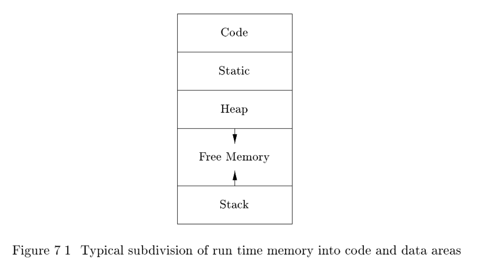

# 7.1 Storage Organization

From the perspective of the compiler writer, the executing target program runs in its own **logical address space** in which each program value has a **location**. The management and organization of this **logical address space** is shared between the compiler, operating system, and target machine. The operating system maps the **logical addresses** into **physical addresses**, which are usually spread throughout memory.

> NOTE: 上面这段的意思是compiler、operating system和target machine遵循中系统的management and organization of this **logical address space** ，那它们之间的阅读是什么呢？是[ELF](https://en.wikipedia.org/wiki/Executable_and_Linkable_Format)吗？
>
> 肯定不是ELF，ELF所描述的是可执行程序的文件格式。本文中的**logical address space**其实是process运行过程中的memory使用情况的抽象模型。

The **run-time** representation of an object program in the **logical address space** consists of **data** and **program** areas as shown in Fig. 7.1. A compiler for a language like `C++` on an operating system like Linux might sub divide memory in this way.

Throughout this book, we assume the **run-time storage** comes in blocks of contiguous bytes, where a byte is the smallest unit of addressable memory(字节是内存的最小编址单元). A byte is eight bits and four bytes form a [machine word](https://en.wikipedia.org/wiki/Computer_word). Multibyte objects are stored in consecutive bytes and given the address of the first byte(多字节数据对象总数存储在一段连续的字节中，并且将第一个字节作为地址).

As discussed in Chapter 6, the amount of storage needed for a name is determined from its **type**. An elementary data type, such as a character, integer,or float, can be stored in an integral number of bytes. Storage for an aggregate type, such as an array or structure, must be large enough to hold all its components.

The storage layout for data objects is strongly influenced by the **addressing constraints** of the target machine. On many machines, instructions to add integers may expect integers to be **aligned**, that is, placed at an address divisible by 4. Although a character array (as in C) of length 10 needs only enough bytes to hold ten characters, a compiler may allocate 12 bytes to get the proper alignment, leaving 2 bytes unused. Space left unused due to alignment considerations is referred to as **padding**. When space is at a premium, a compiler may pack data so that no **padding** is left; additional instructions may then need to be executed at run time to position packed data so that it can be operated on as if it were properly aligned.

> NOTE: 上面这段中所讨论的问题，在Hardware项目中有对它的专门讨论。

The size of the generated **target code** is fixed at compile time, so the compiler can place the executable target code in a statically determined area ***Code***,usually in the low end of memory. Similarly, the size of some **program data objects**, such as **global constants**, and **data generated by the compiler**, such as
information to support garbage collection, may be known at **compile time**, and these data objects can be placed in another statically determined area called ***Static***. One reason for statically allocating as many data objects as possible is that the **addresses** of these objects can be compiled into the **target code**. In early versions of Fortran, all data objects could be allocated statically.

> NOTE: 编译器是知道statically allocating data objects的地址的，所以它能够使用它们的地址来替代它们。

To maximize the utilization of space at **run time**, the other two areas, ***Stack*** and ***Heap***, are at the opposite ends of the remainder of the **address space**. These areas are **dynamic**; their size can change as the program executes. These areas grow towards each other as needed. The stack is used to store data structures called ***activation records*** that get generated during procedure calls.

> NOTE: 关于***activation records***，参见[Call stack](https://en.wikipedia.org/wiki/Call_stack)。

In practice, the ***stack*** grows towards lower addresses, the ***heap*** towards higher. However, throughout this chapter and the next we shall assume that the ***stack*** grows towards higher addresses so that we can use positive offsets for notational convenience in all our examples.

As we shall see in the next section, an **activation record** is used to store information about the status of the machine, such as the value of the **program counter** and **machine registers**, when a **procedure call** occurs. When control returns from the call, the activation of the **calling procedure** can be restarted after restoring the values of relevant registers and setting the program counter to the point immediately after the call. **Data objects** whose lifetimes are contained in that of an activation can be allocated on the stack along with other information associated with the activation.

> NOTE:  本地所描述的是对memory area Stack使用，显然，它主要用于函数调用。
>
> **calling procedure**的意思是主调函数。
>
> 关于program counter，参见[Program counter](https://en.wikipedia.org/wiki/Program_counter)。

Many programming languages allow the programmer to allocate and deallocate data under program control. For example, C has the functions `malloc` and `free `that can be used to obtain and give back arbitrary chunks of storage. The heap is used to manage this kind of long-lived data. Section 7.4 will
discuss various memory-management algorithms that can be used to maintain the heap.

> NOTE: 本段所描述的对memory area Heap的使用。

## 7.1.1 Static Versus Dynamic Storage Allocation

The layout and allocation of data to memory locations in the **run-time** environment are key issues in **storage management**. These issues are tricky because the same name in a program text can refer to multiple locations at run time. The two adjectives ***static*** and ***dynamic*** distinguish between **compile time** and **run time**, respectively. We say that a storage-allocation decision is ***static***, if it can be made by the **compiler** looking only at the text of the program, not at what the program does when it executes. Conversely, a decision is ***dynamic*** if it can be decided only while the program is running. Many compilers use some combination of the following two strategies for dynamic storage allocation:

1. **Stack storage**. Names local to a procedure are allocated space on a **stack**. We discuss the run-time stack starting in Section 7.2. The stack supports the normal call/return policy for procedures
2. **Heap storage**. Data that may outlive the call to the **procedure** that created it is usually allocated on a heap of reusable storage. We discuss heap management starting in Section 7.4. The heap is an area of **virtual memory** that allows objects or other data elements to obtain storage when they are created and to return that storage when they are invalidated

To support **heap management**, garbage collection enables the **run-time system** to detect useless data elements and reuse their storage, even if the programmer does not return their space explicitly. **Automatic garbage collection** is an essential feature of many modern languages, despite it being a difficult operation to do efficiently; it may not even be possible for some languages

