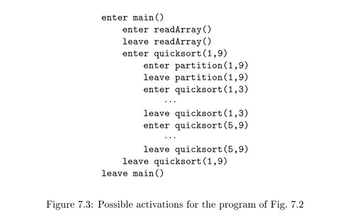

# 7.2 Stack Allocation of Space

Almost all compilers for languages that use procedures, functions, or methods as units of user-defined actions manage at least part of their run-time memory as a **stack**. Each time a **procedure** is called, space for its **local variables** is pushed onto a **stack**, and when the procedure terminates, that space is popped
off the stack. As we shall see, this arrangement not only allows space to be shared by procedure calls whose durations do not overlap in time, but it allows us to compile code for a procedure in such a way that the **relative addresses** of its **nonlocal variables** are always the same, regardless of the sequence of procedure calls.

> NOTE: 上面这段话中的**nonlocal variables**，参见[Non-local variable](https://en.wikipedia.org/wiki/Non-local_variable)。

## 7.2.1 Activation Trees

Stack allocation would not be feasible if procedure calls, or activations of procedures, did not **nest in time**. The following example illustrates nesting of procedure calls.

> NOTE: **nest in time**会在后面进行详细说明。

**Example 7.1** : Figure 7.2 contains a sketch of a program that reads nine integers into an array `a` and sorts them using the **recursive quicksort algorithm**.

```c
int a[11];
void readArray() { /* Reads 9 integers into a[1]; :::; a[9]. */
    int i;
    ...
}
int partition(int m, int n) {
/* Picks a separator value v , and partitions a[m .. n] so that
a[m , p - 1] are less than v , a[p] = v , and a[p + 1 , n] are
equal to or greater than v . Returns p. */
	...
}
void quicksort(int m, int n) {
    int i;
    if (n > m) {
	    i = partition(m, n);
    	quicksort(m, i-1);
    	quicksort(i+1, n);
	}
}
main() {
    readArray();
    a[0] = -9999;
    a[10] = 9999;
    quicksort(1,9);
}
```

Figure 7.2: Sketch of a `quicksort` program

The main function has three tasks. It calls `readArray`, sets the sentinels, and then calls `quicksort` on the entire data array. Figure 7.3 suggests a sequence of calls that might result from an execution of the program. In this execution, the call to `partition (1, 9)` returns 4, so `a[1]`through `a[3]` hold elements less than its chosen separator value `v` , while the larger elements are in `a[5]` through `a[9]`. 




In this example, as is true in general, **procedure activations are nested in time**. If an activation of procedure `p` calls procedure `q` , then that activation of `q` must end before the activation of `p` can end. There are three common cases:

1. The activation of `q` terminates normally. Then in essentially any language, control resumes just after the point of `p` at which the call to `q` was made.
2. The activation of `q` , or some procedure `q` called, either directly or indirectly, aborts; i.e., it becomes impossible for execution to continue. In that case, `p` ends simultaneously with `q` .
3. The activation of `q` terminates because of an exception that `q` cannot handle. Procedure `p` may handle the exception, in which case the activation of `q` has terminated while the activation of `p` continues, although not necessarily from the point at which the call to `q` was made. If `p` cannot handle
   the exception, then this activation of `p` terminates at the same time as the activation of `q` , and presumably the exception will be handled by some other open activation of a procedure.

We therefore can represent the activations of procedures during the running of an entire program by a tree, called an ***activation tree***. Each node corresponds to one activation, and the root is the activation of the "main" procedure that initiates execution of the program. At a node for an activation of procedure `p`,
the children correspond to activations of the procedures called by this activation of `p`. We show these activations in the order that they are called, from left to right. Notice that one child must finish before the activation to its right can begin.

> NOTE: 通过上面的描述，我们应该能够理解在本节第一段中提出的**nest in time**的含义了，nest的中文意思是嵌套，其实可以使用括号来进行类比nest in time，进入函数就相当于开括号，退出函数就相当于闭括号，这样函数调用的过程就可以使用括号来进行表示了，nest in time相当于说是括号是完全匹配的。


Example 7.2 : One possible activation tree that completes the sequence of calls and returns suggested in Fig. 7.3 is shown in Fig. 7.4. Functions are represented by the first letters of their names. Remember that this tree is only one possibility, since the arguments of subsequent calls, and also the number of calls along any branch is influenced by the values returned by partition. 

The use of a run-time stack is enabled by several useful relationships between the **activation tree** and the behavior of the program:

1. The sequence of procedure calls corresponds to a preorder traversal of the activation tree.
2. The sequence of returns corresponds to a postorder traversal of the activation tree.
3. Suppose that control lies within a particular activation of some procedure, corresponding to a node N of the activation tree. Then the activations that are currently open (live ) are those that correspond to node N and its ancestors. The order in which these activations were called is the order in which they appear along the path to N , starting at the root, and they will return in the reverse of that order.

> NOTE: 虽然可以使用activation tree来刻画函数执行过程，但是实际的执行过程对应的是activation tree中的一条路径，正如上面这段话所说的“ Then the activations that are currently open (live ) are those that correspond to node N and its ancestors.”

## 7.2.2 Activation Records

Procedure calls and returns are usually managed by a run-time stack called the **control stack**. Each **live activation** has an **activation record** (sometimes called a **frame**) on the **control stack**, with the root of the activation tree at the bottom, and the entire sequence of activation records on the stack corresponding to the **path** in the activation tree to the activation where **control** currently resides. The latter activation has its record at the top of the stack.

**Example 7.3** : If control is currently in the activation `q (2; 3)` of the tree of Fig. 7.4, then the activation record for `q (2; 3)` is at the top of the **control stack**. Just below is the activation record for `q (1; 3)`, the parent of `q (2; 3)` in the tree. Below that is the activation record `q (1; 9)`, and at the bottom is the activation record for `m`, the main function and root of the activation tree.

We shall conventionally draw **control stacks** with the bottom of the stack higher than the top, so the elements in an activation record that appear lowest on the page are actually closest to the top of the stack.

The contents of activation records vary with the language being implemented. Here is a list of the kinds of data that might appear in an **activation record** (see Fig. 7.5 for a summary and possible order for these elements):


1. **Temporary values**, such as those arising from the evaluation of expressions, in cases where those temporaries cannot be held in registers.
2. **Local data** belonging to the procedure whose activation record this is.
3. A **saved machine status**, with information about the state of the machine just before the call to the procedure. This information typically includes the **return address** (value of the **program counter**, to which the called procedure must return) and the contents of registers that were used by the **calling procedure** and that must be restored when the return occurs.
4. An "**access link**" may be needed to locate data needed by the called procedure but found elsewhere, e.g., in another activation record. Access links are discussed in Section 7.3.5.
5. A **control link**, pointing to the activation record of the caller.
6. Space for the return value of the **called function**, if any. Again, not all called procedures return a value, and if one does, we may prefer to place that value in a register for efficiency.
7. The actual parameters used by the **calling procedure**. Commonly, these values are not placed in the **activation record** but rather in registers, when possible, for greater efficiency. However, we show a space for them to be completely general.

