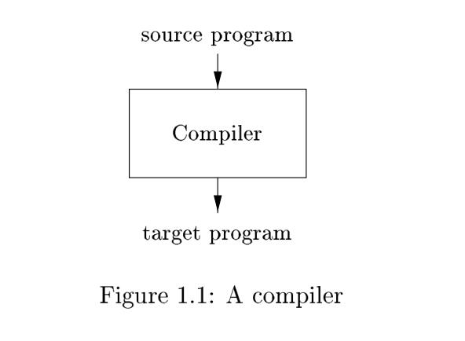
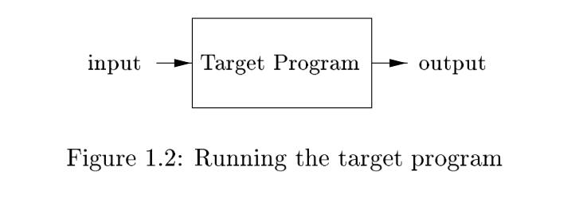
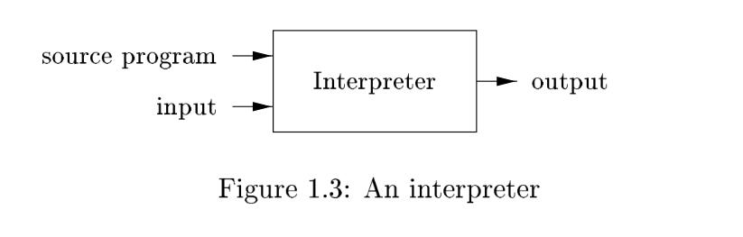
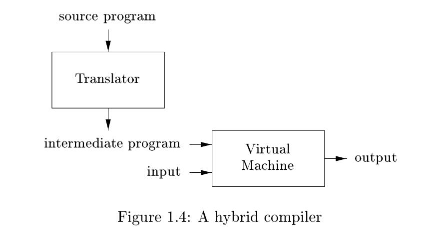
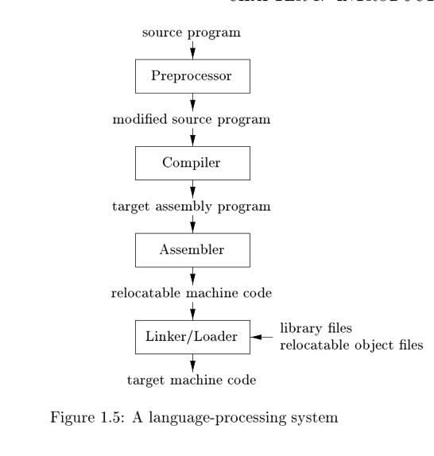

# 1.1 Language Processors

Simply stated, a **compiler** is a program that can read a program in one language--the *source* language--and **translate** it into an equivalent program in another language--the *target* language; see Fig. 1.1. An important role of the compiler is to report any errors in the source program that it detects during the translation process.

> See also: [Compiler](https://en.wikipedia.org/wiki/Compiler)

If the **target program** is an **executable machine-language program**, it can then be called by the user to process inputs and produce outputs; see Fig. 1.2.

> See also: 
>
> - [Machine code](https://en.wikipedia.org/wiki/Machine_code)
> - [Executable](https://en.wikipedia.org/wiki/Executable)

> NOTE: The compiler definition given here is very broad because **target programs** can take many forms, not just **executable machine-language programs**. As stated in article [Is Python interpreted or compiled? Yes.](https://nedbatchelder.com/blog/201803/is_python_interpreted_or_compiled_yes.html):
>
> [Compiling](https://en.wikipedia.org/wiki/Compiler) is a more general idea: take a program in one language (or form), and convert it into another language or form. Usually the source form is a higher-level language than the destination form, such as when converting from C to machine code. But converting from JavaScript 8 to JavaScript 5 is also a kind of compiling.
>
> In Python, the source is compiled into a much simpler form called [bytecode](https://en.wikipedia.org/wiki/Bytecode). 

An **interpreter** is another common kind of language processor. Instead of producing a **target program** as a translation, an interpreter appears to directly execute the operations specified in the **source program** on inputs supplied by the user, as shown in Fig. 1.3.

The machine-language target program produced by a compiler is usually much faster than an interpreter at mapping inputs to outputs . An interpreter, however, can usually give better error diagnostics than a compiler, because it executes the source program statement by statement.

> NOTE: Executing the source program statement by statement is the feature of interpreter and it is impossible for advanced programming language to be so. 
>
> Typical interpreter is shell:
>
> - bash 
> - redis server's execution of command committed by the client can also be seen as an interpreter just as shell

Java language processors combine **compilation** and **interpretation**, as shown in Fig. 1.4. A Java source program may first be compiled into an intermediate form called [bytecode](https://en.wikipedia.org/wiki/Bytecode). The bytecodes are then interpreted by a **virtual machine**. A benefit of this arrangement is that bytecodes compiled on one machine can be interpreted on another machine, perhaps across a network.

> See also:
>
> - [Virtual machine](https://en.wikipedia.org/wiki/Virtual_machine)

In order to achieve faster processing of inputs to outputs, some Java compilers, called *just-in-time* compilers, translate the bytecodes into machine language immediately before they run the intermediate program to process the input. 

> See also: 
>
> - [Just-in-time compilation](https://en.wikipedia.org/wiki/Just-in-time_compilation)

> NOTE: language processor：
>
> - compiler, such as c, `c++`
> - interpreter, such as shell script
> - hybrid compiler, such as python and java 

> NOTE: Python is similar to Java in combining **compilation** and **interpretation**, but there are difference between the two language. The following is an good article explaining python implementation:
>
> - [Is Python interpreted or compiled? Yes.](https://nedbatchelder.com/blog/201803/is_python_interpreted_or_compiled_yes.html)
>
> This post is very informative and clear and can help understand the content in this chapter.

In addition to a compiler, several other programs may be required to create an executable target program, as shown in Fig. 1.5. 

- [preprocessor](https://en.wikipedia.org/wiki/Preprocessor)
- [assembler](https://en.wikipedia.org/wiki/Assembly_language#Assembler)
- [linker](https://en.wikipedia.org/wiki/Linker_(computing))
- [loader](https://en.wikipedia.org/wiki/Loader_(computing))

> NOTE: This book focus only on compiler and the others is not included.

> NOTE: 以下是一些补充内容，在一些文章中可能会提到：
>
> - [Dynamic compilation](https://en.wikipedia.org/wiki/Dynamic_compilation)
>
> - [Dynamic vs Static Compiler (JavaScript)](https://stackoverflow.com/questions/7180763/dynamic-vs-static-compiler-javascript)
>
> - [Why Static Compilation?](https://www.usenix.org/legacy/publications/library/proceedings/jvm02/yu/yu_html/node3.html)