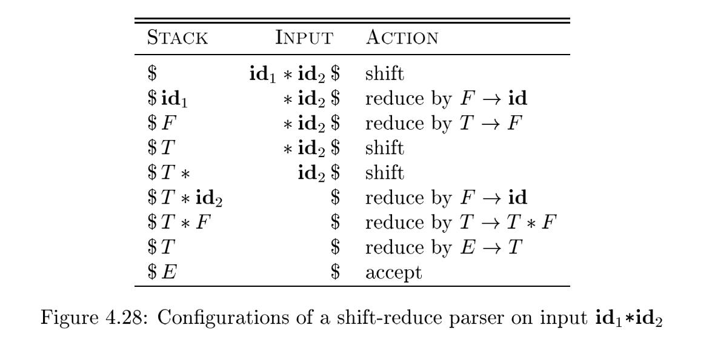

# 4.5 Bottom-Up Parsing

A bottom-up parse corresponds to the construction of a parse tree for an input string beginning at the leaves (the bottom) and working up towards the root(the top). It is convenient to describe parsing as the process of building parse trees, although a front end may in fact carry out a translation directly without
building an explicit tree. The sequence of tree snapshots in Fig. 4.25 illustrates a bottom-up parse of the token stream $id \ast id$, with respect to the expression grammar (4.1).

> NOTE: Thinking of parsing as the process of building parse trees can help us grasp the content more easily.

This section introduces a general style of **bottom-up parsing** known as **shift-reduce parsing**. The largest class of grammars for which **shift-reduce parsers** can be built, the **LR grammars**, will be discussed in Sections 4.6 and 4.7. Although it is too much work to build an **LR parser** by hand, tools called automatic parser generators make it easy to construct efficient **LR parsers** from suitable grammars. The concepts in this section are helpful for writing suitable grammars to make effective use of an LR parser generator. Algorithms for implementing parser generators appear in Section 4.7.

> NOTE:  **LR parser** uses **shift-reduce parsing**.

## 4.5.1 Reductions

> NOTE: Reduction is the reverse of derivation.

We can think of **bottom-up parsing** as the process of  "reducing" a string $w$ to the **start symbol** of the grammar. At each reduction step, a specific substring matching the body of a production is replaced by the nonterminal at the head of that production.

The key decisions during bottom-up parsing are about when to reduce and about what production to apply, as the parse proceeds.

**Example 4.37 :** The snapshots in Fig. 4.25 illustrate a sequence of reductions; the grammar is the expression grammar (4.1). The reductions will be discussed in terms of the sequence of strings
$$
id \ast id, F \ast id, T \ast id, T \ast F, T, E
$$
The strings in this sequence are formed from the roots of all the subtrees in the snapshots. The sequence starts with the input string $id \ast id$. The first reduction produces $F \ast id$ by reducing the leftmost $id$ to $F$ , using the production $F \to id$. The second reduction produces $T \ast id$ by reducing $F$ to $T$ .

By definition, a reduction is the reverse of a step in a derivation (recall that in a derivation, a nonterminal in a sentential form is replaced by the body of one of its productions). The goal of bottom-up parsing is therefore to construct a derivation in reverse. The following corresponds to the parse in Fig. 4.25:
$$
E \Rightarrow T \Rightarrow T \ast F \Rightarrow T \ast id \Rightarrow F \ast id \Rightarrow id \ast id
$$
This derivation is in fact a **rightmost derivation**.

> NOTE:  We know that Reduction is the reverse of derivation, so what is done first in reduction is done later in production. 
>
> The last paragraph concludes with a very important conclusion but the reasoning is a bit murky. I didn't get it right the first time I read it. Here is my analysis of the conclusion.
>
> Given grammar, we can choose **leftmost derivation** or **rightmost derivation** to derivate the parse tree. No matter order of derivation, the resulting **parse tree**  and the resulting **sentence** is the same, but the derivation process is different. This is equivalent to that the shape of the **parse tree** is the same but the process of construction is different. In **leftmost derivation**, the left subtree is always constructed first and then the right subtree, so the right of the sentence is always derivated first while in rightmost derivation the order is reverse. 
>
> Now let's turn our attention to reduction. A bottom-up parse corresponds to the construction of a parse tree for an input string beginning at the leaves (the bottom) and working up towards the root(the top). Fig. 4.25 illustrate the process of bottom-up construction of the parse tree. Given a sentence,  bottom-up parser choose to reduce from left symbol to right symbol, so it always construct the subtree from lower left corner to upper right corner until the complete parse tree. It is obvious that eventually it will be able to construct a complete parse tree. The order of productions used in its construction is the exact opposite of the rightmost derivation. 
>
> parsing是根据input symbol来逆推其derivation的过程，parser对input symbol的处理是固定从左至右的，一次处理一个字符，因此它只能够将input symbol中左侧的terminal逐个规约为non-terminal，然后再跟input symbol中余下的terminal一起进行规约。显然这个过程是从左至右的，规约是derivation的逆过程，从左至右的reduction对应的是从右至左的derivation，所以right-most derivation被称为canonical derivation。
>
> 为什么right-most derivation的过程可以通过input symbol倒推出来呢？而left-most derivation的过程无法通过input symbol倒推出来呢？还是要把握一点：parser对input symbol是从左至右进行处理的，所以它只能够仅仅根据已经读到的terminal symbol来进行reduction，而无需依赖于后面的未读入的字符。在left-most derivation中，优先derivate 的是left-most的non-terminal。

## 4.5.2 Handle Pruning

Bottom-up parsing during a left-to-right scan of the input constructs a right-most derivation in reverse.

Formally, if $S \xrightarrow [rm]{\ast} \alpha A w \xrightarrow [rm]{\ast}  \alpha \beta w $ , as in Fig. 4.27, then production $A \to \beta $ in the position following $\alpha$ is a *handle* of $\alpha \beta w$ .  Alternatively, a **handle** of a right-sentential form $\gamma $ is a production $A \to \beta$ and a position of $\gamma$ where the string $\beta$ may be found, such that replacing $\beta$ at that position by $A$ produces the previous right-sentential form in a rightmost derivation of $\gamma$ .

Notice that the string $w$ to the right of the **handle** must contain only terminal symbols. 

> NOTE: This is because rightmost derivation always choose the rightmost nonterminal to expand;

A rightmost derivation in reverse can be obtained by "handle pruning." That is, we start with a string of terminals $w$ to be parsed. If $w$ is a sentence of the grammar at hand, then let $w = \gamma _n$, where $\gamma _n$
is the $n$th right-sentential form of some as yet unknown rightmost derivation
$$
S = \gamma 0 \xrightarrow [rm] {} \gamma 1 \xrightarrow [rm] {}
\gamma 2 \xrightarrow [rm] {} \ldots \xrightarrow [rm] {}\gamma _{n-1} \xrightarrow [rm] {} \gamma _n
= w
$$
To reconstruct this derivation in reverse order, we locate the **handle** $\beta_n$ in $\gamma_n$ and replace $\beta_n$ by the head of the relevant production $A_n \to \beta_n $ to obtain the previous right-sentential form $\gamma_{n-1}$. Note that we do not yet know how handles are to be found, but we shall see methods of doing so shortly. We then repeat this process. That is, we locate the handle $\beta_{n-1}$ in $\gamma_{n-1}$ and reduce this handle to obtain the right-sentential form $\gamma_{n-2}$. If by continuing this process we produce a right-sentential form consisting only of the start symbol $S$ , then we halt and announce successful completion of parsing. The reverse of the sequence of productions used in the reductions is a rightmost derivation for the input string.

## 4.5.3 Shift-Reduce Parsing

**Shift-reduce parsing** is a form of bottom-up parsing in which a stack holds grammar symbols and an input buffer holds the rest of the string to be parsed. As we shall see, the **handle** always appears at the top of the stack just before it is identified as the **handle**.

Up on entering this **configuration**, the parser halts and announces successful completion of parsing. Figure 4.28 steps through the actions a shift-reduce parser might take in parsing the input string $id \ast id$ according to the expression grammar (4.1).

While the primary operations are shift and reduce, there are actually four possible actions a shift-reduce parser can make: (1) shift, (2) reduce, (3) accept, and (4) error.

1. *Shift*. Shift the next input symbol onto the top of the stack.
2. *Reduce*. The right end of the string to be reduced must be at the top of the stack. Locate the left end of the string within the stack and decide with what nonterminal to replace the string.
3. *Accept*. Announce successful completion of parsing.
4. *Error*. Discover a syntax error and call an error recovery routine.

The use of a **stack** in **shift-reduce parsing** is justified by an important fact: the **handle** will always eventually appear on top of the stack, never inside. This fact can be shown by considering the possible forms of two successive steps in any **rightmost derivation**. Figure 4.29 illustrates the two possible cases. In case (1), $A$ is replaced by $\beta B y$ , and then the rightmost nonterminal $B$ in the body  $\beta B y$ is replaced by $gamma$ .

In case (2), $A$ is again expanded first, but this time the body is a string $y$ of terminals only. The next rightmost nonterminal $B$ will be somewhere to the left of $y$ .

> NOTE: The proof is omitted because I think it's a natural conclusion. If you read the note in 4.5.1 Reductions, you will find the conclusion is easy to understand. Here the author enumerates one example to support this.

## 4.5.4 Conflicts During Shift-Reduce Parsing

There are context-free grammars for which shift-reduce parsing cannot be used. Every shift-reduce parser for such a grammar can reach a configuration in which the parser, knowing the entire stack and also the next k input symbols, cannot decide whether to shift or to reduce (a *shift/reduce conflict*), or cannot decide which of several reductions to make (a *reduce/reduce conflict*). We now give some examples of syntactic constructs that give rise to such grammars. Technically, these grammars are not in the *LR(k)* class of grammars defined in Section 4.7; we refer to them as **non-LR grammars**. The k in LR(k) refers to the number of symbols of lookahead on the input. Grammars used in compiling usually fall in the LR(1) class, with one symbol of lookahead at most.

