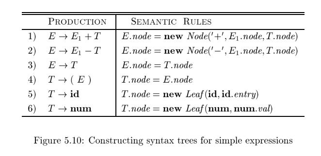

# 5.3 Applications of Syntax-Directed Translation

The syntax-directed translation techniques in this chapter will be applied in Chapter 6 to type checking and intermediate-code generation. Here, we consider selected examples to illustrate some representative SDD's.

The main application in this section is the construction of **syntax trees**. Since some compilers use **syntax trees** as an **intermediate representation**, a common form of SDD turns its input string into a tree. To complete the translation to **intermediate code**, the compiler may then walk the **syntax tree**, using another set of rules that are in effect an SDD on the syntax tree rather than the parse tree. (Chapter 6 also discusses approaches to intermediate-code generation that apply an SDD without ever constructing a tree explicitly.)

We consider two SDD's for constructing **syntax trees** for expressions. The first, an S-attributed definition, is suitable for use during bottom-up parsing. The second, L-attributed, is suitable for use during top-down parsing.

The final example of this section is an L-attributed definition that deals with basic and array types.

## 5.3.1 Construction of Syntax Trees

As discussed in Section 2.8.2, each node in a syntax tree represents a construct; the children of the node represent the meaningful components of the construct. A syntax-tree node representing an expression $E_1 + E_2$ has label `+` and two children representing the sub expressions $E_1$ and $E_2$.

We shall implement the nodes of a syntax tree by objects with a suitable number of fields. Each object will have an `op` field that is the label of the node. The objects will have additional fields as follows:

- If the node is a leaf, an additional field holds the lexical value for the leaf. A constructor function `Leaf (op, val )` creates a leaf object. Alternatively, if nodes are viewed as records, then `Leaf` returns a pointer to a new record for a leaf.
- If the node is an **interior node**, there are as many additional fields as the node has children in the **syntax tree**. A constructor function `Node` takes two or more arguments: $Node(op, c_1, c_2, c_3, \dots, c_k)$ creates an object with  first field `op` and k additional fields for the `k` children $c_1, c_2, c_3, \dots, c_k$.

**Example 5.11 :** The S-attributed definition in Fig. 5.10 constructs syntax trees for a simple expression grammar involving only the binary operators `+` and `-`. As usual, these operators are at the same precedence level and are jointly left associative. All nonterminals have one synthesized attribute `node` ,
which represents a node of the syntax tree.

Every time the first production $E \to E_1 + T$  is used, its rule creates a node with `+` for `op` and two children, $E_1.node$ and $T.node$, for the sub expressions. The second production has a similar rule.

For production 3, $E \to T$ , no node is created, since $E.node$ is the same as $T.node$. Similarly, no node is created for production 4, $T \to (E)$. The value of `T.node` is the same as `E.node`, since parentheses are used only for grouping; they influence the structure of the **parse tree** and the **syntax tree**, but once their
job is done, there is no further need to retain them in the **syntax tree**.

