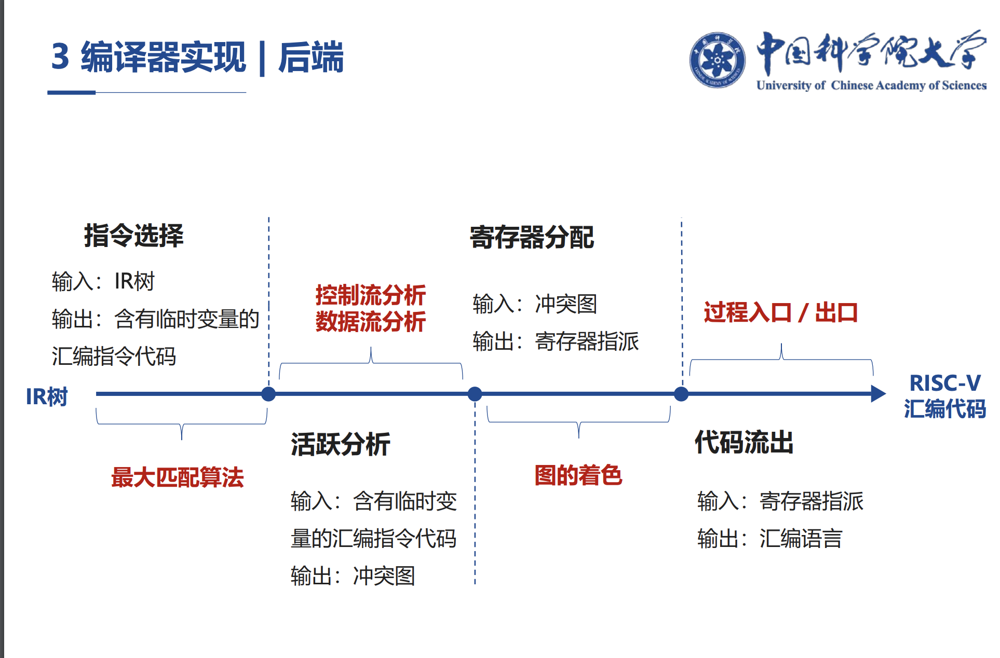

# Code generation

instruction selection(指令选择): Tree Covering(最大覆盖算法、树覆盖算法)

register allocation(寄存器分配): [graph coloring](https://en.wikipedia.org/wiki/Graph_coloring)(图染色算法)

## zhihu [依赖于机器的优化](https://zhuanlan.zhihu.com/p/420299098) 

代码生成部分 主要考虑三点：

1、指令的选择。同样一个功能，可以用不同的指令或指令序列来完成，而我们需要选择比较优化的方案：生成更简短的代码；从多种可能的指令中选择最优的。==> 树覆盖算法

> NOTE:
>
> 一、英文翻译为: instruction selection，这在 cnblogs [LLVM笔记(9) - 指令选择(一) 概述 ](https://www.cnblogs.com/Five100Miles/p/12822190.html) 中提及:
>
> > 常见的指令选择实现可以参见经典书籍[Survey on Instruction Selection](https://arxiv.org/ftp/arxiv/papers/1306/1306.4898.pdf)

2、寄存器分配。每款 CPU 的寄存器都是有限的，我们要有效地利用它。==> 寄存器共享原则 ==> 图染色算法

3、指令重排序。计算执行的次序会影响所生成的代码的效率。在不影响运行结果的情况下，我们要通过代码重排序获得更高的效率。 算法排序的关键点，是要找出代码之间的数据依赖关系 ==> 数据的依赖图，给图中的每个节点再加上两个属性：一是操作类型，因为这涉及它所需要的功能单元；二是时延属性，也就是每条指令所需的时钟周期。==> List Scheduling算法

## LLVM

### cnblogs [LLVM笔记(9) - 指令选择(一) 概述 ](https://www.cnblogs.com/Five100Miles/p/12822190.html)

#### 什么是指令选择

指令选择(instruction selection)是将中间语言转换成汇编或机器代码的过程. 如果仅为单一语言在单一目标上实现指令选择, 可以使用手工编码的方法. 否则通过使用自动代码生成器生成代码, 编译器开发人员只需负责修改不同目标的机器指令描述, 是更优选择.

#### 常见的指令选择实现

常见的指令选择实现可以参见经典书籍[Survey on Instruction Selection](https://arxiv.org/ftp/arxiv/papers/1306/1306.4898.pdf)(这块内容以后有空单独再介绍).

1、宏展开(macro expension)

2、树覆盖(tree covering)

3、有向图覆盖(DAG covering)

#### LLVM当前的指令选择实现

LLVM在O0编译时使用名为FastISel的指令选择PASS, 在O2编译时使用名为SelectionDAG的指令选择PASS, 同时当前社区还在推进名为GlobalISel的指令选择PASS(当前仅在AArch64上支持), 希望能替代SelectionDAG. 我们将首先介绍SelectionDAG(如未特殊说明, 下文介绍均默认为SelectionDAG), 然后会简要介绍FastISel与GlobalISel, 并比较三者特点, 讨论为什么要使用GlobalISel替换SelectionDAG.

### [The LLVM Target-Independent Code Generator](https://llvm.org/docs/CodeGenerator.html#the-llvm-target-independent-code-generator)

### arxiv [Survey on Instruction Selection](https://arxiv.org/ftp/arxiv/papers/1306/1306.4898.pdf)

> NOTE:
>
> 一、中文翻译
>
> csdn [指令选择器调查（1）](https://blog.csdn.net/wuhui_gdnt/article/details/50541566)
>
> csdn [指令选择器调查（2）](https://blog.csdn.net/wuhui_gdnt/article/details/50855260)
>
> 
>
> csdn [指令选择器调查（4）](https://blog.csdn.net/wuhui_gdnt/article/details/51460474)
>
> 

## crvf2019 [一种面向RISC-V的编译原理 教学方案探索](https://crvf2019.github.io/pdf/09.pdf)

## LLVM TableGen 

LLVM [TableGen Overview](https://llvm.org/docs/TableGen/)

是在阅读 zhihu [依赖于机器的优化](https://zhuanlan.zhihu.com/p/420299098) 时发现的LLVM TableGen 

## zhihu [有没有编译原理方面专注于介绍后端优化的书籍？](https://www.zhihu.com/question/286448774)

book 计算机系统结构量化研究方法