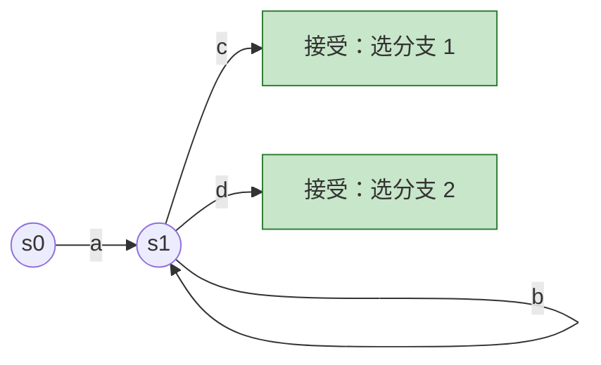
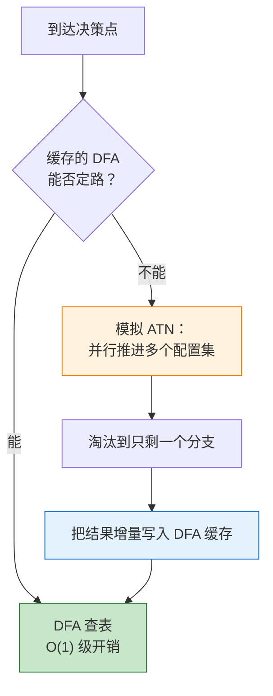
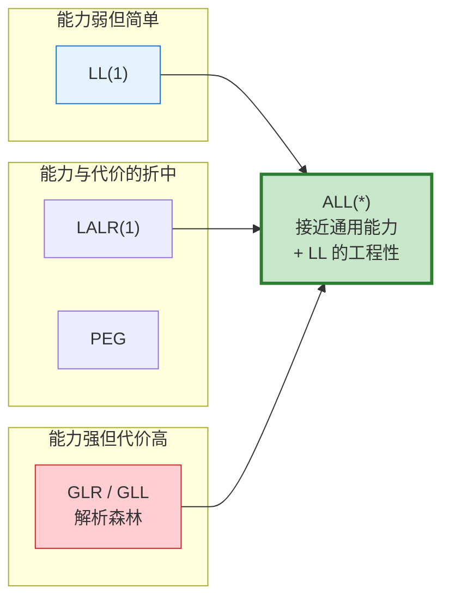

# ANTLR 的突破：从 LL(k) 到 ALL(*)

> **一句话概括**：ANTLR 最核心的突破是 **把文法分析从编译期搬到运行期**——在真实输入与真实调用栈上做解析决策，并把结果增量缓存为 DFA。由此自顶向下的递归下降解析器获得了接近通用 CFG 的识别能力，同时保住了 LL 解析器的**可读性**、**可调试性**与**近线性性能**。这一成果集中体现在 ANTLR 4 的 **ALL(\*)（Adaptive LL(\*)）** 算法上。
> 
> 而更早的**线性近似前瞻**，则是让 $k>1$ 的 LL(k) 从"理论上指数不可行"变为"工程上可行"的那个转折点。

---

## 目录

- [1. 背景：LL 为什么长期输给 LR](#1-背景ll-为什么长期输给-lr)
- [2. 时间线：三十余年的一串贡献](#2-时间线三十余年的一串贡献)
- [3. 线性近似前瞻：让 LL(k>1) 落地](#3-线性近似前瞻让-llk1-落地)
- [4. 谓词解析：把"何时回溯"交给文法作者](#4-谓词解析把何时回溯交给文法作者)
- [5. 树构造与树文法：Lexing = Parsing = Tree Parsing](#5-树构造与树文法lexing--parsing--tree-parsing)
- [6. LL(*)：用 DFA 表示任意长前瞻](#6-ll用-dfa-表示任意长前瞻)
- [7. ALL(*)：把文法分析推迟到运行期](#7-all把文法分析推迟到运行期)
- [8. 附带红利：自动消除直接左递归](#8-附带红利自动消除直接左递归)
- [9. 与其他解析技术的对比](#9-与其他解析技术的对比)
- [10. 工程与生态层面的贡献](#10-工程与生态层面的贡献)
- [11. 边界与代价：ANTLR 没有解决什么](#11-边界与代价antlr-没有解决什么)
- [12. 与教材知识的衔接](#12-与教材知识的衔接)
- [13. 总结](#13-总结)
- [14. 参考资料](#14-参考资料)

---

## 1. 背景：LL 为什么长期输给 LR

在 ANTLR 出现之前，解析器生成器的主流是 LR 系（Yacc、Bison、CUP 等）。LL 系工具虽然生成的代码更贴近人类手写风格，却在两条战线上同时失利。

### 1.1 表达能力上的劣势

LL 系在文法表达能力上明显弱于 LR：

| 文法特性   | LL(1)       | LALR(1)     |
| ------ | ----------- | ----------- |
| 左递归    | 禁止，必须手动消除   | 天然支持，且是推荐写法 |
| 公共左前缀  | 需手动做左因子提取   | 无需处理        |
| 决策所需信息 | 只能看未来 1 个记号 | 归约时整个右部已在栈上 |

这个差距的根源在于决策时机：LR 在**归约**时决策，此时产生式右部已经完整出现在栈上；LL 必须在**展开**时决策，也就是在只看到少量未来记号的情况下预测该走哪条产生式。

### 1.2 工程上的劣势

理论上把前瞻长度 $k$ 加大就能提升 LL 的能力，但代价是灾难性的：

$$
\text{存储一个 LL}(k)\text{ 前瞻集的空间} = O(|T|^k)
$$

其中 $|T|$ 是词汇表（终结符集合）大小。$k$ 每增加 1，规模指数级膨胀。因此在 Parr 之前，**没有实用的 $k>1$ 的 LL 解析器生成器**，工业界只能停留在 LL(1)。

ANTLR 的整条技术路线，可以看作是对这两条劣势的逐次攻克。

---

## 2. 时间线：三十余年的一串贡献

| 时期        | 版本                 | 核心技术                           | 解决的问题                  |
| --------- | ------------------ | ------------------------------ | ---------------------- |
| 1989–1992 | PCCTS 1.00         | **线性近似前瞻**                     | 让 $k>1$ 的 LL(k) 在工程上可行 |
| 1993 起    | ANTLR 1.x–2.x      | **语义谓词 + 语法谓词**                | 用运行期信息与选择性回溯消解歧义       |
| 1990s 后期  | ANTLR 2 / SORCERER | **树构造算子与树文法**                  | 把文法思想推广到 AST 匹配与改写     |
| 2011      | ANTLR 3            | **LL(\*)**（PLDI 2011）          | 用 DFA 表示任意长（正则）前瞻      |
| 2013–2014 | ANTLR 4            | **ALL(\*)**（OOPSLA 2014）       | 文法分析移到运行期；支持任意非左递归 CFG |
| 2013 起    | ANTLR 4            | **Listener / Visitor + 自动解析树** | 文法与应用逻辑解耦              |

> 说明：PCCTS 起始于 1989 年（Purdue 大学），不同资料对 PCCTS 1.00 的确切发布时间记载略有差异（1991 年底至 1992 年初）；Parr 于 1993 年取得博士学位并发布 ANTLR 1.10。

---

## 3. 线性近似前瞻：让 LL(k>1) 落地

### 3.1 关键洞察

Parr 在博士研究中发现：**计算 LL(k) 前瞻集，本质上是一次"有界的 NFA → DFA 转换"**。既然如此，就可以借用自动机构造的思路来组织计算。

真正带来突破的是一个看似"退让"的设计决定：

> 不再记录 $k$ 元组的**精确集合**，而是把深度 $n\ (1 \le n \le k)$ 上出现的所有符号**各自合并成一个集合**，前瞻信息退化为 $k$ 个集合构成的数组。

### 3.2 精度换复杂度

以两条备选分支为例，若精确前瞻集为：

$$
\{(a, b),\ (c, d)\}
$$

近似后变成两个独立的集合：

$$
L_1 = \{a, c\},\qquad L_2 = \{b, d\}
$$

代价是引入了 $(a,d)$、$(c,b)$ 这两个原本不存在的组合，因此**理论识别能力变弱了**。收益则是复杂度的量级下降：

$$
O(|T|^k) \;\longrightarrow\; O(|T| \times k)
$$

**指数变成了乘数。**

### 3.3 为什么这个妥协是对的

两点让这个近似在实践中站得住：

1. **实测损失很小**：Parr 的测量表明，完整精确前瞻相比线性近似前瞻，只多带来约 5% 的额外识别能力。
2. **可以分级使用**：先用便宜的近似前瞻做过滤，只有在近似前瞻无法区分分支时，才对该决策点动用代价高的精确前瞻。

这正是贯穿 ANTLR 全部版本的设计哲学——**分级决策，把昂贵手段留给少数真正困难的决策点**。PCCTS 1.00 因此成为第一个实用的 $k>1$ 的 LL(k) 解析器生成器。

---

## 4. 谓词解析：把"何时回溯"交给文法作者

有些歧义不是靠"多看几个记号"能解决的，ANTLR 为此提供了两类谓词。

### 4.1 语义谓词（Semantic Predicates）

**用运行期的语义信息参与语法决策。** 经典难题是 C/C++ 中的：

```c
T * x;
```

这既可以是"声明一个 `T` 类型的指针变量 `x`"，也可以是"表达式：`T` 乘以 `x`"。**纯语法无法区分**，必须查符号表看 `T` 是否为类型名。

ANTLR 的写法（示意）：

```antlr
stat : {isTypeName(getCurrentToken().getText())}? declaration
     | expressionStat
     ;
```

"支持谓词"本身在 1970 年代就已出现，Parr 的贡献在于两点工程化处理：

- **谓词提升（hoisting）**：把谓词自动提升到**其他规则**的决策点上。因为当解析器在规则 A 中决定是否进入规则 B 时，判断依据往往写在 B 内部——需要把它"提上来"参与 A 的决策。
- **上下文有效性判定**：自动分析一个谓词在哪些语法上下文中有效，避免在无效上下文中误用。

### 4.2 语法谓词（Syntactic Predicates）

这是 Parr 发明的概念：**把"选择性回溯"变成一个文法算子**，写作 `(...)=>`。

在此之前的解析器生成器只有两种极端：

| 策略   | 代表          | 问题          |
| ---- | ----------- | ----------- |
| 从不回溯 | 传统 LL(1)/LR | 文法表达能力受限    |
| 总是回溯 | 朴素回溯式解析器    | 性能不可控，最坏指数级 |

语法谓词让**回溯与否成为文法作者的显式选择**：生成"有限前瞻 + 按需回溯"的混合决策，只在有限前瞻无法定路时才回溯。

值得注意的是，语法谓词允许的前瞻语言可以是**无限的、甚至非正则的**（因为回溯本质上是在跑一个完整的子解析器），这已经越出了固定 $k$ 或正则前瞻的框架。

---

## 5. 树构造与树文法：Lexing = Parsing = Tree Parsing

### 5.1 AST 构造算子

ANTLR 2 用两个极简的后缀算子声明式地描述 AST 形状：

| 算子  | 含义                            |
| --- | ----------------------------- |
| `^` | 该记号成为**子树根**                  |
| `!` | 该记号**从树中排除**（如分号、括号等无语义价值的符号） |

```antlr
expr : term ('+'^ term)* ;     // '+' 成为子树根
stat : 'return' expr ';'! ;    // 分号不进入 AST
```

### 5.2 树文法与 SORCERER

更进一步的思想是：**既然可以用文法匹配记号流，为什么不用文法匹配树？**

SORCERER 与 ANTLR 2 的树文法就是这个思路的产物——用文法规则匹配并改写 AST，而不是手写一堆访问者代码。Parr 由此提出口号：

$$
\textbf{Lexing} = \textbf{Parsing} = \textbf{Tree Parsing}
$$

三者共用同一套 LL(k) 机制，只是输入分别是字符流、记号流和树节点流。配套还有两个重要抽象：

- **TokenStream**：把词法与语法彻底分离，并支持多通道（channel），例如把注释与空白送入独立通道而不丢弃。
- **错误处理机制**：自动错误恢复 + 生成人类可读的错误消息，这在当年的生成器中相当罕见。

> **后续演变**：ANTLR 4 **放弃了树文法**，理由是它要求文法作者维护两套文法（记号文法 + 树文法）。取而代之的是"自动生成解析树 + Listener/Visitor"（见第 10 节）。

---

## 6. LL(*)：用 DFA 表示任意长前瞻

### 6.1 固定 $k$ 的天花板

考虑这样一条规则：

```antlr
A : a b* c
  | a b* d
  ;
```

两个分支的公共前缀是 `a b*`，其中 `b` 可以重复**任意多次**。要区分它们，必须越过整段 `b*` 去看后面究竟是 `c` 还是 `d`。

**任何固定的 $k$ 都不够用**——只要输入里的 `b` 超过 $k-1$ 个，前瞻窗口内看到的就全是 `b`。

### 6.2 解决方案：前瞻 DFA

LL(\*)（ANTLR 3，PLDI 2011）的做法是把前瞻从"$k$ 个固定深度的集合"升级为**用 DFA 表示的正则前瞻语言**：

- 在**编译期**为每个决策点构造一个前瞻 DFA；
- 解析时把后续记号喂给该 DFA，一直读到它到达某个接受状态，接受状态标注了应选择的备选分支编号；
- DFA 中的**环**恰好可以吞掉 `b*` 这类重复前缀，因此前瞻可以任意远；
- 若 DFA 构造不出来或无法定路，则退回语法谓词 / 回溯。



这让 ANTLR 3 得以处理大量此前必须依赖 LR 或全回溯才能处理的文法。

---

## 7. ALL(*)：把文法分析推迟到运行期

这是最被公认的"突破"。OOPSLA 2014 论文摘要中的原话是：

> *The critical innovation is to move grammar analysis to parse-time, which lets ALL(\*) handle any non-left-recursive context-free grammar.*
> 
> （关键创新是把文法分析移到解析期，这让 ALL(\*) 能处理任何非左递归的上下文无关文法。）

### 7.1 静态分析的死穴

LL(\*) 的前瞻 DFA 是**编译期静态构造**的，这带来两个无法回避的问题：

1. **正则前瞻语言不够用**：某些文法的区分信息本质上不是正则的（需要计数、需要匹配嵌套），DFA 根本表示不了；
2. **静态分析的不可判定性**：编译期要对"所有可能的输入"和"所有可能的调用上下文"做保守推断，很多情形只能放弃。

**根本矛盾在于：编译期是在"猜"。** 它必须为一切可能情况做准备，而绝大多数可能情况在实际运行中从未出现。

### 7.2 ALL(*) 的解法

ALL(\*) 不在编译期猜，而是在**解析时**、面对**真实输入**、在**真实的调用栈上下文**中做决策：

- 文法被编译成 **ATN（Augmented Transition Network，增强转移网络）**——一种保留了文法结构的状态转移网络；
- 遇到决策点时，用一种类 GLR 的机制**并行推进多个 ATN 配置（configuration）的子集**，每个配置记录"状态 + 备选分支编号 + 调用栈"；
- 随着记号逐个消耗，存活的备选分支不断被淘汰，直到只剩一个——那就是答案。



### 7.3 "Adaptive"的含义：自适应缓存

单纯的运行期模拟会很慢。ALL(\*) 的关键工程手段是：**把分析结果增量地缓存成 DFA**。

同一个决策点再次遇到相同的记号序列时，不再模拟 ATN，而是一次 DFA 查表。于是：

- 分析成本随着解析进行被**摊销**掉；
- 缓存内容完全由**实际出现的输入**决定，而非文法理论上允许的全部输入——这正是 "Adaptive" 的含义；
- 一个长期运行的进程（如 IDE、数据库的 SQL 解析器）会逐渐"热"起来，趋近纯 DFA 查表的速度。

ANTLR 4 运行时还提供两级预测模式：

| 模式               | 是否考虑调用栈上下文 | 特点               |
| ---------------- | ---------- | ---------------- |
| **SLL(\*)**      | 不考虑        | 更快，但对少数文法可能报错或误判 |
| **ALL(\*) / LL** | 考虑         | 完整正确性保证，开销略高     |

实践中常用的策略是"两阶段解析"：先用 SLL 快速跑，若失败则回退到完整 LL 重跑一遍。

### 7.4 复杂度与实测性能

| 指标             | 结论                       |
| -------------- | ------------------------ |
| 理论最坏复杂度        | $O(n^4)$                 |
| 实际文法上的表现       | **几乎总是线性**               |
| 与 GLL / GLR 对比 | 论文中 Java 文法测试快约**两个数量级** |

理论最坏与实际表现之间的巨大落差，正是自适应缓存的功劳：最坏情况需要每个决策点都退化到全量 ATN 模拟且无缓存命中，这在真实文法与真实输入上极少发生。

### 7.5 保住了 LL 的全部优点

ALL(\*) 获得接近通用 CFG 的能力，却没有付出 GLR/GLL 那些代价：

| 优点              | 说明                                                              |
| --------------- | --------------------------------------------------------------- |
| **单一解析树**       | 不返回解析森林。对计算机语言而言歧义几乎总是错误，森林是负担而非收益                              |
| **支持带副作用的嵌入动作** | GLR/GLL 需要推测执行多条路径，因此难以支持有副作用的动作；ALL(\*) 的预测阶段不执行用户动作，定路后才唯一地执行 |
| **错误信息与调试直观**   | 生成的是人类可读的递归下降代码，栈回溯即文法规则调用链                                     |
| **歧义解决符合直觉**    | 歧义时选择规则中**最先出现**的备选分支                                           |

最后一点值得与 PEG 对比。PEG 的有序选择是"提交式"的：

```peg
A <- "a" / "ab"
```

由于 `"a"` 先匹配成功后不再回头，这条 PEG 规则**永远匹配不到 `ab`**——一个反直觉且难以察觉的陷阱。ANTLR 4 面对：

```antlr
a : 'a' | 'a' 'b' ;
```

会先完成前瞻预测，在确认输入是 `ab` 时正确地选择第二条分支；只有在两条分支**都能匹配同一段输入**（真歧义）时，才用"取最靠前分支"作为消解规则。

---

## 8. 附带红利：自动消除直接左递归

### 8.1 传统写法的痛苦

LL 解析器不能处理左递归。按龙书 4.3 节的方法，表达式文法必须先分层再消除左递归，写成：

```antlr
expr    : addExpr ;
addExpr : mulExpr (('+' | '-') mulExpr)* ;
mulExpr : powExpr (('*' | '/') powExpr)* ;
powExpr : atom ('^' powExpr)? ;          // 右结合需特殊处理
atom    : INT | ID | '(' expr ')' ;
```

优先级靠**非终结符的层数**表达，结合性靠**递归方向**表达。运算符一多，这条链就变得冗长且难以修改——每插入一个优先级层，都要改动相邻两层的产生式。

### 8.2 ANTLR 4 的写法

```antlr
e : e '^'<assoc=right> e   // 幂运算，右结合，优先级最高
  | e ('*' | '/') e        // 优先级次之
  | e ('+' | '-') e        // 优先级最低
  | INT
  | ID
  | '(' e ')'
  ;
```

规则如下：

- **优先级 = 备选分支的书写顺序**，越靠前优先级越高；
- **结合性默认左结合**，需要右结合时用 `<assoc=right>` 标注；
- ANTLR 4 在内部**自动把直接左递归重写**为等价的非左递归形式（本质上是带优先级参数的循环展开），文法作者完全无需感知。

这是"结构承载语义"的另一种取舍：不再用**非终结符分层**这种结构手段编码优先级，而是把优先级作为**一张有序表**交给工具处理——与 Pratt parsing 的绑定强度表在思想上一致。

### 8.3 重要限制

ANTLR 4 只自动处理**直接左递归**：

```antlr
// ✅ 直接左递归：自动处理
e : e '+' e | INT ;

// ❌ 间接左递归：仍然报错，需手动改写
a : b '+' INT ;
b : a ;
```

这也正是 ALL(\*) 论文中"any **non-left-recursive** context-free grammar"这一限定语的由来：算法本身要求文法非左递归，直接左递归是靠**文法层面的自动重写**绕过的，而间接左递归的自动重写没有被实现。

---

## 9. 与其他解析技术的对比

| 技术                | 方向   | 前瞻/决策机制             | 文法能力       | 典型复杂度             | 输出       | 左递归       |
| ----------------- | ---- | ------------------- | ---------- | ----------------- | -------- | --------- |
| **LL(1)**         | 自顶向下 | 1 个记号               | 最弱         | $O(n)$            | 单树       | 禁止        |
| **LL(k)**         | 自顶向下 | 固定 $k$ 个记号          | 较弱         | $O(n)$            | 单树       | 禁止        |
| **LALR(1)**       | 自底向上 | 1 个记号 + 状态          | 强          | $O(n)$            | 单树       | **推荐**    |
| **PEG / Packrat** | 自顶向下 | 有序选择 + 记忆化          | 强但语义特殊     | $O(n)$（需记忆化）      | 单树       | 禁止        |
| **GLR / GLL**     | 通用   | 并行探索全部路径            | 全部 CFG     | 最坏 $O(n^3)$       | 解析**森林** | 支持        |
| **ALL(\*)**       | 自顶向下 | 运行期 ATN 模拟 + DFA 缓存 | 全部非左递归 CFG | 最坏 $O(n^4)$，实测近线性 | 单树       | 直接左递归自动处理 |

从这张表能看出 ALL(\*) 占据的生态位：**在文法能力上接近 GLR/GLL，在输出形态、性能与工程友好度上接近 LL**。



---

## 10. 工程与生态层面的贡献

理论突破之外，ANTLR 在工具化上的投入同样是它能普及的关键。

### 10.1 文法与应用逻辑解耦

ANTLR 4 不再要求把动作代码嵌入文法，而是**自动生成解析树**，并提供两种遍历方式：

| 机制           | 特点                             | 适用场景            |
| ------------ | ------------------------------ | --------------- |
| **Listener** | 由运行时驱动遍历，回调 `enterX` / `exitX` | 无需控制遍历顺序的常规场景   |
| **Visitor**  | 由用户显式调用 `visit(child)`，可返回值    | 需要控制遍历顺序或自底向上求值 |

带来的直接收益是：**同一份文法可以被多个应用复用**（格式化器、静态检查器、编译器前端各写自己的 Listener），而不必为每个应用维护一份带不同动作的文法副本。

### 10.2 工具链

- **ANTLRWorks / ANTLRWorks2**：图形化文法开发环境，支持语法图可视化、解析树实时观察、断点调试——把文法开发从"猜谜"变成可视化调试。
- **StringTemplate**：为代码生成设计的模板引擎，强制"模型-视图分离"。它原本是 ANTLR 多目标代码生成的副产品，本身也是一项独立的研究工作。
- **grammars-v4**：官方维护的文法仓库，收录数百种现成文法（主流编程语言、SQL 方言、配置与数据格式等），可直接复用。

### 10.3 多目标语言后端

同一份 `.g4` 文法可生成 Java、C#、Python、JavaScript/TypeScript、Go、C++、Swift、PHP、Dart 等多种目标语言的解析器。这对跨语言团队与工具链移植意义重大。

### 10.4 工业落地

ANTLR 的使用规模是这些理论工作"有效"的最好证据：

- **Twitter 搜索**：查询解析（每日超 20 亿次查询）
- **Apache Hive / Pig**：查询语言解析
- **Oracle SQL Developer 与迁移工具**
- **Hibernate**：HQL 解析
- **NetBeans**：C++ 解析

> 关于奖项：中文资料常提到 ANTLR/PCCTS 曾获 ACM SIGPLAN 相关软件奖项（Parr 与 Russell Quong）。需要注意的是，SIGPLAN 官网现行的 [Programming Languages Software Award](https://sigplan.org/Awards/Software/) 获奖名单**自 2010 年起**，其中未收录 ANTLR。引用此类荣誉时建议核对一手来源。

---

## 11. 边界与代价：ANTLR 没有解决什么

任何工具的价值都需要连同其边界一起理解。

### 11.1 间接左递归仍需手工处理

如第 8.3 节所述，只有直接左递归被自动重写。间接左递归（经由其他规则绕回自身）依然会被拒绝。

### 11.2 运行期分析的开销与不确定性

- **冷启动代价**：DFA 缓存为空时，前几次解析要做完整 ATN 模拟，延迟明显高于稳态。对短生命周期进程（如 CLI 工具解析小文件），摊销收益有限。
- **内存占用**：DFA 缓存会随遇到的输入形态增长，长期运行的服务需关注 `ATNSimulator` 缓存的内存表现（必要时可清理）。
- **性能悬崖**：某些文法写法（如大量深层嵌套的可选/歧义分支）会让预测阶段反复回退到全量模拟，出现难以预料的性能退化。这类问题的排查手段包括：切换 SLL/LL 模式、用 `-Xlog`、profiler 或诊断监听器（`DiagnosticErrorListener`）定位有问题的决策点。

### 11.3 歧义被"消解"而非"报告"

"取最靠前分支"是一条便利的规则，但它会**静默地**掩盖真实的文法歧义。文法作者若不主动开启歧义诊断，可能长期不知道自己的文法存在歧义。

### 11.4 上下文相关约束仍属语义分析

ANTLR 处理的是上下文无关文法。"标识符先声明后使用""实参个数与形参一致""类型相容"这类**上下文相关约束**，依然要靠符号表与类型检查在语义分析阶段完成（语义谓词只是把少量此类信息提前借用到语法决策中）。

### 11.5 生成代码的规模

自动生成的 ATN 序列化数据与解析器代码体积不小，对包体积敏感的场景（如浏览器端）需要评估。

---

## 12. 与教材知识的衔接

如果你刚学过龙书第 4 章，ANTLR 的意义可以这样定位：

| 教材中的手工技术                        | 目的               | ANTLR 4 中的对应处理                |
| ------------------------------- | ---------------- | ----------------------------- |
| **左因子提取**（left factoring）       | 消除公共左前缀带来的 LL 冲突 | 由 ALL(\*) 的运行期预测直接定路，通常无需提取   |
| **左递归消除**                       | 使文法适配自顶向下分析      | 直接左递归自动重写；用书写顺序表达优先级          |
| **分层文法**（E-T-F）                 | 用非终结符层次编码优先级     | 可扁平书写，优先级由分支顺序 + `<assoc>` 指定 |
| **FIRST / FOLLOW 集与 LL(1) 分析表** | 编译期静态决策          | 被运行期 ATN 模拟 + 自适应 DFA 缓存取代    |

一句话：**ANTLR 把大量原本必须由人完成的文法变换，交还给了工具。**

值得注意的是它与教材路线在思想上的差异。龙书 4.1 用分层文法把优先级**编码进文法结构**——这是"用结构约束让错误无从产生"（参见 [结构即语义](../../Books/龙书/4-Syntax-Analysis/4.1-Introduction/structure-is-semantics.md)）。ANTLR 4 则选择另一条路：**把优先级从结构中抽出，变成一张有序的声明表**，由工具负责生成等价的结构。两者是同一目标下"结构承载"与"声明承载"的不同权衡，各有代价——前者保证强、结构刚性；后者书写便利，但正确性依赖工具实现。

---

## 13. 总结

```
【问题的起点】
    LL 系解析器代码可读、易调试，但
      · 表达能力弱于 LR（左递归、公共左前缀）
      · 加大前瞻 k 会让前瞻集空间爆炸为 O(|T|^k)
    ⟹ 长期只有 LL(1) 实用

【五次递进】
    ① 线性近似前瞻（PCCTS）
       把 k 元组精确集合退化为 k 个集合的数组
       O(|T|^k) → O(|T|×k)，损失约 5% 能力
       ⟹ 第一个实用的 k>1 的 LL(k) 生成器

    ② 谓词解析（ANTLR 1–2）
       语义谓词：用符号表等运行期信息消解歧义，并自动 hoisting
       语法谓词：把"选择性回溯"变成文法算子 (...)=>
       ⟹ 回溯与否第一次成为文法作者的显式选择

    ③ 树构造与树文法（ANTLR 2 / SORCERER）
       ^ 与 ! 声明式构造 AST；Lexing = Parsing = Tree Parsing
       ⟹ 文法思想推广到树；ANTLR 4 后被 Listener/Visitor 取代

    ④ LL(*)（ANTLR 3, PLDI 2011）
       前瞻升级为编译期构造的 DFA（正则前瞻语言）
       DFA 中的环可越过 b* 这类重复前缀
       ⟹ 前瞻不再受固定 k 限制

    ⑤ ALL(*)（ANTLR 4, OOPSLA 2014）★ 核心突破
       把文法分析移到解析期：在真实输入与真实调用栈上
       并行推进 ATN 配置集来定路，并把结果增量缓存为 DFA
       ⟹ 处理任意非左递归 CFG；最坏 O(n⁴) 但实测近线性，
          比 GLL/GLR 快约两个数量级，且保住单树、副作用动作、
          可读代码与直观错误信息

【附带红利】
    直接左递归自动重写 ⟹ e : e '*' e | e '+' e | INT ;
    优先级 = 分支书写顺序，结合性 = <assoc=right>

【边界】
    间接左递归仍需手工改写
    冷启动开销、缓存内存、个别文法的性能悬崖
    歧义被静默消解（取最靠前分支），需主动开启诊断
    上下文相关约束仍属语义分析范畴
```

> **核心洞察**：ANTLR 的演进史，是一部反复在"静态保证"与"动态信息"之间重新划界的历史。传统解析理论的默认立场是**一切在编译期定案**——算 FIRST/FOLLOW、造分析表、静态判定冲突。这条路的代价是编译期必须为"所有可能的输入"做准备，于是要么被指数复杂度压垮（LL(k) 的前瞻集），要么被不可判定性挡住（LL(\*) 的 DFA 构造失败）。Parr 的三次关键决策，都是在承认"静态分析必然过度保守"这一事实后作出的让步与反击：线性近似前瞻**主动放弃精度**换取可行的复杂度；语法谓词**把回溯的时机交还给人**，而不是全局二选一；ALL(\*) 则走到最远——**干脆不在编译期猜，等到运行期用真实输入来算，再把答案缓存下来**。这最后一步之所以成立，靠的是一个朴素但深刻的观察：真实程序实际用到的文法路径，远远少于文法理论上允许的路径。因此按需分析 + 缓存摊销，能让理论上 $O(n^4)$ 的算法在实践中跑成线性。这也给一般的系统设计留下一条可迁移的经验——**当静态分析被最坏情况绑住手脚时，不妨考虑把决策推迟到信息更充分的时刻，再用缓存把代价摊平**。同样值得记住的是它的另一面：ANTLR 换来了书写自由，代价是把正确性的一部分从"结构上不可能出错"转移到了"工具实现正确"。理解这个权衡，比记住 ALL(\*) 的名字更重要。

---

## 14. 参考资料

### 核心论文

- Terence Parr, Sam Harwell, Kathleen Fisher. **Adaptive LL(\*) Parsing: The Power of Dynamic Analysis**. OOPSLA 2014.
  - 技术报告 PDF：<https://www.antlr.org/papers/allstar-techreport.pdf>
  - ACM DL：<https://dl.acm.org/doi/10.1145/2714064.2660202>
- Terence Parr, Kathleen Fisher. **LL(\*): The Foundation of the ANTLR Parser Generator**. PLDI 2011.
  - PDF：<https://www.antlr.org/papers/LL-star-PLDI11.pdf>
- Terence Parr, Russell Quong. **ANTLR: A Predicated-LL(k) Parser Generator**. *Software: Practice and Experience*, 1995.
  - Wiley：<https://onlinelibrary.wiley.com/doi/10.1002/spe.4380250705>

### 官方资源

- ANTLR 官网：<https://www.antlr.org/>
- ANTLR 4 源码与文档：<https://github.com/antlr/antlr4>
- 现成文法仓库 grammars-v4：<https://github.com/antlr/grammars-v4>
- `PredictionMode` API（SLL 与 LL 两级预测模式）：<https://www.antlr.org/api/Java/org/antlr/v4/runtime/atn/PredictionMode.html>

### 书籍

- Terence Parr. *The Definitive ANTLR 4 Reference*, 2nd Edition. Pragmatic Bookshelf, 2013.
- Terence Parr. *Language Implementation Patterns*. Pragmatic Bookshelf, 2010.

### 本仓库内相关笔记

- [表达式文法如何"编码"结合性与优先级](../../Books/龙书/4-Syntax-Analysis/4.1-Introduction/expression-grammar-associativity-and-precedence.md) —— 对照 ANTLR 4 用书写顺序表达优先级的做法
- [结构即语义](../../Books/龙书/4-Syntax-Analysis/4.1-Introduction/structure-is-semantics.md) —— "结构承载"与"声明承载"两种权衡的系统讨论
- [语法树与最左/最右推导的一一对应](../../Books/龙书/4-Syntax-Analysis/4.2-Context-Free-Grammars/Parse-tree&Leftmost-Rightmost-Derivation.md) —— LL 构造最左推导、LR 构造最右推导逆序的理论根据
