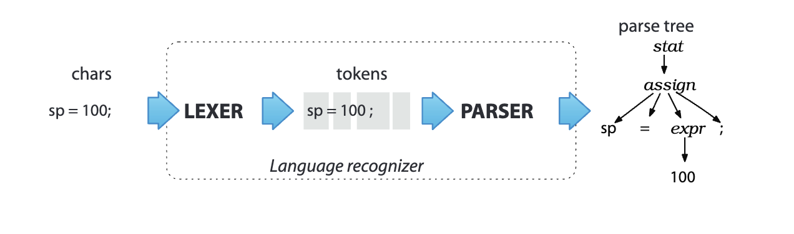
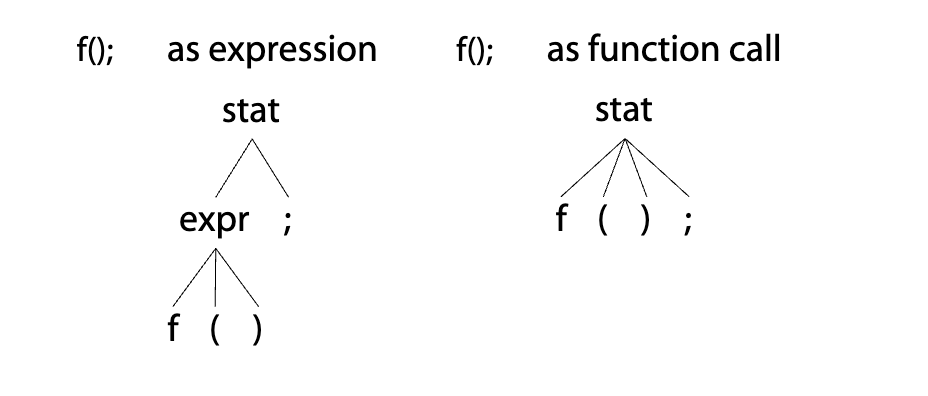
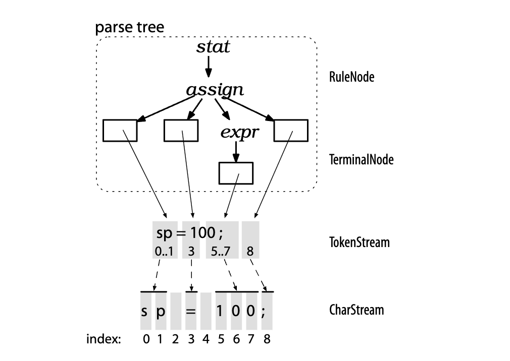
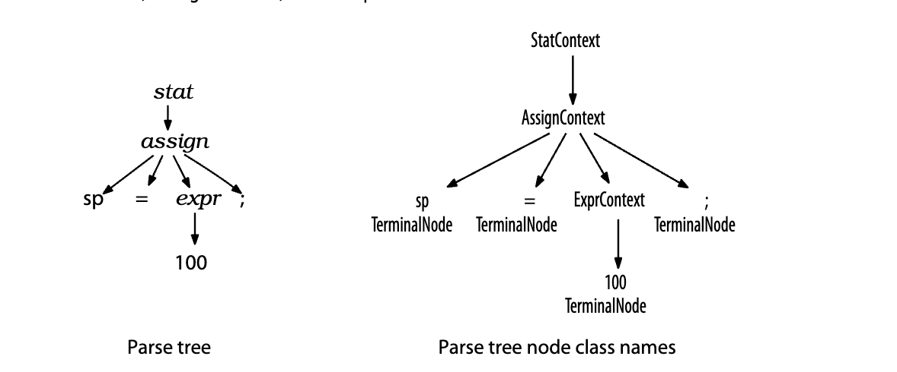
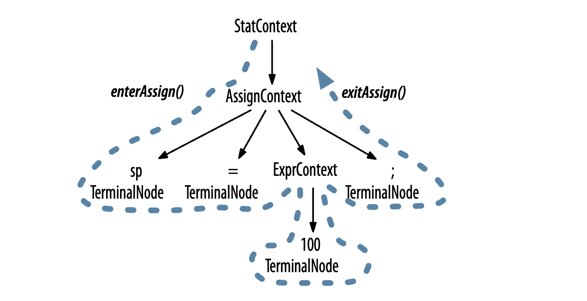
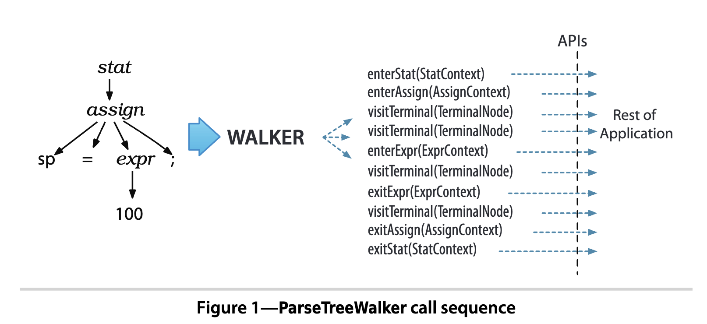
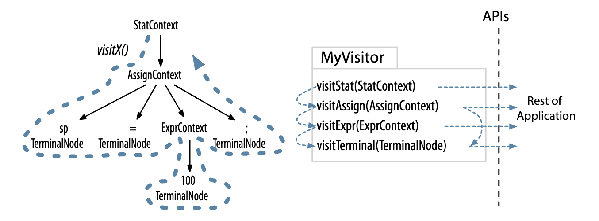

# CHAPTER 2 The Big Picture

In this chapter, we’ll learn about the important **processes**, **terminology**, and **data structures** associated with language applications.

## 2.1 Let’s Get Meta!

interpreter

translator

Programs that recognize languages are called **parsers** or **syntax analyzers**.Syntax refers to the rules governing language membership, and in this book we’re going to build **ANTLR grammars** to specify **language syntax**. A grammar is just a set of rules, each one expressing the structure of a phrase. The ANTLR tool translates grammars to **parsers** that look remarkably similar to what an experienced programmer might build by hand. (ANTLR is a program that writes other programs.) Grammars themselves follow the syntax of a language optimized for specifying other languages: ANTLR’s meta-language.

### lexer&parser

Parsing is much easier if we break it down into two similar but distinct tasks or stages. The separate stages mirror how our brains read English text. We don’t read a sentence character by character. Instead, we perceive(感知) a sentence as a stream of **words**. The human brain subconsciously(潜意识地) groups character sequences into words and looks them up in a dictionary before recognizing grammatical structure. This process is more obvious if we’re reading Morse code because we have to convert the dots and dashes to characters before reading a message. It’s also obvious when reading long words such as *Humuhumunukunukuapua’a*, the Hawaiian state fish.

> 翻译: 如果将语法解析过程拆解为两个相近却彼此独立的任务或阶段，整个过程会容易很多。这两个阶段的划分，正好对应了人脑阅读英文文本的处理逻辑：我们不会逐字符地认读句子，而是将句子感知为一连串的单词。在识别句法结构之前，人脑会下意识地将字符序列组合成单词，并在脑中完成词义匹配。如果是阅读摩尔斯电码，这个过程会体现得更明显 —— 我们必须先把点和划转换成字符，才能读懂信息内容。认读长单词时也是同理，比如夏威夷州的州鱼 *Humuhumunukunukuapua’a*（凹鼻鲀）。

The process of grouping characters into **words or symbols (*tokens*)** is called ***lexical analysis*** or simply *tokenizing*. We call a program that **tokenizes** the input a *lexer*. The lexer can group related tokens into **token classes**, or ***token types***, such as `INT` (integers), `ID` (identifiers), `FLOAT` (floating-point numbers), and so on. The **lexer** groups vocabulary symbols into types when the **parser** cares only about the type, not the individual symbols. Tokens consist of at least two pieces of information: the token type (identifying the lexical structure) and the text matched for that token by the lexer.

> 翻译: 将字符组合成单词或符号（**令牌**，token）的过程，称为**词法分析**（lexical analysis），也可简称为令牌化（tokenizing）。完成输入分词功能的程序，叫做**词法分析器**（lexer）。词法分析器可以将同类令牌归为不同的令牌类，或称**令牌类型**（token type），比如整数型 `INT`、标识符型 `ID`、浮点型 `FLOAT` 等等。当语法分析器只关注符号的类型、而非具体符号本身时，词法分析器就会将各类词汇符号按类型归类。每个令牌至少包含两部分信息：令牌类型（用于标识词法结构类别），以及词法分析器匹配到的该令牌对应的原文文本。

The second stage is the actual parser and feeds off of these tokens to recognize the sentence structure, in this case an assignment statement. By default, ANTLR-generated parsers build a data structure called a *parse tree* or *syntax tree* that records how the parser recognized the structure of the input sentence and its component phrases. The following diagram illustrates the basic data flow of a language recognizer:



The **interior nodes** of the **parse tree** are **phrase names** that group and identify their children. The root node is the most abstract phrase name, in this case `stat` (short for "statement"). The leaves of a **parse tree** are always the **input tokens**. Sentences, linear sequences of symbols, are really just serializations of **parse trees** we humans grok natively in hardware. To get an idea across to someone, we have to conjure up the same parse tree in their heads using a word stream.

> 翻译: 语法分析树的**内部节点**是短语名称，用于对其子节点进行分组与标识。根节点是抽象层级最高的短语名称，本例中为 `stat`（statement「语句」的缩写）。语法分析树的**叶节点**始终是输入令牌。由符号线性排列构成的语句，本质上就是语法分析树的序列化结果——人类大脑天生就能直观理解这种树状结构。想要向他人传递一个想法，我们就得通过单词流，在对方的脑海中构建出相同的语法分析树。

By producing a **parse tree**, a **parser** delivers a handy data structure to the rest of the application that contains complete information about how the parser grouped the symbols into phrases. Trees are easy to process in subsequent steps and are well understood by programmers. Better yet, the parser can generate **parse trees** automatically.

> 翻译: 通过生成语法分析树，语法分析器会为应用的其余部分提供一套易用的数据结构，其中完整记录了语法分析器如何将符号组合成各个短语的全部信息。树结构既便于后续步骤处理，也为程序员所熟知。更便利的是，语法分析器可以自动生成语法分析树。

By operating off **parse trees**, multiple applications that need to recognize the same language can reuse a single parser. The other choice is to embed **application-specific code snippets** directly into the grammar, which is what **parser generators** have done traditionally. ANTLR v4 still allows this (see Chapter 10, *Attributes and Actions*, on page 175), but parse trees make for a much tidier and more decoupled design.

> 翻译: 基于语法分析树进行处理，多个需要识别同一种语言的应用就可以复用同一个语法分析器。另一种方案是将应用专属的代码片段直接嵌入文法中，这是传统解析器生成工具的常规做法。ANTLR v4 仍然支持这种方式（详见第 175 页第 10 章《属性与动作》），但语法分析树能让整体设计更整洁、解耦程度更高。

**Parse trees** are also useful for translations that require multiple passes (**tree walks**) because of computation dependencies where one stage needs information from a previous stage. In other cases, an application is just a heck of a lot easier to code and test in multiple stages because it's so complex. Rather than reparse the input characters for each stage, we can just walk the **parse tree** multiple times, which is much more efficient.

> 翻译: 对于存在计算依赖、需要**多遍处理**（树遍历）的翻译场景，语法分析树同样很有用——这类场景中，后一阶段需要依赖前一阶段的信息。在另一些场景中，应用本身复杂度极高，拆分为多个阶段来编码和测试会容易得多。我们无需为每个阶段都重新解析输入字符，只需多次遍历语法分析树即可，效率要高得多。

Because we specify phrase structure with a set of rules, parse-tree subtree roots correspond to grammar rule names. As a preview of things to come, here's the grammar rule that corresponds to the first level of the `assign` subtree from the diagram:

```antlr
assign : ID '=' expr ';' ; // match an assignment statement like "sp = 100;"
```

Understanding how ANTLR translates such rules into human-readable parsing code is fundamental to using and debugging grammars, so let's dig deeper into how parsing works.

> 翻译: 由于我们通过一组规则来定义短语结构，因此语法分析树的子树根节点与文法规则的名称一一对应。作为后续内容的预览，下面是与图中 `assign` 子树第一层对应的文法规则：
> 
> 理解 ANTLR 如何将这类规则转换为可读性良好的解析代码，是使用和调试文法的基础。接下来我们就深入探讨语法解析的工作原理。

## 2.2 Implementing Parsers

The ANTLR tool generates **recursive-descent parsers** from grammar rules such
as `assign` that we just saw. **Recursive-descent parsers** are really just a collection
of **recursive methods**, one per rule. The descent term refers to the fact that
parsing begins at the root of a **parse tree** and proceeds toward the **leaves(tokens)**. The rule we invoke first, the *start symbol*, becomes the root of the parse tree. That would mean calling method `stat()`(statement的缩写) for the **parse tree** in the previous section. A more general term for this kind of parsing is *top-down parsing*; **recursive-descent parsers** are just one kind of **top-down parser** implementation.

To get an idea of what recursive-descent parsers look like, here's the (slightly cleaned up) method that ANTLR generates for rule `assign`:

```java
// assign : ID '=' expr ';' ;
void assign() {    // method generated from rule assign
    match(ID);     // compare ID to current input symbol then consume
    match('=');
    expr();        // match an expression by calling expr()
    match(';');
}
```

The cool part about **recursive-descent parsers** is that the **call graph** traced out by invoking methods `stat()`, `assign()`, and `expr()` mirrors the **interior parse tree nodes**. (Take a quick peek back at the parse tree figure.) The calls to `match()` correspond to the **parse tree leaves**. To build a parse tree manually in a handbuilt parser, we'd insert "add new subtree root" operations at the start of each rule method and an "add new leaf node" operation to `match()`.

> 翻译: 递归下降解析器的巧妙之处在于：调用 `stat()`、`assign()`、`expr()` 这些方法所形成的调用链，正好与语法分析树的内部节点一一对应。（可以回头对照一下之前的语法分析树示意图。）而对 `match()` 方法的调用，就对应语法分析树的叶节点。如果要在手写解析器中手动构建语法分析树，只需要在每个规则方法的开头插入“新建子树根节点”的操作，再在 `match()` 中加入“新建叶节点”的操作即可。

Method `assign()` just checks to make sure all necessary tokens are present and in the right order. When the parser enters `assign()`, it doesn't have to choose between more than one *alternative*. An alternative is one of the choices on the right side of a rule definition. For example, the `stat` rule that invokes `assign` likely has a list of other kinds of statements.

```antlr
/** Match any kind of statement starting at the current input position */
stat: assign        // First alternative ('|' is alternative separator)
    | ifstat        // Second alternative
    | whilestat
    ...
    ;
```

A parsing rule for `stat` looks like a switch.

```java
void stat() {
    switch ( «current input token» ) {
        CASE ID     : assign(); break;
        CASE IF     : ifstat(); break; // IF is token type for keyword 'if'
        CASE WHILE  : whilestat(); break;
        ...
        default     : «raise no viable alternative exception»
    }
}
```

### lookahead token

Method `stat()` has to make a *parsing decision* or prediction by examining the next input token. Parsing decisions predict which alternative will be successful. In this case, seeing a `WHILE` keyword predicts the third alternative of rule `stat`. Rule method `stat()` therefore calls `whilestat()`. You might've heard the term *lookahead token* before; that's just the next input token. A lookahead token is any token that the parser sniffs before matching and consuming it.

> 翻译: `stat()` 方法必须通过检查下一个输入令牌，做出**语法分析决策**（parsing decision）或称预测。语法分析决策的作用是预判哪条候选分支能够匹配成功。在本例中，读到 `WHILE` 关键字时，就会预判 `stat` 规则的第三条候选分支匹配成功，因此 `stat()` 规则方法会调用 `whilestat()`。你可能听过**向前看令牌**（lookahead token）这个术语，它指的就是下一个输入令牌。向前看令牌，就是解析器在正式匹配并消耗该令牌之前，预先探查的所有令牌。

Sometimes, the parser needs lots of lookahead tokens to predict which alternative will succeed. It might even have to consider all tokens from the current position until the end of file! ANTLR silently handles all of this for you, but it's helpful to have a basic understanding of decision making so debugging generated parsers is easier.

To visualize parsing decisions, imagine a maze with a single entrance and a single exit that has words written on the floor. Every sequence of words along a path from entrance to exit represents a sentence. The structure of the maze is analogous to the rules in a grammar that define a language. To test a sentence for membership in a language, we compare the sentence's words with the words along the floor as we traverse the maze. If we can get to the exit by following the sentence's words, that sentence is valid.

> 翻译: 为了直观理解语法分析决策，我们可以想象一座只有一个入口和一个出口的迷宫，地面上写满了单词。从入口到出口的任意一条路径上的单词序列，都对应一条语句。迷宫的结构，就相当于定义一门语言的文法规则。要检验一条语句是否属于该语言，我们只需要在穿行迷宫的过程中，把语句里的单词和地面上的单词逐一比对。如果能顺着语句的单词一路走到出口，这条语句就是合法的。

To navigate the maze, we must choose a valid path at each fork, just as we must choose alternatives in a parser. We have to decide which path to take by comparing the next word or words in our sentence with the words visible down each path emanating from the fork. The words we can see from the fork are analogous to lookahead tokens. The decision is pretty easy when each path starts with a unique word. In rule `stat`, each alternative begins with a unique token, so `stat()` can distinguish the alternatives by looking at the first lookahead token.

> 翻译: 要在迷宫中行进，我们必须在每个岔路口选择一条可行的路径，这和解析器在候选分支中做选择的过程完全一致。我们会把语句里的下一个（或多个）单词，和岔路口每条路径前方可见的单词做比对，以此决定走哪条路。从岔路口能看到的单词，就对应向前看令牌。如果每条路径的起始单词都不相同，决策就非常简单。在 `stat` 规则中，每条候选分支都以唯一的令牌开头，因此 `stat()` 只需要查看第一个向前看令牌，就能区分不同的候选分支。

When the words starting each path from a fork overlap, a parser needs to look further ahead, scanning for words that distinguish the alternatives. ANTLR automatically throttles the amount of lookahead up-and-down as necessary for each decision. If the lookahead is the same down multiple paths to the exit (end of file), there are multiple interpretations of the current input phrase. Resolving such ambiguities is our next topic. After that, we'll figure out how to use parse trees to build language applications.

> 翻译: 如果岔路口各条路径的起始单词存在重叠，解析器就需要看得更远，扫描能够区分不同候选分支的特征单词。ANTLR 会根据每次决策的实际需要，自动调整向前看的长度。如果多条路径一直到出口（文件末尾）的向前看内容都完全相同，就说明当前输入短语存在多种解释方式。如何解决这类歧义，是我们下一节的主题。在此之后，我们还会讲解如何利用语法分析树来构建语言类应用。

## 2.3 You Can’t Put Too Much Water into a Nuclear Reactor

> 翻译: 往核反应堆里注再多水都不为过

An ambiguous phrase or sentence is one that has more than one interpretation. In other words, the words fit more than one **grammatical structure**. The section title “You Can’t Put Too Much Water into a Nuclear Reactor” is an ambiguous sentence from a Saturday Night Live sketch I saw years ago. The characters weren’t sure if they should be careful not to put too much water into the reactor or if they should put lots of water into the reactor.

> 翻译: 歧义短语或歧义句，指的是存在不止一种解读方式的语言单位。换句话说，同一组语词可以对应不止一种语法结构。本节标题「你不能往核反应堆里加太多水」本身就是一句典型的歧义句，出自我多年前看过的《周六夜现场》小品。剧中的角色拿不准这句话的含义：到底是提醒他们要谨慎，不能往反应堆里加注过量的水；还是在说往反应堆里注水，再多都不为过，应该尽量多加。

**Ambiguity** can be funny in natural language but causes problems for computer-based language applications. To interpret or translate a phrase, a program has to uniquely identify the meaning. That means we have to provide **unambiguous grammars** so that the generated parser can match each input phrase in exactly one way.

We haven’t studied grammars in detail yet, but let’s include a few ambiguous grammars here to make the notion of ambiguity more concrete. You can refer to this section if you run into ambiguities later when building a grammar.

Some ambiguous grammars are obvious.

```antlr
stat: ID '=' expr ';'  // match an assignment; can match "f();"
    | ID '=' expr ';'  // oops! an exact duplicate of previous alternative
    ;
expr: INT ;
```

Most of the time, though, the ambiguity will be more subtle, as in the following grammar that can match a function call via both alternatives of rule stat:

```antlr
stat: expr ';'        // expression statement
    | ID '(' ')' ';'  // function call statement
    ;
expr: ID '(' ')'
    | INT
    ;
```

Here are the two interpretations of input `f();` starting in rule stat:



The parse tree on the left shows the case where f() matches to rule expr. The tree on the right shows f() matching to the start of rule stat’s second alternative.

Since most language inventors design their syntax to be unambiguous, an ambiguous grammar is analogous to a programming bug. We need to reorganize(重新组织) the grammar to present a single choice to the parser for each input phrase. If the parser detects an ambiguous phrase, it has to pick one of the **viable alternatives**. ANTLR resolves the ambiguity by choosing the first alternative involved in the decision. In this case, the parser would choose the interpretation of `f();` associated with the parse tree on the left.

Ambiguities can occur in the **lexer** as well as the parser, but ANTLR resolves them so the rules behave naturally. ANTLR resolves **lexical ambiguities** by matching the input string to the rule specified first in the grammar. To see how this works, let’s look at an ambiguity that’s common to most programming languages: the ambiguity between **keywords** and **identifier** rules. Keyword `begin` (followed by a nonletter) is also an identifier, at least lexically, so the lexer can match b-e-g-i-n to either rule.

```antlr
BEGIN : 'begin' ;  // match b-e-g-i-n sequence; ambiguity resolves to BEGIN
ID    : [a-z]+ ;   // match one or more of any lowercase letter
```

For more on this lexical ambiguity, see *Matching Identifiers*, on page 74.

Note that **lexers** try to match the longest string possible for each token, meaning that input `beginner` would match only to rule ID. The lexer would not match `begin` as `BEGIN` followed by an ID matching `ner`.

Sometimes the syntax for a language is just plain ambiguous and no amount of grammar reorganization will change that fact. For example, the natural grammar for arithmetic expressions can interpret input such as `1+2*3` in two ways, either by performing the operations left to right (as Smalltalk does) or in **precedence order** like most languages. We’ll learn how to implicitly specify the operator **precedence order** for expressions in Section 5.4, *Dealing with Precedence, Left Recursion, and Associativity*, on page 69.

The venerable C language exhibits another kind of ambiguity, which we can resolve using context information such as how an identifier is defined. Consider the code snippet `i*j;`. Syntactically, it looks like an expression, but its meaning, or semantics, depends on whether i is a type name or variable. If i is a type name, then the snippet isn’t an expression. It’s a declaration of variable j as a pointer to type i. We’ll see how to resolve these ambiguities in Chapter 11, *Altering the Parse with Semantic Predicates*, on page 189.

**Parsers** by themselves test input sentences only for language membership and build a **parse tree**. That’s crucial stuff, but it’s time to see how language applications use **parse trees** to interpret or translate the input.

> 翻译: 语法分析器本身仅负责检验输入语句是否符合语言定义，并构建语法分析树。这是解析流程的核心基础，但接下来我们来了解语言类应用是如何利用语法分析树对输入进行解释或翻译的。

## 2.4 Building Language Applications Using Parse Trees

To make a language application, we have to execute some appropriate code for each input phrase or subphrase. The easiest way to do that is to operate on the parse tree created automatically by the parser. The nice thing about operating on the tree is that we’re back in familiar Java territory. There’s no further ANTLR syntax to learn in order to build an application.

Let’s start by looking more closely at the data structures and class names ANTLR uses for recognition and for parse trees. A passing familiarity with the data structures will make future discussions more concrete.

Earlier we learned that lexers process characters and pass tokens to the parser, which in turn checks syntax and creates a parse tree. The corresponding ANTLR classes are `CharStream`, `Lexer`, `Token`, `Parser`, and `ParseTree`. The “pipe” connecting the lexer and parser is called a `TokenStream`. The diagram below illustrates how objects of these types connect to each other in memory.



These ANTLR data structures share as much data as possible to reduce memory requirements. The diagram shows that leaf (token) nodes in the parse tree are containers that point at tokens in the token stream. The tokens record start and stop character indexes into the `CharStream`, rather than making copies of substrings. There are no tokens associated with whitespace characters (indexes 2 and 4) since we can assume our lexer tosses out whitespace.

The figure also shows `ParseTree` subclasses `RuleNode` and `TerminalNode` that correspond to **subtree roots** and **leaf nodes**. `RuleNode` has familiar methods such as `getChild()` and `getParent()`, but `RuleNode` isn’t specific to a particular **grammar**. To better support access to the elements within specific nodes, ANTLR generates a `RuleNode` subclass for each **rule**. The following figure shows the specific classes of the subtree roots for our assignment statement example, which are `StatContext`, `AssignContext`, and `ExprContext`:



These are called *context objects* because they record everything we know about the recognition of a phrase by a rule. Each context object knows the start and stop tokens for the recognized phrase and provides access to all of the elements of that phrase. For example, `AssignContext` provides methods `ID()` and `expr()` to access the identifier node and expression subtree.

Given this description of the concrete types, we could write code by hand to perform a depth-first walk of the tree. We could perform whatever actions we wanted as we discovered and finished nodes. Typical operations are things such as computing results, updating data structures, or generating output. Rather than writing the same tree-walking boilerplate code over again for each application, though, we can use the tree-walking mechanisms that ANTLR generates automatically.

## 2.5 Parse-Tree Listeners and Visitors

ANTLR provides support for two tree-walking mechanisms in its runtime library. By default, ANTLR generates a parse-tree listener interface that responds to events triggered by the built-in **tree walker**. The listeners themselves are exactly like SAX document handler objects for **XML parsers**. **SAX listeners** receive notification of events like `startDocument()` and `endDocument()`. The methods in a **listener** are just **callbacks**, such as we’d use to respond to a checkbox click in a GUI application. Once we look at listeners, we’ll see how ANTLR can also generate tree walkers that follow the visitor design pattern.1

### Parse-Tree Listeners

To walk a tree and trigger calls into a listener, ANTLR's runtime provides class `ParseTreeWalker`. To make a language application, we build a `ParseTreeListener` **implementation** containing application-specific code that typically calls into a larger surrounding application.

> NOTE: 需要实现 `ParseTreeListener` 接口

ANTLR generates a `ParseTreeListener` subclass specific to each grammar with `enter` and `exit` methods for each rule. As the **walker** encounters the node for rule `assign`, for example, it triggers `enterAssign()` and passes it the `AssignContext` parse-tree node. After the **walker** visits all children of the assign node, it triggers `exitAssign()`. The tree diagram shown below shows `ParseTreeWalker` performing a depth-first walk, represented by the thick dashed line.



It also identifies where in the walk `ParseTreeWalker` calls the `enter` and `exit` methods for rule `assign`. (The other listener calls aren’t shown.)

And the diagram in *Figure 1, ParseTreeWalker call sequence*, on page 19 shows the complete sequence of calls made to the listener by `ParseTreeWalker` for our statement tree.

The beauty of the **listener mechanism** is that it’s all automatic. We don’t have to write a parse-tree walker, and our listener methods don’t have to explicitly visit their children.



### Parse-Tree Visitors

There are situations, however, where we want to control the walk itself, explicitly calling methods to visit children. Option `-visitor` asks ANTLR to generate a **visitor interface** from a grammar with a visit method per rule. Here’s the familiar **visitor pattern** operating on our **parse tree**:



The thick(粗的) dashed line shows a **depth-first walk** of the parse tree. The thin(细的) dashed lines indicate the method call sequence among the visitor methods. To initiate a walk of the tree, our application-specific code would create a **visitor implementation** and call `visit()`.

```java
ParseTree tree = ... ; // tree is result of parsing
MyVisitor v = new MyVisitor();
v.visit(tree);
```

ANTLR’s visitor support code would then call `visitStat()` upon seeing the **root node**. From there, the `visitStat()` implementation would call `visit()` with the children as arguments to continue the walk. Or, `visitMethod()` could explicitly call `visitAssign()`, and so on.

> 翻译: 随后，ANTLR 的访问器支撑代码在遍历到根节点时，会调用 `visitStat()` 方法。在此基础上，`visitStat()` 的实现既可以将子节点作为参数传入 `visit()` 方法来继续向下遍历，也可以显式调用 `visitAssign()` 等方法，自主控制遍历流程。

ANTLR gives us a leg up over writing everything ourselves by generating the visitor interface and providing a class with default implementations for the visitor methods. This way, we avoid having to override every method in the interface, letting us focus on just the methods of interest. We’ll learn all about visitors and listeners in Chapter 7, Decoupling Grammars from Application-Specific Code, on page 109.

> 翻译: ANTLR 会自动生成访问器接口，并提供一个包含所有访问器方法默认实现的基类。相比全部自行手写整套实现，这大大降低了开发工作量。这样一来，我们无需重写接口中的每一个方法，只需重点关注实际需要用到的方法即可。
> 
> 关于访问器与监听器的完整用法，我们将在第 109 页的第 7 章《文法与应用专属代码解耦》中详细讲解。

So, now we have the **big picture**. We looked at the overall data flow from character stream to parse tree and identified the key class names in the ANTLR runtime. And we just saw a summary of the **listener** and **visitor** mechanisms used to connect **parsers** with **application-specific code**. Let’s make this all more concrete by working through a real example in the next chapter.


