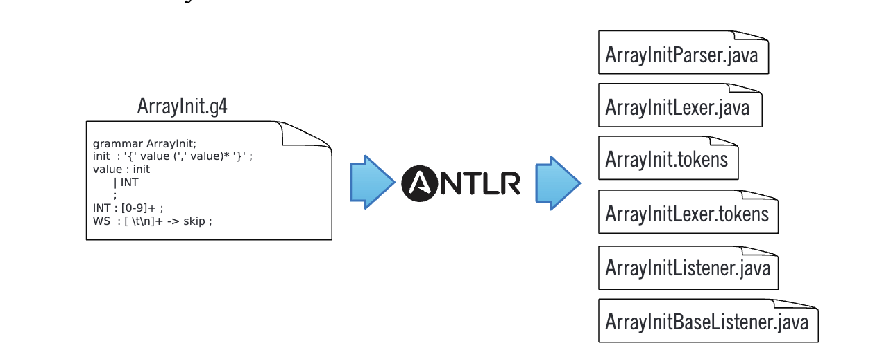
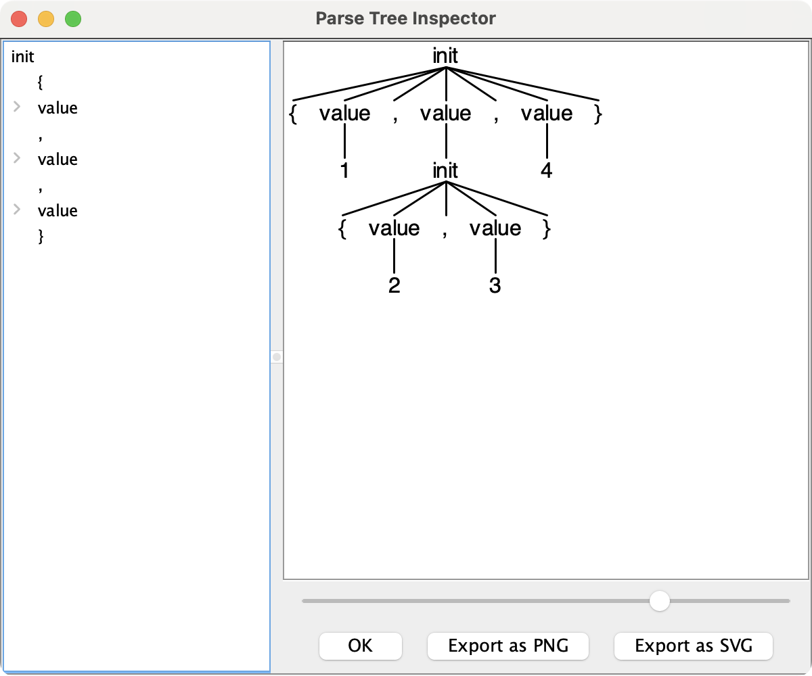
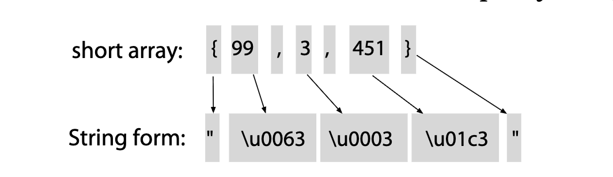

# CHAPTER 3 A Starter ANTLR Project

For our first project, let’s build a grammar for a tiny subset of C or one of its derivatives like Java. In particular, let’s recognize integers in, possibly nested, curly braces like {1, 2, 3} and {1, {2, 3}, 4}. These constructs could be int array or struct initializers. A grammar for this syntax would come in handy in a variety of situations. For one, we could use it to build a source code refactoring tool for C that converted integer arrays to byte arrays if all of the initialized values fit within a byte. We could also use this grammar to convert initialized Java short arrays to strings. For example, we could transform the following:

```java
static short[] data = {1,2,3};
```

into the following equivalent string with Unicode constants:

```java
static String data = "\u0001\u0002\u0003"; // Java char are unsigned short
```

where Unicode character specifiers, such as `\u0001`, use four hexadecimal digits representing a 16-bit character value, that is, a short.

The reason we might want to do this translation is to overcome a limitation in the Java `.class` file format. A Java class file stores array initializers as a sequence of explicit array-element initializers, equivalent to `data[0]=1; data[1]=2; data[2]=3;`, instead of a compact block of packed bytes.¹ Because Java limits the size of initialization methods, it limits the size of the arrays we can initialize. In contrast, a Java class file stores a string as a contiguous sequence of shorts. Converting array initializers to strings results in a more compact class file and avoids Java’s initialization method size limit.

By working through this starter example, you’ll learn a bit of **ANTLR grammar syntax**, what ANTLR generates from a **grammar**, how to incorporate the generated parser into a Java application, and how to build a translator with a parse-tree listener.

## 3.1 The ANTLR Tool, Runtime, and Generated Code

To get started, let’s peek inside ANTLR’s jar. There are two key ANTLR components: the **ANTLR tool** itself and the **ANTLR runtime** (parse-time) API. When we say “run ANTLR on a grammar,” we’re talking about running the **ANTLR tool**, class `org.antlr.v4.Tool`. Running ANTLR generates code (a parser and a lexer) that recognizes sentences in the language described by the grammar. A lexer breaks up an input stream of characters into tokens and passes them to a parser that checks the syntax. The runtime is a library of classes and methods needed by that generated code such as `Parser`, `Lexer`, and `Token`. First we run ANTLR on a grammar and then compile the generated code against the runtime classes in the jar. Ultimately, the compiled application runs in conjunction with the runtime classes.

> 翻译: 在正式开始之前，我们先了解一下 ANTLR 的 jar 包内部构成。ANTLR 包含两个核心组件：**ANTLR 工具**本身，以及**ANTLR 运行时**（解析阶段）API。
> 
> 我们常说的 “对一份文法运行 ANTLR”，指的就是运行 ANTLR 工具，也就是 `org.antlr.v4.Tool` 这个类。运行 ANTLR 会生成代码（包含语法分析器和词法分析器），这些代码能够识别该文法所定义语言中的合法语句。词法分析器负责将输入的字符流拆分为令牌，再传递给语法分析器完成语法校验。
> 
> 运行时则是一个类与方法库，提供了生成代码运行所需的所有基础类型，比如 `Parser`、`Lexer` 和 `Token`。完整的开发流程是：先对文法文件运行 ANTLR 工具生成代码，再将生成的代码与 jar 包中的运行时类一起编译。最终，编译好的应用程序会依赖运行时类共同运行。

The first step to building a language application is to create a grammar that describes a language’s syntactic rules (the set of valid sentences). We’ll learn how to write grammars in *Chapter 5, Designing Grammars*, on page 57, but for the moment, here’s a grammar that’ll do what we want:

> `starter/ArrayInit.g4`

```antlr
/** Grammars always start with a grammar header. This grammar is called
 *  ArrayInit and must match the filename: ArrayInit.g4
 */
grammar ArrayInit;

/** A rule called init that matches comma-separated values between {...}. */
init  : '{' value (',' value)* '}' ;  // must match at least one value

/** A value can be either a nested array/struct or a simple integer (INT) */
value : init
      | INT
      ;

// parser rules start with lowercase letters, lexer rules with uppercase
INT :   [0-9]+ ;             // Define token INT as one or more digits
WS  :   [ \t\r\n]+ -> skip ; // Define whitespace rule, toss it out
```

Let’s put grammar file `ArrayInit.g4` in its own directory, such as `/tmp/array` (by cutting and pasting or downloading the source code from the book website). Then, we can run ANTLR (the tool) on the grammar file.

```bash
$ cd /tmp/array
$ antlr4 ArrayInit.g4  # Generate parser and lexer using antlr4 alias
```

From grammar ArrayInit.g4, ANTLR generates lots of files that we’d normally have to write by hand.



At this point, we're just trying to get the gist of the development process, so here's a quick description of the generated files:

> 翻译: 眼下我们只需要先理清开发流程的大致脉络，因此下面对生成的文件做一个简要说明。

### ArrayInitParser.java

This file contains the parser class definition specific to grammar ArrayInit that recognizes our array language syntax.

```java
public class ArrayInitParser extends Parser { ... }
```

It contains a method for each rule in the grammar as well as some support code.

### ArrayInitLexer.java

ANTLR automatically extracts a separate parser and lexer specification from our grammar. This file contains the lexer class definition, which ANTLR generated by analyzing the lexical rules `INT` and `WS` as well as the grammar literals `'{'`, `','`, and `'}'`. Recall that the lexer tokenizes the input, breaking it up into vocabulary symbols. Here's the class outline:

```java
public class ArrayInitLexer extends Lexer { ... }
```

### ArrayInit.tokens

ANTLR assigns a **token type number** to each **token** we define and stores these values in this file. It's needed when we split a large grammar into multiple smaller grammars so that ANTLR can synchronize all the token type numbers. See *Importing Grammars*, on page 36.

### ArrayInitListener.java, ArrayInitBaseListener.java

By default, ANTLR parsers build a tree from the input. By walking that tree, a tree walker can fire "events" (callbacks) to a listener object that we provide. `ArrayInitListener` is the interface that describes the callbacks we can implement. `ArrayInitBaseListener` is a set of empty default implementations. This class makes it easy for us to override just the callbacks we're interested in. (See *Section 7.2, Implementing Applications with Parse-Tree Listeners*, on page 112.) ANTLR can also generate **tree visitors** for us with the `-visitor` command-line option. (SeeTraversing Parse Trees with Visitors, on page 119.)

We’ll use the listener classes to translate **short array initializers** to String objects
shortly (sorry about the pun), but first let’s verify that our parser correctly
matches some sample input.

### ANTLR Grammars Are Stronger Than Regular Expressions

Those of you familiar with regular expressionsa might be wondering if ANTLR is overkill for such a simple recognition problem. It turns out that we can’t use regular expressions to recognize initializations because of nested initializers. Regular expressions have no memory in the sense that they can’t remember what they matched earlier in the input. Because of that, they don’t know how to match up left and right curlies. We’ll get to this in more detail in Pattern: Nested Phrase, on page 65.

## 3.2 Testing the Generated Parser

Once we've run ANTLR on our grammar, we need to compile the generated Java source code. We can do that by simply compiling everything in our `/tmp/array` directory.

```bash
$ cd /tmp/array
$ javac *.java    # Compile ANTLR-generated code
```

If you get a `ClassNotFoundException` error from the compiler, that means you probably haven’t set the Java `CLASSPATH` correctly. On UNIX systems, you’ll need to execute the following command (and likely add to your start-up script such as `.bash_profile`):

```
$ export CLASSPATH=".:/usr/local/lib/antlr-4.0-complete.jar:$CLASSPATH"
```

To test our grammar, we use the TestRig via alias `grun` that we saw in the previous chapter. Here’s how to print out the tokens created by the lexer:

```
$ grun ArrayInit init -tokens
{99, 3, 451}
^EOF
```

```
[@0,0:0='{',<1>,1:0]
[@1,1:2='99',<4>,1:1]
[@2,3:3=',',<2>,1:3]
[@3,5:5='3',<4>,1:5]
[@4,6:6=',',<2>,1:6]
[@5,8:10='451',<4>,1:8]
[@6,11:11='}',<3>,1:11]
[@7,13:12='<EOF>',<-1>,2:0]
```

After typing in array initializer `{99, 3, 451}`, we have to hit `EOF` on a line by itself.
By default, ANTLR loads the entire input before processing. (That's the most common case and the most efficient.)

Each line of the output represents a single **token** and shows everything we know about the token. For example, `[@5,8:10='451',<4>,1:8]` indicates that it's the token at index 5 (indexed from 0), goes from character position 8 to 10 (inclusive starting from 0), has text `451`, has token type 4 (`INT`), is on line 1 (from 1), and is at character position 8 (starting from zero and counting tabs as a single character). Notice that there are no tokens for the space and newline characters. Rule `WS` in our grammar tosses them out because of the `-> skip` directive.

To learn more about how the parser recognized the input, we can ask for the parse tree with the `-tree` option.

```
$ grun ArrayInit init -tree
{99, 3, 451}
EOF
(init { (value 99) , (value 3) , (value 451) })
```

Option `-tree` prints out the **parse tree** in LISP-like text form `(root children)`. Or, we can use the `-gui` option to visualize the tree in a dialog box. Try it with a nested group of integers as input: `{1,{2,3},4}`.

```
$ grun ArrayInit init -gui
{1,{2,3},4}
EOF
```

Here's the parse tree dialog box that pops up:



In English, the **parse tree** says, "The input is an initializer with three values surrounded by curly braces. The first and third values are the integers 1 and 4. The second value is itself an initializer with two values surrounded by curly braces. Those values are integers 2 and 3."

Those **interior nodes**, `init` and `value`, are really handy because they identify all of the various input elements by name. It's kind of like identifying the verb and subject in an English sentence. The best part is that ANTLR creates that tree automatically for us based upon the rule names in our grammar. We'll build a translator based on this grammar at the end of this chapter using a built-in **tree walker** to trigger callbacks like `enterInit()` and `enterValue()`.

Now that we can run ANTLR on a grammar and test it, it's time to think about how to call this parser from a Java application.

> 翻译: 用自然语言描述，这棵语法树表达的含义是：“该输入是一个被大括号包裹、包含三个值的初始化器。第一个与第三个值分别是整数 1 和 4；第二个值本身又是一个被大括号包裹、包含两个值的初始化器，这两个值为整数 2 和 3。”
> 
> `init` 和 `value` 这类内部节点非常实用，它们通过名称标识各类输入元素，有点像在英文句子中识别谓语和主语。最方便的一点是：ANTLR 会依据文法里定义的规则名，自动生成这棵语法树。本章末尾，我们会基于该文法构建一个转换器，使用内置的树遍历器来触发 `enterInit()`、`enterValue()` 这类回调函数。
> 
> 现在我们已经能够基于文法运行 ANTLR 并完成测试，接下来需要考虑如何在 Java 应用程序中调用这个语法分析器。

## 3.3 Integrating a Generated Parser into a Java Program

Once we have a good start on a grammar, we can integrate the ANTLR-generated code into a larger application. In this section, we'll look at a simple Java `main()` that invokes our **initializer parser** and prints out the parse tree like TestRig's `-tree` option. Here's a boilerplate `Test.java` file that embodies the overall recognizer data flow we saw in Section 2.1, *Let's Get Meta!*, on page 9:

> starter/Test.java

```java
// import ANTLR's runtime libraries
import org.antlr.v4.runtime.*;
import org.antlr.v4.runtime.tree.*;

public class Test {
    public static void main(String[] args) throws Exception {
        // create a CharStream that reads from standard input
        ANTLRInputStream input = new ANTLRInputStream(System.in);

        // create a lexer that feeds off of input CharStream
        ArrayInitLexer lexer = new ArrayInitLexer(input);

        // create a buffer of tokens pulled from the lexer
        CommonTokenStream tokens = new CommonTokenStream(lexer);

        // create a parser that feeds off the tokens buffer
        ArrayInitParser parser = new ArrayInitParser(tokens);

        ParseTree tree = parser.init(); // begin parsing at init rule
        System.out.println(tree.toStringTree(parser)); // print LISP-style tree
    }
}
```

The program uses a number of classes like `CommonTokenStream` and `ParseTree` from ANTLR's runtime library that we'll learn more about starting in Section 4.1, *Matching an Arithmetic Expression Language*, on page 32.

Here's how to compile everything and run Test:

```
$ javac ArrayInit*.java Test.java
$ java Test
{1,{2,3},4}
EOF
(init { (value 1) , (value (init { (value 2) , (value 3) })) , (value 4) })
```

ANTLR parsers also automatically report and recover from syntax errors. For example, here's what happens if we enter an initializer that's missing the final curly brace:

```
$ java Test
{1,2
EOF
line 2:0 missing '}' at ''
(init { (value 1) , (value 2) <missing '}'>)
```

At this point, we've seen how to run ANTLR on a grammar and integrate the generated parser into a trivial Java application. An application that merely checks syntax is not that impressive, though, so let's finish up by building a translator that converts short array initializers to String objects.

## 3.4 Building a Language Application

Continuing with our array initializer example, our next goal is to translate not just recognize initializers. For example, let's translate Java short arrays like `{99, 3, 451}` to `"\u0063\u0003\u01c3"` where 63 is the hexadecimal representation of the 99 decimal.

To move beyond recognition, an application has to extract data from the parse tree. The easiest way to do that is to have ANTLR's built-in parse-tree walker trigger a bunch of callbacks as it performs a **depth-first walk**. As we saw earlier, ANTLR automatically generates a **listener infrastructure** for us. These listeners are like the callbacks on GUI widgets (for example, a button would notify us upon a button press) or like **SAX events** in an XML parser.

To write a program that reacts to the input, all we have to do is implement a few methods in a subclass of `ArrayInitBaseListener`. The basic strategy is to have each listener method print out a translated piece of the input when called to do so by the **tree walker**.

The beauty of the **listener mechanism** is that we don’t have to do any tree walking ourselves. In fact, we don’t even have to know that the runtime is walking a tree to call our methods. All we know is that our **listener** gets notified at the beginning and end of phrases associated with rules in the grammar. As we’ll see in Section 7.2, *Implementing Applications with Parse-Tree Listeners*, on page 112, this approach reduces how much we have to learn about ANTLR—we’re back in familiar programming language territory for anything but phrase recognition.

> 翻译: 监听器机制的精妙之处在于：我们不需要手动实现树遍历逻辑。事实上，我们甚至无需关心运行时正在遍历语法树来调用我们的方法。我们只需要知道：当文法规则对应的语法短语开始、结束时，监听器会收到通知。正如我们将在112页7.2节《使用语法树监听器实现应用程序》中看到的，这种方式降低了ANTLR的学习门槛——除了短语识别之外，其余部分都回归到我们熟悉的编程语言开发模式。

Starting a **translation** project means figuring out how to convert each input token or phrase to an output string. To do that, it’s a good idea to manually translate a few representative samples in order to pick out the general phrase-to-phrase conversions. In this case, the translation is pretty straightforward.

> 翻译: 启动一个翻译项目，核心是确定如何将每一个输入token或短语转换成输出字符串。推荐先手动翻译几个典型样例，提炼出短语间通用的转换规则。本例中的转换逻辑十分直观。



short array: `{ 99 , 3 , 451 }`
String form: `" \u0063 \u0003 \u01c3 "`

In English, the translation is a series of "X goes to Y" rules.

1. Translate `{` to `"`.
2. Translate `}` to `"`.
3. Translate integers to four-digit hexadecimal strings prefixed with `\u`.

To code the translator, we need to write methods that print out the converted strings upon seeing the appropriate input token or phrase. The built-in tree walker triggers callbacks in a listener upon seeing the beginning and end of the various phrases. Here’s a listener implementation for our translation rules:

> starter/ShortToUnicodeString.java

```java
/** Convert short array inits like {1,2,3} to "\u0001\u0002\u0003" */
public class ShortToUnicodeString extends ArrayInitBaseListener {
    /** Translate { to " */
    @Override
    public void enterInit(ArrayInitParser.InitContext ctx) {
        System.out.print('"');
    }

    /** Translate } to " */
    @Override
    public void exitInit(ArrayInitParser.InitContext ctx) {
        System.out.print('"');
    }

/** Translate integers to 4-digit hexadecimal strings prefixed with \\u */
@Override
public void enterValue(ArrayInitParser.ValueContext ctx) {
    // Assumes no nested array initializers
    int value = Integer.valueOf(ctx.INT().getText());
    System.out.printf("\\u%04x", value);
}
```

We don’t need to override every enter/exit method; we do just the ones we care about. The only unfamiliar expression is `ctx.INT()`, which asks the **context object** for the integer INT token matched by that invocation of rule value. **Context objects** record everything that happens during the recognition of a rule.

The only thing left to do is to create a translator application derived from the earlier Test boilerplate code shown earlier.

> starter/Translate.java

```java
// import ANTLR's runtime libraries
import org.antlr.v4.runtime.*;
import org.antlr.v4.runtime.tree.*;

public class Translate {
    public static void main(String[] args) throws Exception {
        // create a CharStream that reads from standard input
        ANTLRInputStream input = new ANTLRInputStream(System.in);
        // create a lexer that feeds off of input CharStream
        ArrayInitLexer lexer = new ArrayInitLexer(input);
        // create a buffer of tokens pulled from the lexer
        CommonTokenStream tokens = new CommonTokenStream(lexer);
        // create a parser that feeds off the tokens buffer
        ArrayInitParser parser = new ArrayInitParser(tokens);
        ParseTree tree = parser.init(); // begin parsing at init rule

        // Create a generic parse tree walker that can trigger callbacks
        ParseTreeWalker walker = new ParseTreeWalker();
        // Walk the tree created during the parse, trigger callbacks
        walker.walk(new ShortToUnicodeString(), tree);
        System.out.println(); // print a \n after translation
    }
}
```

The only difference from the boilerplate code is the highlighted section that creates a tree walker and asks it to walk the tree returned from the parser. As the tree walker traverses, it triggers calls into our `ShortToUnicodeString` listener.

Please note: To focus our attention and to reduce bloat, the remainder of the book will typically show just the important or novel bits of code rather than entire files. If you’re reading the electronic version of this book, you can always click the code snippet titles; the title bars are links to the full source code on the Web. You can also grab the full source code bundle on the book’s website.3

> 翻译: 请注意：为聚焦重点、减少内容冗余，本书后续章节通常只展示关键或新增的代码片段，而非完整文件。如果你阅读本书的电子版，可直接点击代码片段的标题；标题栏是网页上完整源代码的链接。你也可以在本书官网下载全部源代码压缩包。

Let’s build the translator and try it on our sample input.

```
$ javac ArrayInit*.java Translate.java
$ java Translate
{99, 3, 451}
EOF
"\u0063\u0003\u01c3"
```

It works! We’ve just built our first translator, without even touching the grammar. All we had to do was implement a few methods that printed the appropriate phrase translations. Moreover, we can generate completely different output simply by passing in a different listener. Listeners effectively isolate the language application from the grammar, making the grammar reusable for other applications.

In the next chapter, we’ll take a whirlwind tour of ANTLR grammar notation and the key features that make ANTLR powerful and easy to use.

> 翻译: 下一章，我们将快速浏览ANTLR文法的表示法，以及让ANTLR强大且易用的核心特性。


