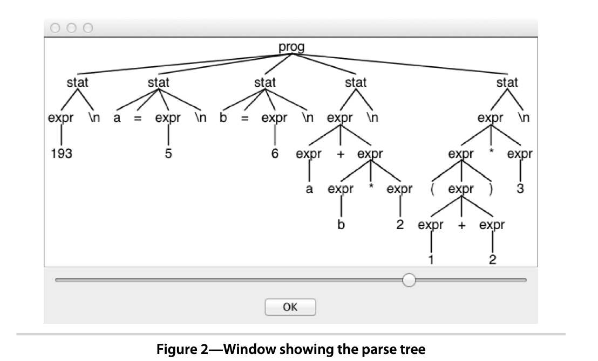

# CHAPTER 4 A Quick Tour

So far, we have learned how to install ANTLR and have looked at the key processes, terminology, and building blocks needed to build a language application. In this chapter, we’re going to take a whirlwind tour of ANTLR by racing through a number of examples that illustrate its capabilities. We’ll be glossing over a lot of details in the interest of brevity(简洁), so don’t worry if things aren’t crystal clear. The goal is just to get a feel for what you can do with ANTLR. We’ll look underneath the hood starting in Chapter 5, *Designing Grammars*, on page 57. For those with experience using previous versions of ANTLR, this chapter is a great way to retool.

> 翻译: 到目前为止，我们已经学习了如何安装 ANTLR，并且了解了构建语言应用所需的核心流程、术语与基础组件。本章将快速概览 ANTLR，通过多个示例来展示它的各项能力。为保证行文简洁，很多细节会一笔带过，所以如果有些内容不是完全理解也无需担心。本章目标只是让你直观感受 ANTLR 能做什么。从第 5 章《设计文法》（57 页）开始，我们再深入探究底层原理。如果你之前使用过旧版 ANTLR，本章也非常适合用来更新知识体系。

This chapter is broken down into four broad topics that nicely illustrate the feature set. It’s a good idea to download the code¹ for this book (or follow the links in the ebook version) and work through the examples as we go along. That way, you’ll get used to working with grammar files and building ANTLR applications. Keep in mind that many of the code snippets you see interspersed in the text aren’t complete files so that we can focus on the interesting bits.

> 翻译: 本章分为四大主题，充分展示 ANTLR 的功能集。建议下载本书配套源码 ¹（或在电子书里点击链接），跟着动手跑一遍示例。这样你就能熟悉文法文件的编写以及 ANTLR 应用的构建流程。请注意：文中穿插的大量代码片段并不是完整文件，目的是让我们聚焦核心内容。

First, we’re going to work with a grammar for a simple **arithmetic expression language**. We’ll test it initially using ANTLR’s built-in test rig and then learn more about the boilerplate main program that launches parsers shown in Section 3.3, *Integrating a Generated Parser into a Java Program*, on page 26. Then, we’ll look at a nontrivial **parse tree** for the **expression grammar**. (Recall that a parse tree records how a parser matches an input phrase.) For dealing with very large grammars, we’ll see how to split a grammar into manageable chunks using **grammar** imports. Next, we’ll check out how ANTLR-generated parsers respond to invalid input.

> 翻译: 首先，我们将编写一套简单算术表达式语言的文法。先用 ANTLR 内置的测试工具测试文法，之后进一步学习 3.3 节（26 页）介绍的、用于启动语法分析器的样板主程序。然后，我们观察表达式文法对应的复杂语法树。（回顾：语法树记录语法分析器匹配输入短语的全过程。）针对超大型文法，我们会学习如何通过文法导入，将文法拆分为多个便于维护的模块。接下来，我们看一看 ANTLR 生成的语法分析器如何处理非法输入。

Second, after looking at the parser for arithmetic expressions, we’ll use a visitor pattern to build a calculator that walks expression grammar parse trees. ANTLR parsers automatically generate visitor interfaces and blank method implementations so we can get started painlessly.

> 翻译: 第二，在学习算术表达式语法分析器之后，我们将使用**访问者模式**构建一个计算器，遍历表达式文法的语法树。ANTLR 语法分析器会自动生成访问者接口与空方法实现，让我们可以轻松上手。

Third, we’ll build a translator that reads in a Java class definition and spits out a Java interface derived from the methods in that class. Our implementation will use the tree listener mechanism that ANTLR also generates automatically.

> 翻译: 第三，我们构建一个转换器：读取 Java 类定义，然后根据该类中的方法，输出对应的 Java 接口。实现将使用 ANTLR 自动生成的语法树监听器机制。

Fourth, we’ll learn how to embed actions (arbitrary code) directly in the grammar. Most of the time, we can build language applications with visitors or listeners, but for the ultimate flexibility, ANTLR allows us to inject our own application-specific code into the generated parser. These actions execute during the parse and can collect information or generate output like any other arbitrary code snippets. In conjunction with **semantic predicates** (Boolean expressions), we can even make parts of our grammar disappear at runtime! For example, we might want to turn the enum keyword on and off in a Java grammar to parse different versions of the language. Without semantic predicates, we’d need two different versions of the grammar.

> 翻译: 第四，我们学习如何在文法中直接嵌入**动作（自定义代码）**。大多数场景下，我们用访问者或监听器就能构建语言应用；但如果需要最大灵活性，ANTLR 支持向生成的语法分析器注入业务自定义代码。这些动作会在语法分析阶段执行，可以收集信息、生成输出，和普通代码片段一样。配合**语义谓词（布尔表达式）**，我们甚至能在运行时让文法的部分规则 “失效”！例如，在 Java 文法中，可以动态启用 / 禁用`enum`关键字，以此解析不同版本的 Java 语言。如果没有语义谓词，我们就需要维护两套不同的文法。

Finally, we’ll zoom in on a few ANTLR features at the lexical (token) level. We’ll see how ANTLR deals with input files that contain more than one language. Then we’ll look at the awesome `TokenStreamRewriter` class that lets us tweak, mangle, or otherwise manipulate token streams, all without disturbing the original input stream. Finally, we’ll revisit our interface generator example to learn how ANTLR can ignore whitespace and comments during Java parsing but retain them for later processing.

> 翻译: 最后，我们聚焦词法（token）层面的若干 ANTLR 特性。我们会看到 ANTLR 如何处理包含多种语言的输入文件。然后介绍强大的`TokenStreamRewriter`类，它可以修改、调整、操作 token 流，**不会改动原始输入流**。最后，我们重新回顾接口生成器示例，学习 ANTLR 在解析 Java 代码时，可以跳过空格与注释，同时保留这些内容供后续处理。

Let’s begin our tour by getting acquainted with ANTLR grammar notation.
Make sure you have the `antlr4` and `grun` aliases or scripts defined, as explained in Section 1.2, *Executing ANTLR and Testing Recognizers*, on page 6.

## 4.1 Matching an Arithmetic Expression Language

For our first grammar, we’re going to build a simple calculator. Doing something with expressions makes sense because they’re so common. To keep things simple, we’ll allow only the basic **arithmetic operators** (add, subtract, multiply, and divide), parenthesized expressions, integer numbers, and variables. We’ll also restrict ourselves to integers instead of allowing floating-point numbers.

Here’s some sample input that illustrates all language features:

```markdown
tour/t.expr
```

```
193
a = 5
b = 6
a+b*2
(1+2)*3
```

In English, a program in our expression language is a sequence of statements terminated by newlines. A statement is either an expression, an assignment, or a blank line. Here’s an ANTLR grammar that’ll parse those statements and expressions for us:

> tour/Expr.g4

```antlr
grammar Expr;

/** The start rule; begin parsing here. */
prog: stat+ ;

stat: expr NEWLINE
    | ID '=' expr NEWLINE
    | NEWLINE
    ;

expr: expr ( '*'|'/' ) expr
    | expr ( '+'|'-' ) expr
    | INT
    | ID
    | '(' expr ')'
    ;

ID  : [a-zA-Z]+ ;      // match identifiers
INT : [0-9]+ ;         // match integers
NEWLINE: '\r'? '\n' ; // return newlines to parser (is end-statement signal)
WS  : [ \t]+ -> skip ; // toss out whitespace
```

Without going into too much detail, let’s look at some of the key elements of ANTLR’s grammar notation.

- Grammars consist of a set of rules that describe language syntax. There are rules for syntactic structure like `stat` and `expr` as well as rules for vocabulary symbols (tokens) such as identifiers and integers.
- Rules starting with a **lowercase letter** comprise the **parser rules**.
- Rules starting with an **uppercase letter** comprise the **lexical (token) rules**.
- We separate the alternatives of a rule with the `|` operator, and we can group symbols with parentheses into **subrules**. For example, **subrule** `('*'|'/')` matches either a multiplication symbol or a division symbol.
  - 使用|连接'`*`'和'`/`''

We’ll tackle all of this stuff in detail when we get to Chapter 5, *Designing Grammars*, on page 57.

One of ANTLR v4’s most significant new features is its ability to handle (most kinds of) **left-recursive rules**. A **left-recursive rule** is one that invokes itself at the start of an alternative. For example, in this grammar, rule `expr` has alternatives on lines 11 and 12 that recursively invoke `expr` on the left edge. Specifying arithmetic expression notation this way is dramatically easier than what we’d need for the typical **top-down parser** strategy. In that strategy, we’d need multiple **rules**, one for each **operator precedence level**. For more on this feature, see Section 5.4, *Dealing with Precedence, Left Recursion, and Associativity*, on page 69.

> 翻译: ANTLR v4最重要的新特性之一，就是**可以处理大多数类型的左递归规则**。左递归规则指：在某个候选分支的开头调用自身。例如在本文的文法中，`expr`规则第11、12行的分支，就在最左侧递归调用`expr`。
> 用这种方式定义算术表达式，远比传统自顶向下语法分析方案简单得多。传统方案中，需要为每一级运算符优先级单独写一条规则。更多相关内容，参见5.4节《处理优先级、左递归与结合性》（69页）。

The notation for the token definitions should be familiar to those with **regular expression** experience. We’ll look at lots of lexical (token) rules in Chapter 6, *Exploring Some Real Grammars*, on page 83. The only unusual syntax is the `-> skip` operation on the WS whitespace rule. It’s a **directive**(指令) that tells the lexer to match but throw out whitespace. (Every possible input character must be matched by at least one **lexical rule**.) We avoid tying the grammar to a specific target language by using formal ANTLR notation instead of an arbitrary code snippet in the grammar that tells the lexer to skip.

> 翻译: 有正则表达式基础的读者，对token定义的这套语法会比较熟悉。第6章《探究真实文法》（83页）会介绍大量词法（token）规则。唯一特殊的语法是空白符规则WS里的`-> skip`操作。这是一条指令，告诉词法分析器：匹配空白字符但是直接丢弃。（输入里所有字符，都必须至少能被一条词法规则匹配。）
> 我们使用标准ANTLR语法，而不是在文法里嵌入任意代码片段来通知词法分析器跳过字符，这样可以避免文法绑定到某一门目标编程语言。

OK, let’s take grammar `Expr` out for a joy ride. Download the `tour/Expr.g4` link on the previous code listing, if you’re viewing the ebook version, or by cutting and pasting the grammar into a file called `Expr.g4`.

> 翻译: 好了，让我们动手跑一遍Expr文法。如果你在读电子书，可以点击上一段代码清单里的`tour/Expr.g4`链接下载源码；也可以直接复制文法，保存为`Expr.g4`文件。

The easiest way to test grammars is with the built-in TestRig, which we can access using alias `grun`. For example, here is the build and test sequence on a Unix box:

```shell
$ antlr4 Expr.g4
$ ls Expr*.java
ExprBaseListener.java  ExprListener.java
ExprLexer.java         ExprParser.java
$ javac Expr*.java
$ grun Expr prog -gui t.expr # launches org.antlr.v4.runtime.misc.TestRig
```

Because of the `-gui` option, the test rig pops up a window showing the parse tree, as shown in Figure 2, *Window showing the parse tree*, on page 35.



The parse tree is analogous to the **function call tree** our parser would trace as it recognizes input. (ANTLR generates a function for each rule.)

It’s OK to develop and test grammars using the test rig, but ultimately we’ll need to integrate our ANTLR-generated parser into an application. The main program given below shows the code necessary to create all necessary objects and launch our expression language parser starting at rule prog:

> 翻译: 加上`-gui`参数后，测试工具会弹出窗口展示语法树，详见图2《语法树展示窗口》（35页）。
> 
> 语法树，类似于语法分析器识别输入时产生的函数调用树。（ANTLR会为每一条规则生成一个对应的函数。）可以使用TestRig开发、测试文法，但最终我们还是要把ANTLR生成的语法分析器集成到应用程序中。

```markdown
tour/ExprJoyRide.java
```

```java
import org.antlr.v4.runtime.*;
import org.antlr.v4.runtime.tree.*;
import java.io.FileInputStream;
import java.io.InputStream;

public class ExprJoyRide {
    public static void main(String[] args) throws Exception {
        String inputFile = null;
        if ( args.length>0 ) inputFile = args[0];
        InputStream is = System.in;
        if ( inputFile!=null ) is = new FileInputStream(inputFile);
        ANTLRInputStream input = new ANTLRInputStream(is);
        ExprLexer lexer = new ExprLexer(input);
        CommonTokenStream tokens = new CommonTokenStream(lexer);
        ExprParser parser = new ExprParser(tokens);
        ParseTree tree = parser.prog(); // parse; start at prog
        System.out.println(tree.toStringTree(parser)); // print tree as text
    }
}
```

Lines 7..11 create an input stream of characters for the **lexer**. Lines 12..14 create the **lexer** and **parser** objects and a **token stream** "pipe" between them. Line 15 actually launches the **parser**. (Calling a rule method is like invoking that rule; we can call any parser rule method we want.) Finally, line 16 prints out the **parse tree** returned from the rule method `prog()` in text form.

Here is how to build the test program and run it on input file `t.expr`:

```shell
$ javac ExprJoyRide.java Expr*.java
$ java ExprJoyRide t.expr
```

```
(prog
  (stat (expr 193) \n)
  (stat a = (expr 5) \n)
  (stat b = (expr 6) \n)
  (stat (expr (expr a) + (expr (expr b) * (expr 2))) \n)
  (stat (expr (expr ( (expr (expr 1) + (expr 2)) )) * (expr 3)) \n)
)
```

The (slightly cleaned up) text representation of the **parse tree** is not as easy to read as the visual representation, but it’s useful for functional testing.

This expression grammar is pretty small, but grammars can run into the thousands of lines. In the next section, we’ll learn how to keep such large grammars manageable.

### Importing Grammars

It’s a good idea to break up very large grammars into logical chunks, just like we do with software. One way to do that is to split a grammar into **parser** and **lexer grammars**. That’s not a bad idea because there’s a surprising amount of overlap between different languages lexically. For example, identifiers and numbers are usually the same across languages. Factoring out lexical rules into a "module" means we can use it for different parser grammars. Here’s a lexer grammar containing all of the lexical rules:

> tour/CommonLexerRules.g4

```antlr
lexer grammar CommonLexerRules; // note "lexer grammar"

ID   : [a-zA-Z]+ ;      // match identifiers
INT  : [0-9]+ ;         // match integers
NEWLINE:'\r'? '\n' ;   // return newlines to parser (end-statement signal)
WS   : [ \t]+ -> skip ; // toss out whitespace
```

Now we can replace the lexical rules from the original grammar with an import statement.

> tour/LibExpr.g4

```antlr
grammar LibExpr;         // Rename to distinguish from original
import CommonLexerRules; // includes all rules from CommonLexerRules.g4

/** The start rule; begin parsing here. */
prog:   stat+ ;
stat:   expr NEWLINE
    |   ID '=' expr NEWLINE
    |   NEWLINE
    ;

expr:   expr ( '*'|'/' ) expr
    |   expr ( '+'|'-' ) expr
    |   INT
    |   ID
    |   '(' expr ')'
    ;
```

The build and test sequence is the same as it was without the import. We do not run ANTLR on the imported grammar itself.

```
$ antlr4 LibExpr.g4 # automatically pulls in CommonLexerRules.g4
$ ls Lib*.java
```

```
LibExprBaseListener.java        LibExprListener.java
LibExprLexer.java               LibExprParser.java
```

```
$ javac LibExpr*.java
$ grun LibExpr prog -tree
3+4
```

```
(prog (stat (expr (expr 3) + (expr 4)) \n))
```

So far, we’ve assumed valid input, but error handling is an important part of almost all language applications. Let’s see what ANTLR does with erroneous input.

### Handling Erroneous Input

ANTLR parsers automatically **report** and **recover** from **syntax errors**. For example, if we forget a closing parenthesis in an expression, the **parser** automatically emits an error message.

```
$ java ExprJoyRide
(1+2
3
```

```
line 1:4 mismatched input '\n' expecting {'(', '+', '*', '-', '/'}
(prog
  (stat (expr ( (expr (expr 1) + (expr 2)) <missing ')'> ) \n)
  (stat (expr 3) \n)
)
```

Equally important is that the parser recovers to correctly match the second expression (the 3).

When using the `-gui` option on grun, the parse-tree dialog automatically highlights error nodes in red.

Notice that ANTLR successively recovered from the error in the first expression again to properly match the second.

ANTLR's error mechanism has lots of flexibility. We can alter the error messages, catch recognition exceptions, and even alter the fundamental error handling strategy. We'll cover this in <u>Chapter 9, Error Reporting and Recovery, on page 149</u>.

That completes our quick tour of grammars and parsing. We've looked at a simple expression grammar and how to launch it using the built-in test rig and a sample main program. We also saw how to get text and visual representations of **parse trees** that show how our grammar recognizes input phrases.

The import statement lets us break up grammars into modules. Now, let's move beyond language recognition to interpreting expressions (computing their values).

## 4.2 Building a Calculator Using a Visitor

To get the previous arithmetic expression parser to compute values, we need to write some Java code. ANTLR v4 encourages us to keep grammars clean and use **parse-tree visitors** and other **walkers** to implement language applications. In this section, we’ll use the well-known **visitor pattern** to implement our little calculator. To make things easier for us, ANTLR automatically generates a visitor interface and blank visitor implementation object.

Before we get to the **visitor**, we need to make a few modifications to the grammar. First, we need to label the alternatives of the rules. (The labels can be any identifier that doesn’t collide with a rule name.) Without labels on the alternatives, ANTLR generates only one **visitor method** per rule. (Chapter 7, Decoupling Grammars from Application-Specific Code, on page 109 uses a similar grammar to explain the visitor mechanism in more detail.) In our case, we’d like a different visitor method for each alternative so that we can get different "events" for each kind of input phrase. Labels appear on the right edge of alternatives and start with the # symbol in our new grammar, LabeledExpr.

> tour/LabeledExpr.g4

```antlr
stat:   expr NEWLINE        # printExpr
    |   ID '=' expr NEWLINE # assign
    |   NEWLINE             # blank
    ;

expr:   expr op=('*'|'/') expr # MulDiv
    |   expr op=('+'|'-') expr # AddSub
    |   INT                    # int
    |   ID                     # id
    |   '(' expr ')'           # parens
    ;
```

Next, let’s define some **token names** for the **operator literals** so that, later, we can reference token names as Java constants in the **visitor**.

> tour/LabeledExpr.g4

```antlr
MUL : '*' ; // assigns token name to '*' used above in grammar
DIV : '/' ;
ADD : '+' ;
SUB : '-' ;
```

Now that we have a properly enhanced grammar, let’s start coding our calculator and see what the main program looks like. Our main program in file Calc.java is nearly identical to the main() in ExprJoyRide.java from earlier. The first difference is that we create lexer and parser objects derived from grammar LabeledExpr, not Expr.

> tour/Calc.java

```java
LabeledExprLexer lexer = new LabeledExprLexer(input);
CommonTokenStream tokens = new CommonTokenStream(lexer);
LabeledExprParser parser = new LabeledExprParser(tokens);
ParseTree tree = parser.prog(); // parse
```

We also can remove the print statement that displays the tree as text. The other difference is that we create an instance of our visitor class, `EvalVisitor`, which we’ll get to in just a second. To start walking the parse tree returned from method prog(), we call visit().

> tour/Calc.java

```java
EvalVisitor eval = new EvalVisitor();
eval.visit(tree);
```

All of our supporting machinery is now in place. The only thing left to do is implement a visitor that computes and returns values by walking the parse tree. To get started, let’s see what ANTLR generates for us when we type:

```shell
$ antlr4 -no-listener -visitor LabeledExpr.g4
```

First, ANTLR generates a visitor interface with a method for each labeled alternative name.

```java
public interface LabeledExprVisitor<T> {
    T visitId(LabeledExprParser.IdContext ctx);          // # from label id
    T visitAssign(LabeledExprParser.AssignContext ctx);  // # from label assign
    T visitMulDiv(LabeledExprParser.MulDivContext ctx);  // # from label MulDiv
    ...
}
```

The interface definition uses Java generics with a parameterized type for the return values of the visit methods. This allows us to derive implementation classes with our choice of return value type to suit the computations we want to implement.

Next, ANTLR generates a default visitor implementation called LabeledExprBaseVisitor that we can subclass. In this case, our expression results are integers and so our EvalVisitor should extend `LabeledExprBaseVisitor<Integer>`. To implement the calculator, we override the methods associated with statement and expression alternatives. Here it is in its full glory. You can either cut and paste or save the tour/EvalVisitor link (ebook version).

> tour/EvalVisitor.java

```java
import java.util.HashMap;
import java.util.Map;

public class EvalVisitor extends LabeledExprBaseVisitor<Integer> {
    /** "memory" for our calculator; variable/value pairs go here */
    Map<String, Integer> memory = new HashMap<String, Integer>();

    /** ID '=' expr NEWLINE */
    @Override
    public Integer visitAssign(LabeledExprParser.AssignContext ctx) {
        String id = ctx.ID().getText();  // id is left-hand side of '='
        int value = visit(ctx.expr());   // compute value of expression on right
        memory.put(id, value);           // store it in our memory
        return value;
    }
/** expr NEWLINE */
@Override
public Integer visitPrintExpr(LabeledExprParser.PrintExprContext ctx) {
    Integer value = visit(ctx.expr()); // evaluate the expr child
    System.out.println(value);         // print the result
    return 0;                          // return dummy value
}

/** INT */
@Override
public Integer visitInt(LabeledExprParser.IntContext ctx) {
    return Integer.valueOf(ctx.INT().getText());
}

/** ID */
@Override
public Integer visitId(LabeledExprParser.IdContext ctx) {
    String id = ctx.ID().getText();
    if ( memory.containsKey(id) ) return memory.get(id);
    return 0;
}

/** expr op=('*'|'/') expr */
@Override
public Integer visitMulDiv(LabeledExprParser.MulDivContext ctx) {
    int left = visit(ctx.expr(0));  // get value of left subexpression
    int right = visit(ctx.expr(1)); // get value of right subexpression
    if ( ctx.op.getType() == LabeledExprParser.MUL ) return left * right;
    return left / right; // must be DIV
}

/** expr op=('+'|'-') expr */
@Override
public Integer visitAddSub(LabeledExprParser.AddSubContext ctx) {
    int left = visit(ctx.expr(0));  // get value of left subexpression
    int right = visit(ctx.expr(1)); // get value of right subexpression
    if ( ctx.op.getType() == LabeledExprParser.ADD ) return left + right;
    return left - right; // must be SUB
}

/** '(' expr ')' */
@Override
public Integer visitParens(LabeledExprParser.ParensContext ctx) {
    return visit(ctx.expr()); // return child expr's value
}
```

And here is the build and test sequence that evaluates expressions in t.expr:

```shell
$ antlr4 -no-listener -visitor LabeledExpr.g4  # -visitor is required!!!
$ ls LabeledExpr*.java
```

```
LabeledExprBaseVisitor.java     LabeledExprParser.java
LabeledExprLexer.java           LabeledExprVisitor.java
```

```shell
$ javac Calc.java LabeledExpr*.java
$ cat t.expr
```

```
193
a = 5
b = 6
a+b*2
(1+2)*3
```

```shell
$ java Calc t.expr
```

```
193
17
9
```

The takeaway is that we built a calculator without having to insert raw Java actions into the grammar, as we would need to do in ANTLR v3. The grammar is kept application independent and programming language neutral. The **visitor mechanism** also keeps everything beyond the recognition-related stuff in familiar Java territory. There’s no extra ANTLR notation to learn in order to build a language application on top of a generated parser.

Before moving on, you might take a moment to try to extend this expression language by adding a `clear` statement. It’s a great way to get your feet wet and do something real without having to know all of the details. The `clear` command should clear out the memory map, and you’ll need a new alternative in rule stat to recognize it. Label the alternative with `# clear` and then run ANTLR on the grammar to get the augmented visitor interface. Then, to make something happen upon clear, implement visitor method `visitClear()`. Compile and run Calc following the earlier sequence.

Let’s switch gears now and think about translation rather than evaluating or interpreting input. In the next section, we’re going to use a variation of the visitor called a listener to build a translator for Java source code.

## 4.3 Building a Translator with a Listener

Imagine your boss assigns you to build a tool that generates a Java interface file from the methods in a Java class definition. Panic ensues if you’re a junior programmer. As an experienced Java developer, you might suggest using the Java reflection API or the javap tool to extract method signatures. If your Java tool building kung fu is very strong, you might even try using a bytecode library such as ASM. Then your boss says, “Oh, yeah. Preserve whitespace and comments within the bounds of the method signature." There's no way around it now. We have to parse Java source code. For example, we'd like to read in Java code like this:

> tour/Demo.java

```java
import java.util.List;
import java.util.Map;
public class Demo {
    void f(int x, String y) { }
    int[ ] g(/*no args*/) { return null; }
    List<Map<String, Integer>>[] h() { return null; }
}
```

and generate an interface with the method signatures, preserving the whitespace and comments.

> tour/IDemo.java

```java
interface IDemo {
    void f(int x, String y);
    int[ ] g(/*no args*/);
    List<Map<String, Integer>>[] h();
}
```

Believe it or not, we're going to solve the core of this problem in about fifteen lines of code by listening to "events" fired from a Java **parse-tree walker**. The Java parse tree will come from a parser generated from an existing Java grammar included in the source code for this book. We'll derive the name of the generated interface from the class name and grab method signatures (return type, method name, and argument list) from method definitions. For a similar but more thoroughly explained example, see Section 8.3, Generating a **Call Graph**, on page 134.

The key "interface" between the grammar and our listener object is called `JavaListener`, and ANTLR automatically generates it for us. It defines all of the methods that class ParseTreeWalker from ANTLR's runtime can trigger as it traverses the parse tree. In our case, we need to respond to three events by overriding three methods: when the walker enters and exits a class definition and when it encounters a method definition. Here are the relevant methods from the generated listener interface:

```
public interface JavaListener extends ParseTreeListener {
    void enterClassDeclaration(JavaParser.ClassDeclarationContext ctx);
    void exitClassDeclaration(JavaParser.ClassDeclarationContext ctx);
    void enterMethodDeclaration(JavaParser.MethodDeclarationContext ctx);
    ...
}
```

### listener VS visitor

The biggest difference between the **listener** and **visitor** mechanisms is that listener methods are called by the ANTLR-provided walker object, whereas visitor methods must walk their children with explicit visit calls. Forgetting to invoke `visit()` on a node's children means those subtrees don't get visited.

To build our listener implementation, we need to know what rules `classDeclaration` and `methodDeclaration` look like because listener methods have to grab phrase elements matched by the rules. File Java.g4 is a complete grammar for Java, but here are the two methods we need to look at for this problem:

> tour/Java.g4

```antlr
classDeclaration
    : 'class' Identifier typeParameters? ('extends' type)?
      ('implements' typeList)?
      classBody
    ;
```

> tour/Java.g4

```antlr
methodDeclaration
    : type Identifier formalParameters ('[' ']')* methodDeclarationRest
    | 'void' Identifier formalParameters methodDeclarationRest
    ;
```

So that we don't have to implement all 200 or so interface methods, ANTLR generates a default implementation called `JavaBaseListener`. Our interface extractor can then subclass JavaBaseListener and override the methods of interest.

Our basic strategy will be to print out the interface header when we see the start of a class definition. Then, we'll print a terminating `}` at the end of the class definition. Upon each method definition, we'll spit out its signature.
Here's the complete implementation:

> tour/ExtractInterfaceListener.java

```java
import org.antlr.v4.runtime.TokenStream;
import org.antlr.v4.runtime.misc.Interval;

public class ExtractInterfaceListener extends JavaBaseListener {
    JavaParser parser;
    public ExtractInterfaceListener(JavaParser parser) {this.parser = parser;}
    /** Listen to matches of classDeclaration */
    @Override
    public void enterClassDeclaration(JavaParser.ClassDeclarationContext ctx){
        System.out.println("interface I"+ctx.Identifier()+" {");
    }
    @Override
    public void exitClassDeclaration(JavaParser.ClassDeclarationContext ctx) {
        System.out.println("}");
    }
}
/** Listen to matches of methodDeclaration */
@Override
public void enterMethodDeclaration(
    JavaParser.MethodDeclarationContext ctx
)
{
    // need parser to get tokens
    TokenStream tokens = parser.getTokenStream();
    String type = "void";
    if ( ctx.type()!=null ) {
        type = tokens.getText(ctx.type());
    }
    String args = tokens.getText(ctx.formalParameters());
    System.out.println("\t"+type+" "+ctx.Identifier()+args+";");
}
```

To fire this up, we need a main program, which looks almost the same as the others in this chapter. Our application code starts after we’ve launched the parser.

> tour/ExtractInterfaceTool.java

```java
JavaLexer lexer = new JavaLexer(input);
CommonTokenStream tokens = new CommonTokenStream(lexer);
JavaParser parser = new JavaParser(tokens);
ParseTree tree = parser.compilationUnit(); // parse

ParseTreeWalker walker = new ParseTreeWalker(); // create standard walker
ExtractInterfaceListener extractor = new ExtractInterfaceListener(parser);
walker.walk(extractor, tree); // initiate walk of tree with listener
```

We also need to add `import org.antlr.v4.runtime.tree.*;` at the top of the file.

Given grammar Java.g4 and our main() in ExtractInterfaceTool, here’s the complete build and test sequence:

```
$ antlr4 Java.g4
$ ls Java*.java ExtractInterface*.java
```

```
ExtractInterfaceListener.java   JavaBaseListener.java    JavaListener.java
ExtractInterfaceTool.java       JavaLexer.java           JavaParser.java
```

```
$ javac Java*.java Extract*.java
$ java ExtractInterfaceTool Demo.java
```

```
interface IDemo {
    void f(int x    , String y);
    int[ ] g(/*no args*/);
    List<Map<String, Integer>>[] h();
}
```

This implementation isn’t quite complete because it doesn’t include in the interface file the import statements for the types referenced by the interface methods such as List. As an exercise, try handling the imports. It should convince you that it's easy to build these kinds of extractors or translators using a listener. We don't even need to know what the importDeclaration rule looks like because enterImportDeclaration() should simply print the text matched by the entire rule: `parser.getTokenStream().getText(ctx)`.

> 翻译: 这个实现还不算完整，因为接口文件中没有导入接口方法所引用类型（例如`List`）的导入语句。作为练习，可以尝试处理导入逻辑。这会让你体会到，使用监听器模式构建这类提取器或转换器其实很简单。我们甚至不需要知道`importDeclaration`（导入声明）的语法规则长什么样，因为`enterImportDeclaration()`只需要打印整条规则匹配到的文本即可：`parser.getTokenStream().getText(ctx)`。

The visitor and listener mechanisms work very well and promote the **separation of concerns** between parsing and parser application. Sometimes, though, we need extra control and flexibility.

## 4.4 Making Things Happen During the Parse

**Listeners** and **visitors** are great because they keep application-specific code out of **grammars**, making **grammars** easier to read and preventing them from getting entangled with a particular application. For the ultimate flexibility and control, however, we can directly embed code snippets (**actions**) within grammars. These actions are copied into the **recursive-descent parser code** ANTLR generates. In this section, we’ll implement a simple program that reads in rows of data and prints out the values found in a specific column. After that, we’ll see how to make special **actions**, called **semantic predicates**, dynamically turn parts of a grammar on and off.

### Embedding Arbitrary Actions in a Grammar

We can compute values or print things out on-the-fly during parsing if we don’t want the overhead of building a **parse tree**. On the other hand, it means embedding arbitrary code within the expression grammar, which is harder; we have to understand the effect of the actions on the parser and where to position those actions.

To demonstrate actions embedded in a grammar, let’s build a program that prints out a specific column from rows of data. This comes up all the time for me because people send me text files from which I need to grab, say, the name or email column. For our purposes, let’s use the following data:

> tour/t.rows

```
parrt    Terence Parr    101
tombu    Tom Burns    020
bke    Kevin Edgar    008
```

The columns are tab-delimited, and each row ends with a newline character.
Matching this kind of input is pretty simple grammatically.

```antlr
file : (row NL)+ ; // NL is newline token: '\r'? '\n'
row  : STUFF+ ;
```


